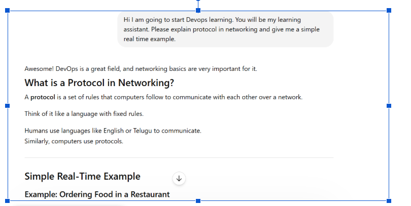
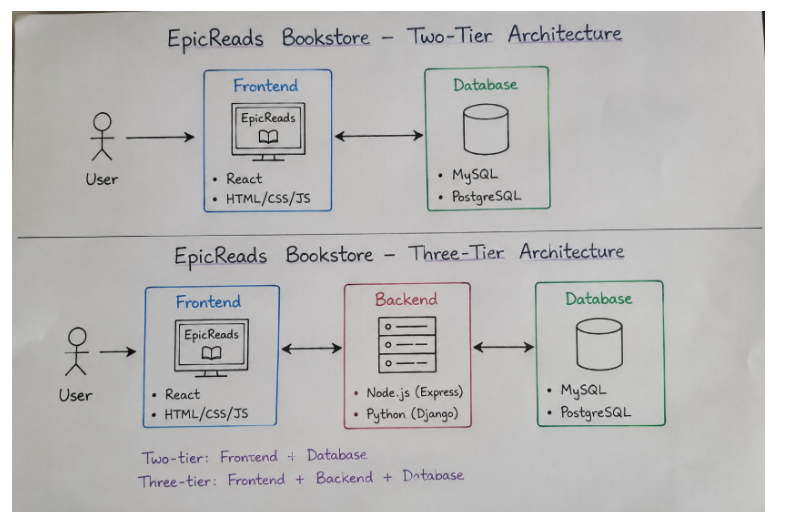
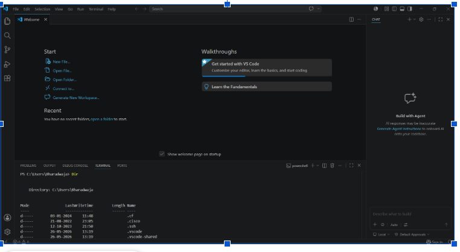

# Week 00 - Internet and Networking

Part of the DevOps Micro Internship (DMI) Cohort 3 with Agentic AI

---

# 🧑‍💻 Task 1: Using ChatGPT as Your Learning Assistant

## Scenario

You're new to DevOps and will frequently encounter technical questions. ChatGPT can be your learning companion.

## Your Task

Write a clear ChatGPT prompt to help you understand:

> "What is a protocol in networking? Explain with a simple real-life example."

Take a screenshot of your interaction showing:

* Your detailed prompt (with clear expectations)
* ChatGPT's simplified response with an example

## Screenshot

Save your screenshot in the `screenshots` folder and update the file name below.




Replace `task-1-chatgpt.png` with your actual screenshot file name.

---

## What I Learned (2–3 lines)

In networking, a protocol is a standardized set of rules and formats that dictates how devices exchange data. It acts like a universal language, allowing computers, servers, and routers to communicate successfully regardless of differences in their underlying hardware, software, or manufacturer.

---

# 🌐 Task 2: Internet and Networking

## Scenario

Your friend is launching an online bookstore named **EpicReads**.

He asked you to explain how users globally can access his website hosted in Finland.

## Your Task

Write a short explanation (**100–150 words**) that includes:

* Packet Switching
* IP Address
* TCP/IP
* HTTP/HTTPS

💡 **Tip:** You may use ChatGPT (as demonstrated in Task 1) to refine your explanation.

## Answer

EpicReads’ website hosted in Finland can be accessed globally through networking technologies and internet protocols.
When a user opens the website, the browser uses HTTP/HTTPS protocols to request webpages securely over the internet.
HTTPS ensures encrypted and safe communication between users and the server.
Every device connected to the internet has an IP Address, which helps identify the user’s system and the Finland-based server.
Data is transferred using the TCP/IP protocol suite. TCP ensures reliable delivery of data packets, while IP routes them across networks worldwide.
The internet uses Packet Switching, where data is divided into small packets and sent through different paths before being reassembled at the destination.
This allows users from any country to quickly and reliably access the EpicReads online bookstore.

---

# 🏗️ Task 3: Application Architecture & Stack

## Scenario

EpicReads bookstore has two application versions:

### Two-Tier Application

* Frontend
* Database

### Three-Tier Application

* Frontend
* Backend
* Database

## Your Task

* Draw simple diagrams (hand-drawn or tool-based such as draw.io)
* Label each layer clearly
* List at least two common technologies or tools used for each layer
* Submit a screenshot or photo clearly showing your own drawing

## Diagram Screenshot / Photo

Save your diagram image in the `screenshots` folder and update the file name below.




Replace `task-3-diagram.png` with your actual diagram file name.

---

## Technologies Used

### Frontend

* React
* HTML/CSS/JS

### Backend

* Node.js
* Python

### Database

* MySql.
* Postgresql

---

# 🌍 Task 4: Domain Name & DNS (Basic Concepts)

## Scenario

Your friend's bookstore **EpicReads** is currently accessible through:

```text
52.172.142.222:3000
```

He purchased the domain:

```text
epicreads.com
```

## Your Task

In **50–100 words**, explain in your own words:

1. What is DNS (Domain Name System)?
2. Which DNS record type should be used to connect the domain to the given IP, and why?

## Answer

DNS (Domain Name System) is like the internet’s phonebook. It converts easy-to-remember domain names such as epicreads.com into IP addresses like 52.172.142.222, which computers use to identify servers. Without DNS, users would need to remember IP addresses to access websites.

To connect epicreads.com to the server IP 52.172.142.222, an A Record should be used. An A Record maps a domain name directly to an IPv4 address, allowing users worldwide to access the EpicReads website using the domain name instead of the numeric IP address.

---

# 💻 Task 5: Visual Studio Code Setup (Hands-on)

## Your Task

Install Visual Studio Code (if not already installed).

Take a screenshot of your VS Code environment showing:

* Terminal open inside VS Code
* Running a basic command:

### Windows

```powershell
dir
```

### Linux / macOS

```bash
pwd
ls
```

* Your selected VS Code theme clearly visible

⚠️ **Important:** The screenshot must show your username or another identifiable detail to confirm it is your environment.

## Screenshot

Save your screenshot in the `screenshots` folder and update the file name below.




Replace `task-5-vscode.png` with your actual screenshot file name.

---

# 🔗 Task 6: Publish Your Assignment as a LinkedIn Post

## Objective

Publishing on LinkedIn helps you:

* Build your professional online presence
* Reinforce your learning
* Document your DevOps journey publicly

## Your Task

Summarize your answers from Tasks 1–5 into a LinkedIn post.

Clearly structure your post into the following sections:

* ChatGPT
* Internet & Networking
* App Architecture
* DNS
* VS Code Setup

Add the following credit note at the end of your post:

> **P.S. This post is a part of DevOps Micro Internship with Agentic AI Cohort-3 by Pravin Mishra. You can start your DevOps journey by joining this Discord community: https://discord.pravinmishra.com/**

---

## LinkedIn Post URL

Paste your LinkedIn post URL here:

```text
https://www.linkedin.com/posts/bharadwaja-kachiraju-78a45598_cohort-assignment-bharawaja-kachirajudocx-activity-7464980357029953537-oJEs?utm_source=share&utm_medium=member_desktop&rcm=ACoAABS2KxoBOPNTBIxog_qhN1vz4HLYmnjgQPY
```

---

## LinkedIn Post Backup Copy

Paste the full text of your LinkedIn post here:

🚀 Excited to Start My DevOps Learning Journey! 🚀

I’m happy to share that I’m looking forward to joining the DevOps Micro Internship (DMI) – Cohort 3, guided by Pravin Mishra 🚀
This internship offers a great opportunity to build strong fundamentals in DevOps, Cloud, and Networking through a practical, hands-on learning approach. The structured assignments and real-world tasks are designed to strengthen practical understanding beyond just theory.

📌 Week 0 Assignment Topics Include:
• Basics of Internet & Networking
• Application Architecture (Two-tier & Three-tier)
• DNS & Domain Name Concepts
• Hands-on Practice with Visual Studio Code
• Professional Documentation & Knowledge Sharing

📖 View my assignment here 👇🏻

https://lnkd.in/dHs5gEZH

Grateful to Pravin Mishra for creating such a valuable learning opportunity and mentoring aspiring DevOps engineers through this initiative.
Looking forward to learning, building, and sharing my progress throughout this journey! 🌱✨

P.S. This post is part of the DevOps Micro Internship (DMI) Cohort 3 run by Pravin Mishra. You can be part of this learning community too. 
JOIN HERE (https://lnkd.in/dhurmKWy ) 
DMI Cohort 3: https://lnkd.in/deYTkw22
Pravin Mishra Profile: https://lnkd.in/dRniAR8y

---

# Reflection – Week 0

### What did you find easy?

I found easy the topics about internet, apllication stack and architecture as I already have some exposure on it.

---

### What was difficult?

Nothing was difficult as of week 0.

---

### What will you improve next week?

My schedule to distrbute my time to all the important tasks.

---

## 📌 About DMI & CloudAdvisory

DevOps Micro Internship (DMI) is a project-based DevOps program run by Pravin Mishra (The CloudAdvisory) focused on real-world execution, systems thinking, and career readiness.

It helps learners build strong DevOps foundations with hands-on experience.


## 📌 Resources

- 🌐 **DMI Official Website:** https://pravinmishra.com/dmi  
- 🎓 **DevOps for Beginners (Udemy):** https://www.udemy.com/course/devops-for-beginners-docker-k8s-cloud-cicd-4-projects/  
- 🎓 **Ultimate Agentic AI DevOps with Clude Code** https://www.udemy.com/course/ultimate-agentic-ai-devops-with-claude-code/?referralCode=448389767BC96284087B
- 🎓 **DevOps with Claude Code: Terraform, EKS, ArgoCD & Helm** https://www.udemy.com/course/devops-with-claude-code-terraform-eks-argocd-helm/?referralCode=1C5B734505D65A010FA3
- ▶️ **YouTube Playlist (DMI Cohort 3):** https://www.youtube.com/playlist?list=PLFeSNDtI4Cho  
- 🔗 **Pravin Mishra (LinkedIn):** https://www.linkedin.com/in/pravin-mishra-aws-trainer/  
- 🏢 **CloudAdvisory (LinkedIn):** https://www.linkedin.com/company/thecloudadvisory/

---

*This submission is part of DevOps Micro Internship (DMI) Cohort 3 — Agentic AI Track*