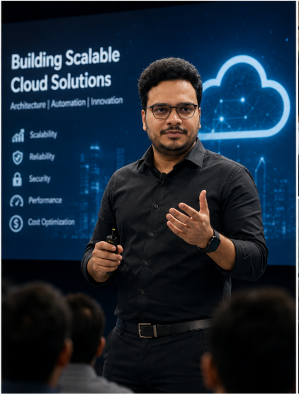
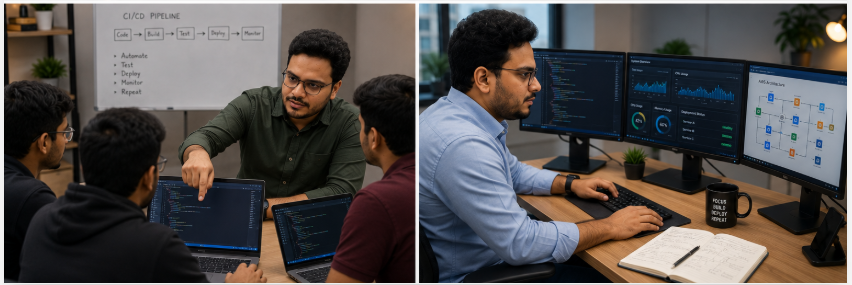

# Week 01 — Success Mindset (Mindset OS)

Part of the DevOps Micro Internship (DMI) Cohort 3 with Agentic AI

---

## Purpose (Read This First)

This week is not motivation homework.

This is you building your **Mindset OS** — the system you will use for the next 5 months (and honestly, for years).

### Expectations

* Be honest.
* Be specific.
* Be practical.
* Write like an adult professional: clear sentences, no one-liners.

You will reuse this in later weeks. So do it properly once.

---

# Assignment 1. What is something you believe to be true that most people around you would disagree with?

### Rules

* No "safe" answers.
* Must be your real belief (not copied from internet).
* Minimum 50 words.

**Hint:** What do you believe about career, money, learning, discipline, relationships, health, success, life, tech industry, etc. that most people don't agree with?

## Answer

I believe we shouldn't judge a person's intelligence or character based on whether their opinions align with our own. Too often, if someone agrees with us, we consider them wise or sensible. But the moment they express a different opinion, we are quick to dismiss them as uninformed or foolish.

I've observed this happen many times, where people's perception of the same individual changes almost instantly just because that person changes their viewpoint. To me, opinions are temporary—they evolve as we gain new experiences, knowledge, and perspectives. Judging someone's worth based on something so fluid is unfair and short-sighted.

Many people would probably agree with this idea in theory, but in practice, we often do the opposite. I believe we should judge people by their values, integrity, and willingness to learn, rather than by whether they happen to agree with us at a particular moment.

---

# Assignment 2. What are the top 3 objective truths you discovered through experimentation and results?

### Definition

Objective truths do not depend on opinions. They hold true regardless of how people feel.

Write each truth in this format:

**Truth:** (1 sentence)

**Evidence from my life:** (2–4 lines: what you tried + what happened)

---

## Truth #1

### Truth

Small, consistent actions help overcome procrastination.

### Evidence from my life

Earlier, I used to procrastinate a lot in my day-to-day activities, especially the ones that were important for achieving my goals. I would feel highly motivated at the beginning, but after some time I would keep postponing tasks, telling myself, "I'll start in another hour" or "I'll do it in 30 minutes." By the end of the day, I often felt guilty because I had made little or no progress on the things that truly mattered.

To test a different approach, I stopped focusing on completing large amounts of work. Instead, I committed to working on an activity for just 20–30 minutes. Once the time was up, I would intentionally stop, even if I was interested in continuing, and switch to another activity. This made it much easier to start because the commitment felt manageable rather than overwhelming.

Although I still get distracted occasionally,I now know that even a short period of focused work is enough to regain momentum and motivation. Through this experience, I realized that consistency matters more than waiting for motivation

---

## Truth #2

### Truth

Listening builds stronger relationships than giving unsolicited advice.

### Evidence from my life

I learned that listening with empathy strengthens relationships more than immediately offering advice.
Earlier, whenever someone shared their life experiences or personal struggles with me, I would be eager to give advice or suggest solutions. I believed I was helping them by sharing my perspective and thought that I knew how they should handle the situation. Looking back, I realize that I often underestimated the complexity of what they were going through.

Over time, I observed that no one can truly understand another person's situation until they have walked in their shoes. I also realized that most people are not looking for advice, guidance, or even consolation when they open up. More often, they simply want someone who will listen without judging or interrupting. Expressing their thoughts and emotions helps them release the emotional burden they have been carrying.

Based on this realization, I made a personal rule: I will not offer advice unless the other person asks for it. Since adopting this approach, my conversations have become more meaningful, people seem more comfortable sharing their thoughts with me, and I have built stronger relationships. I also learned that advice has much greater value when it is invited rather than imposed, even if the advice itself is genuine and well-intentioned.
---

## Truth #3

### Truth

Principles are most effective when they are adapted to your own life.

### Evidence from my life

I learned that adapting useful principles to my own circumstances produces better results than trying to copy someone else's routine exactly.

For a long time, I watched many content creators and influencers and tried to follow their advice exactly as they presented it. Some of their suggestions were genuinely helpful, while others seemed useful in theory but did not work well in practice. Whenever I tried to imitate their routines without considering my own situation, I struggled to stay consistent and often felt discouraged.

Over time, I realized that a principle and the way it is applied are two different things. The principle may be universal, but its implementation should be personalized. Every person's career, responsibilities, environment, and daily routine are different. For example, not everyone can wake up at the same early hour or follow an identical schedule because their circumstances may not allow it.

I began identifying the underlying principles behind successful habits—such as consistency, regular exercise, continuous learning, and adequate rest—and adapted them to fit my own lifestyle instead of copying someone else's routine. This approach helped me stay consistent and achieve better results.

However, adapting principles should never become an excuse to avoid positive change. If someone's current lifestyle is built around unhealthy or harmful habits, they should not justify those habits by saying that their lifestyle does not allow them to adopt better principles. In such cases, the lifestyle itself needs to change. I am referring only to genuine constraints—such as career responsibilities, family commitments, or the environment in which a person lives—that cannot be changed easily. When those are the limiting factors, it is more effective to adapt good principles to fit your circumstances rather than blindly copying someone else's routine. The goal is not to imitate another person's lifestyle but to apply sound principles in a way that is both practical and sustainable for your own life.

---

# Assignment 3. What does your 2.0 version look like?

### Instructions

Write as if a journalist is writing about you **3 to 7 years from now** (not 20 years).

**Minimum 300 words.**

### Rules

* Write in past tense, like it already happened.
* Don't use "likes to / wants to / hopes to."
* Use specifics:

  * built
  * shipped
  * led
  * published
  * earned
  * relocated
  * contributed
* Include skills proof:

  * projects
  * portfolios
  * GitHub
  * blogs
  * certifications
  * job role
  * leadership
  * community contribution
* Add 1–3 images if you can (optional but powerful).

### Publish It Publicly On Any ONE

* LinkedIn
* Medium
* WordPress
* Blogspot
* Personal blog
* Portfolio page

Include this line:

> **P.S. This post is a part of DevOps Micro Internship with Agentic AI Cohort-3 by [Pravin Mishra](https://www.linkedin.com/in/pravin-mishra-aws-trainer/). You can start your DevOps journey by joining this [Discord community](https://discord.pravinmishra.com/) ( https://discord.pravinmishra.com/ ).**

## Your Article

BK: From a Telugu-medium student in rural Telangana to a technology leader who inspired others to dream bigger

Just a few years ago, Bharadwaja Kachraju aka BK set out to redefine what was possible for someone from his background. Raised in a rural part of Telangana, he completed his schooling in Telugu medium before transitioning to English medium for higher education. That transition was one of the biggest challenges of his life. He spent more time understanding the language than understanding the subjects and often questioned whether he would ever be confident enough to build a successful career or clear job interviews.

His first breakthrough came when he secured an entry-level role in SAP after nearly two years of persistent effort. Instead of treating that as the destination, he used it as the foundation for continuous growth. Over the following years, he expanded his expertise beyond SAP by building strong skills in DevOps, cloud technologies, automation, and modern IT practices. He earned industry-recognized certifications, built a public GitHub portfolio showcasing automation projects and learning labs, and documented his learning journey through technical articles and blogs.

With more than a decade of experience in the IT industry, BK became known not only for solving complex technical problems but also for simplifying them for others. He led cross-functional initiatives, mentored junior engineers, and played a key role in modernizing infrastructure and delivery processes within his organization. His ability to combine technical depth with empathy earned him the trust of both colleagues and leadership.

Outside his professional responsibilities, BK cotributed actively to the technology community. He mentored students and early-career professionals, especially those from rural and non-English-medium backgrounds. Through talks, online content, and one-on-one mentoring, he demonstrated that consistent effort matters more than where a person begins.

Today, many professionals seek BK’s guidance not only for technical challenges but also for career development and personal growth. His journey has become living proof that language, background, and circumstances do not define a person’s potential. With discipline, continuous learning, and perseverance, he built the career he once doubted was possible and inspired countless others to believe that they could do the same.

### Public Link

Paste your link here:

https://medium.com/@bharadwajk32/bk-from-a-telugu-medium-student-in-rural-telangana-to-a-technology-leader-who-inspired-others-to-8e7d2332eaaf?sharedUserId=bharadwajk32
---

# Assignment 4. Have you ever cut corners (unethical / dishonest / shortcut behavior — not necessarily illegal)? If yes, how did it make you feel?

### Important

You don't need to write the full story.

Focus on the feeling:

* guilt
* fear
* shame
* stress
* regret
* numbness
* etc.

This is about self-awareness, not judgment.

### Answer Format

Yes

If Yes:

**What emotion did you feel?** (minimum 50–100 words)

## Answer

Shame and Regret 

There was a time when I made a mistake but tried to justify it by giving an excuse instead of taking responsibility immediately. Even though others accepted my explanation, I knew I wasn't being completely honest. I felt uncomfortable because the situation didn't align with the values I wanted to live by.

---

# Assignment 5. What are 10 non-fiction books you plan to read in the next 1 year?

### Rules

* Mention **Title + Author**
* Any language allowed
* No fiction novels

### Tip

Choose books that improve:

* mindset
* communication
* productivity
* health
* money
* career
* leadership

## Book List

1. Deep Work — Cal Newport
2. Atomic Habits – James Clear
3. Lateral Thinking: A Textbook of Creativity - Edward de Bono
4. How to Win Friends and Influence People – Dale Carnegie
5. The 7 Habits of Highly Effective People – Stephen R. Covey
6. The Psychology of Money – Morgan Housel
7. Can't Hurt Me – David Goggins
8. The First 90 Days — Michael D. Watkins
9. Vijayaniki Aidu Metlu - Yandamuri Veerendranath 
10. Leadership - B. V. Pattabhiram

---

# Assignment 6. What are the things you will measure regularly in your life and career?

### Rules

List topics only. No need to share numbers.

### Must Include

* Learning / skill
* Output / proof
* Health / energy
* Time / focus
* Money / finance (personal or business)

### Example

* Learning hours per week
* Deep work sessions per week
* Projects shipped / documented
* Steps / workouts
* Sleep hours
* Spending tracker

## My Metrics

* Learning hours per week
* Daily screen time
* Sleep hours.
* Workout sessions
* Daily steps
* Monthly savings
* Investment tracking
* Books completed
* Hands-on practice hours of any skill
* Technical blogs published

---

# Assignment 7. Brain Dump + 5-Month System Plan

## Step 1: Brain Dump (Private)

Do a brain dump of everything in your mind into a notebook.

Examples:

* Bills
* Tasks
* Worries
* Goals
* Pending messages
* Ideas
* Responsibilities

### Did You Do It?

Yes

Answer:

I noted it down in my notebook.

---

## Step 2: Your 5-Month Routine + Focus Blocks

Create a simple plan you can realistically follow for the next 5 months.

### Weekly Routine

Example:

* Mon–Thu: 60 min deep work
* Sat: DMI session
* Sun: Weekly review

#### My Weekly Routine

1. Mon - Fri: 1 - 2 hours of learning concepts through practical labs and 30 mins of theory reading
2. 3 to 4 sessions of strength work out and one to two sessions of bdaminton sport
3. Saturday: DMI session
4. Sunday: Small review session and spend some quality time with family

---

### Focus Blocks

#### When Will You Do DMI Work? (Days + Time)

From Monday - Thursday I will complete the assignments ASAP and revisit the theory and assignments on Friday

#### How Many Sessions Per Week?

5

---

### Distraction Rules

Examples:

* Phone rules
* Social media rules
* Environment setup

#### My Distraction Rules

Screen time - Maximum 2 - 3 hours

---

# Reflection – Week 1

### Biggest insight I got about myself this week

I found out that I can literally sit at one place for 8 hours and concentrate on one thing with out distraction.

### My biggest weakness/loop I noticed

Poor sleep quality and food choices are ruining my energy.

### One system I will implement from this week (exact habit + time)

1. 7-8 hours of sleep and Sufficient amount of protein in food
2. 1 - 2 hours of additional skill learning in the morning.
### LinkedIn Post

Paste your LinkedIn post link here:

https://www.linkedin.com/posts/bharadwaja-kachiraju-78a45598_join-the-dmi-devops-micro-internship-share-7478307932091191296--N2V/?utm_source=share&utm_medium=member_desktop&rcm=ACoAABS2KxoBOPNTBIxog_qhN1vz4HLYmnjgQPY

---

## 10. Proof of Work

- LinkedIn Post URL: (https://www.linkedin.com/posts/bharadwaja-kachiraju-78a45598_join-the-dmi-devops-micro-internship-share-7478307932091191296--N2V/?utm_source=share&utm_medium=member_desktop&rcm=ACoAABS2KxoBOPNTBIxog_qhN1vz4HLYmnjgQPY) 
- Blog / Medium : https://medium.com/@bharadwajk32/bk-from-a-telugu-medium-student-in-rural-telangana-to-a-technology-leader-who-inspired-others-to-8e7d2332eaaf 

---

## 📌 About DMI & CloudAdvisory

DevOps Micro Internship (DMI) is a project-based DevOps program run by Pravin Mishra (The CloudAdvisory) focused on real-world execution, systems thinking, and career readiness.

It helps learners build strong DevOps foundations with hands-on experience.

## 📌 Resources

- 🌐 **DMI Official Website:** https://pravinmishra.com/dmi  
- 🎓 **DevOps for Beginners (Udemy):** https://www.udemy.com/course/devops-for-beginners-docker-k8s-cloud-cicd-4-projects/  
- 🎓 **Ultimate Agentic AI DevOps with Clude Code** https://www.udemy.com/course/ultimate-agentic-ai-devops-with-claude-code/?referralCode=448389767BC96284087B
- 🎓 **DevOps with Claude Code: Terraform, EKS, ArgoCD & Helm** https://www.udemy.com/course/devops-with-claude-code-terraform-eks-argocd-helm/?referralCode=1C5B734505D65A010FA3
- ▶️ **YouTube Playlist (DMI Cohort 3):** https://www.youtube.com/playlist?list=PLFeSNDtI4Cho  
- 🔗 **Pravin Mishra (LinkedIn):** https://www.linkedin.com/in/pravin-mishra-aws-trainer/  
- 🏢 **CloudAdvisory (LinkedIn):** https://www.linkedin.com/company/thecloudadvisory/

---

*This submission is part of DevOps Micro Internship (DMI) Cohort 3 — Agentic AI Track*