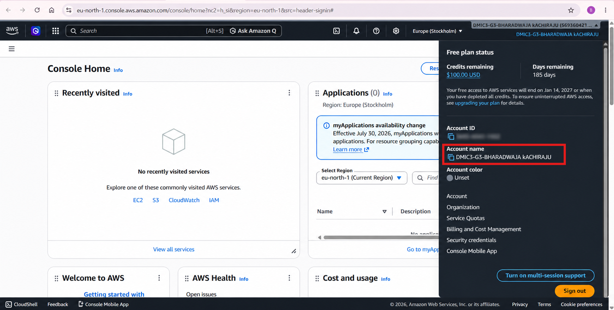

# Assignment 1 — AWS Free Tier Account Setup (EpicReads Cloud Onboarding)

Part of the DevOps Micro Internship (DMI) Cohort 3 with Agentic AI

---

## Purpose

In this assignment, you will create and verify an AWS Free Tier account as part of onboarding EpicReads — an online bookstore moving to the cloud. You will demonstrate an understanding of AWS fundamentals, Free Tier services, and account setup by answering conceptual questions and capturing proof of a working AWS Console login.

---

# Task 1 — Understanding AWS & Free Tier

## Goal

Demonstrate understanding of AWS basics and Free Tier usage by answering the following questions in your own words (3–4 lines each).

### Answers

#### Question 1 — What is an AWS account, and why do you need it at this stage?

An AWS account is a unique identity created by an individual or organization to access AWS cloud services. It provides login credentials and a billing profile to create and manage resources such as EC2 instances, S3 buckets, and ECR repositories.

At this stage, an AWS account is essential for a me to gain hands-on experience with real cloud infrastructure. It is just as important as theory. Using the AWS Free Tier, I can practice deploying applications, provisioning virtual machines, configuring databases, and implementing security controls with little to no cost.

---

#### Question 2 — What is AWS Free Tier, and how long does it last?

The AWS Free Tier is an offering from Amazon Web Services that allows users to explore, learn, and experiment with AWS cloud services at little or no cost, as long as usage stays within defined limits. It is designed to support beginners, students, developers, and startups who want to build and test real cloud resources without immediate billing concerns.

For accounts created after July 15, 2025, AWS provides a Free Plan that offers up to $200 in credits — $100 at signup and up to $100 earned through guided activities. This plan lasts for up to six months or until the credits are exhausted, whichever comes first. If the credits run out or the six months end, the account closes automatically, though users get a 90-day grace period to upgrade to a paid plan or recover their data. Alongside this, AWS also offers Always Free services, which remain free indefinitely as long as monthly usage limits are not exceeded.
For accounts created before July 15, 2025, AWS applied the Legacy Free Tier. This included a 12-month free usage period for selected services such as EC2, S3, RDS, and CloudFront. Like the current model, these older accounts also continue to benefit from Always Free services that do not expire.

---

#### Question 3 — Name three AWS Free Tier services and their free usage limits.

Amazon S3: S3 is a cloud storage service that lets users store and retrieve files such as images, backups, and static websites. The Free Tier offers 5 GB of standard storage, along with 20,000 GET requests and 2,000 PUT requests per month, as long as usage stays within these limits.

Amazon EC2: EC2 is a virtual server service that lets users run applications on cloud-hosted machines instead of physical hardware. The Free Tier provides 750 hours per month of a t2.micro or t3.micro instance — enough to run one small server continuously for a full month, ideal for learning, testing, and hosting basic applications.

Amazon DynamoDB is a fully managed NoSQL database service used to store and query data at scale. Its Free Tier is "Always Free" and never expires, offering 25 GB of storage plus 25 provisioned read and write capacity units per month, enough to handle roughly 200 million requests monthly.

AWS Free Tier benefits vary depending on when an account was created. Newer accounts generally use a credit-based free plan for eligible services, while older accounts meaning those created before July 15, 2025 may follow the previous fixed monthly limits. DynamoDB's Always Free tier remains available to all AWS accounts as long as usage stays within the free limits

---

# Task 2 — Create AWS Free Tier Account

## Goal

Create a valid AWS Free Tier account and sign in to the AWS Management Console.

> No screenshots required for this task. Completion is verified through Task 3.

---

# Task 3 — Verify AWS Account

## Goal

Confirm that your AWS account setup is complete by navigating to the Account section and capturing proof.

### Evidence

#### Screenshot 1 — AWS Account page showing account name (email may be blurred)

---

# Submission Instructions

- Add all required screenshots in your GitHub repository submission
- Full name must be visible in required screenshots
- Do not expose sensitive information (keys, passwords, account IDs)

---

# Completion Checklist

- [ ] Task 1 answers written in own words
- [ ] AWS Free Tier account created successfully
- [ ] Signed in to AWS Management Console
- [ ] Screenshot of AWS Account page captured (full name visible, no sensitive data)
- [ ] All required screenshots added to repository

---

## 📌 About DMI & CloudAdvisory

DevOps Micro Internship (DMI) is a project-based DevOps program run by Pravin Mishra (The CloudAdvisory) focused on real-world execution, systems thinking, and career readiness.

It helps learners build strong DevOps foundations with hands-on experience.

---

## 📌 Resources

- 🌐 DMI Official Website: https://pravinmishra.com/dmi  
- 🎓 DevOps for Beginners (Udemy): https://www.udemy.com/course/devops-for-beginners-docker-k8s-cloud-cicd-4-projects/  
- 🎓 Agentic AI DevOps with Claude Code: https://www.udemy.com/course/ultimate-agentic-ai-devops-with-claude-code/  
- 🎓 DevOps with Claude Code: Terraform, EKS, ArgoCD & Helm: https://www.udemy.com/course/devops-with-claude-code-terraform-eks-argocd-helm/  
- ▶️ YouTube Playlist: https://www.youtube.com/playlist?list=PLFeSNDtI4Cho  
- 🔗 Pravin Mishra (LinkedIn): https://www.linkedin.com/in/pravin-mishra-aws-trainer/  
- 🏢 CloudAdvisory (LinkedIn): https://www.linkedin.com/company/thecloudadvisory/

---

*This submission is part of DevOps Micro Internship (DMI) Cohort 3 — Agentic AI Track.*