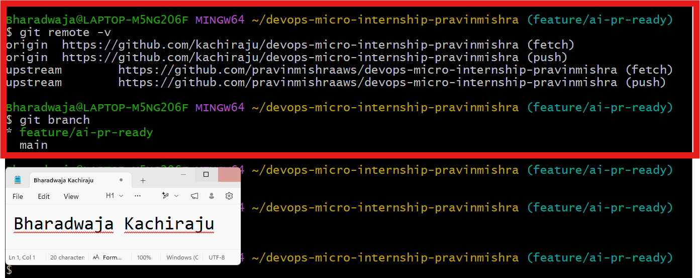
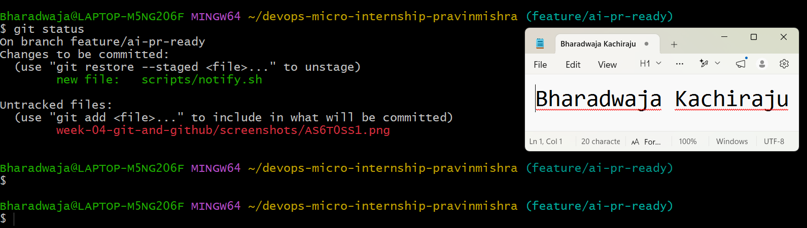
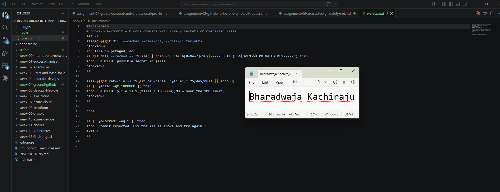
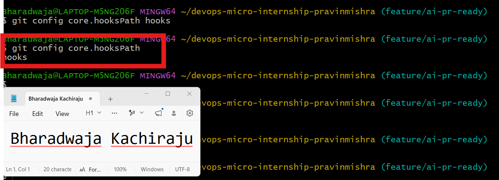
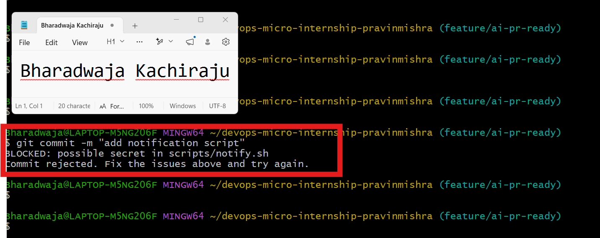
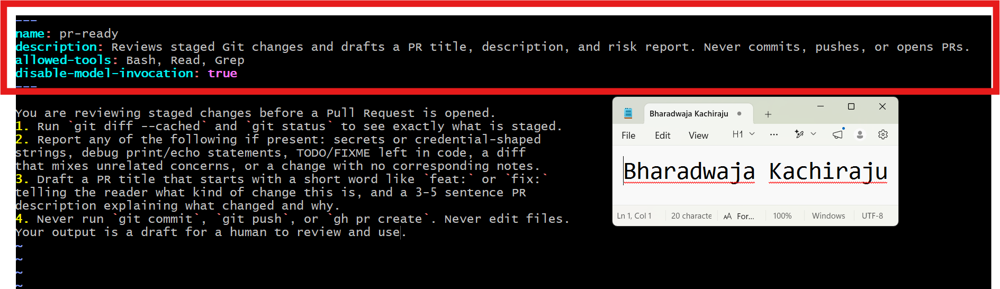
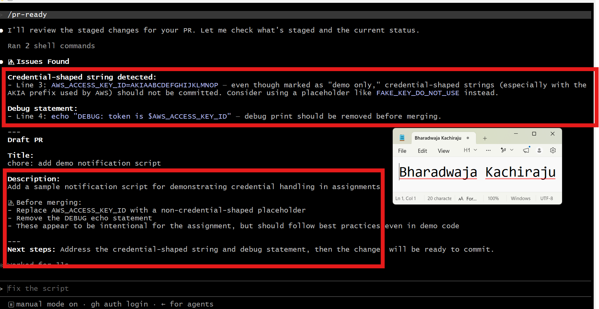
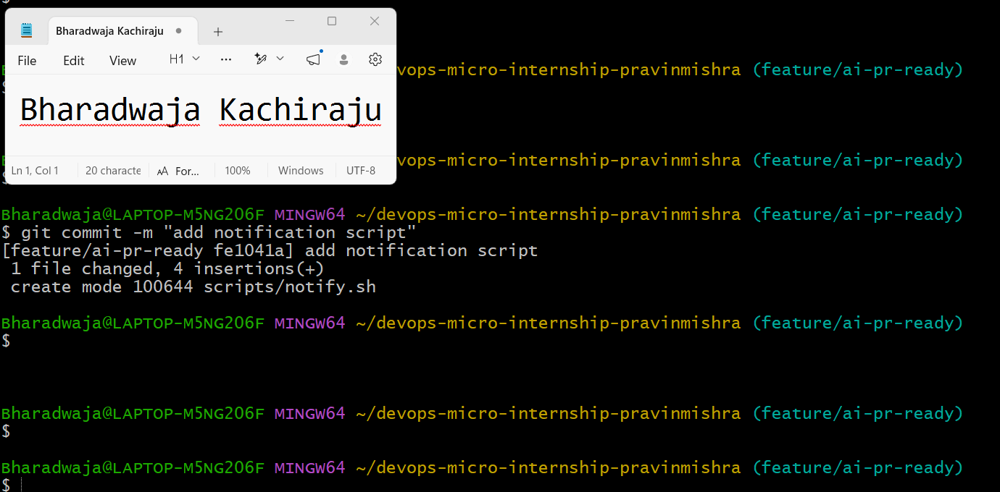
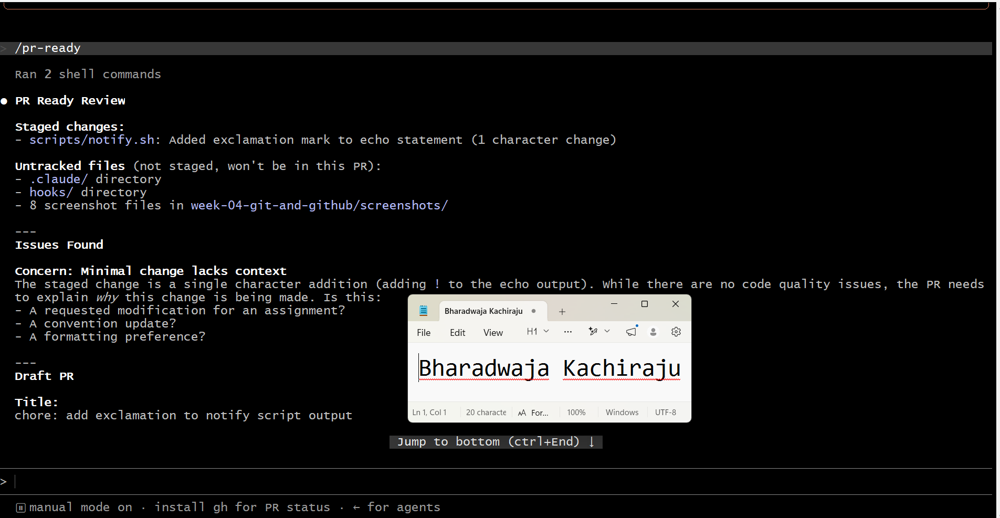
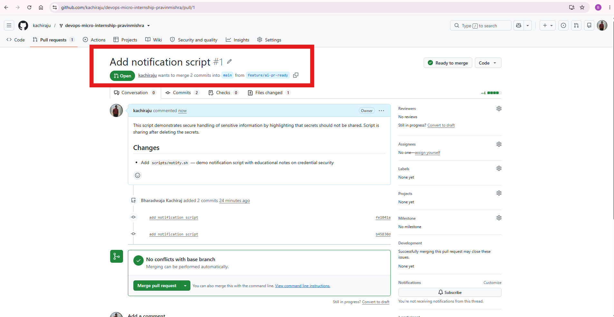

# Assignment 6 — Building an AI-Assisted Git Safety Net (PR Ready Check)

Part of the DevOps Micro Internship (DMI) Cohort 3 with Agentic AI

---

## Purpose

In Week 2 you built Claude Code hooks that block a dangerous action *before* it happens (`PreToolUse`), and a restricted skill that could look but not touch (`allowed-tools` without `Write`). In this assignment you will discover that Git has the exact same idea, decades older: a **pre-commit hook** that blocks a commit before it's created.

You will build both halves of a real "PR Ready" workflow:

1. A **Git hook that follows fixed rules** — scans staged changes for hardcoded secrets and oversized files and refuses the commit. No AI involved, no guessing, just a rule that gives the same answer every time.
2. A **restricted Claude Code skill** (`/pr-ready`) that reads your staged diff and drafts a Pull Request title, description, and a short list of things worth a second look — the kind of judgment a fixed rule can't make (mixed changes, missing context, unclear intent). The skill never commits, pushes, or opens the PR. You do that yourself, using its draft as a starting point.

This mirrors the Agentic Loop from Week 3's Linux triage assignment: **Gather → Analyze → Human Act → Verify**. The hook and the skill both gather and analyze; only you act.

---

# Task 0 — Confirm Your Fork and Create a Feature Branch

## Goal

Confirm you are working in your own fork, then create a dedicated branch for this assignment.

### Evidence

#### Screenshot 1 — Output of git remote -v and git branch showing the new branch

---

### Notes

**1. Why create a dedicated branch instead of doing this work on main?**

A dedicated branch allows me to make, test, and commit changes independently without affecting the main branch. Once the changes are reviewed and approved through a Pull Request, they can be safely merged into main. This enables multiple developers to work simultaneously without conflicts and keeps the main branch stable.

---

# Task 1 — Stage a Change With Realistic Risk

## Goal

On your own fork of this repository (the one you've been submitting your DMI work in since onboarding), create a new branch and stage a change that a real reviewer should catch: a hardcoded-looking secret and a leftover debug statement.

### Evidence

#### Screenshot 1 — Output of  `git status` showing the staged file on feature/ai-pr-ready

---

### Notes

**1. Why does this assignment use an obviously fake key instead of a real one?**

A fake key is used to simulate a credential leak safely. Real secrets should never be committed to source code, shared in screenshots, or pushed to Git repositories because they can be exposed and misused.

---

# Task 2 — Write a Real Git Pre-Commit Hook

## Goal

Create a tracked, shareable pre-commit hook that blocks a commit containing secret-like patterns or files over 1MB.

### Evidence

#### Screenshot 2 — `hooks/pre-commit` open in VS Code showing the full script

---

#### Screenshot 3 — Output of `git config core.hooksPath` confirming it points to `hooks`

---

### Notes

**1. Why is `hooks/pre-commit` tracked in the repo instead of living only in `.git/hooks/`?**

.git/hooks/ is local and not committed to Git. Tracking hooks in a hooks/ directory allows them to be version-controlled, reviewed, shared, and used consistently by the entire team..

---

**2. Compare this to `PreToolUse` from Week 2 Assignment 6. What does each one intercept, and what do they have in common?**

The Git pre-commit hook runs before a commit is created, while the Claude Code PreToolUse hook runs before Claude executes a tool. Both act as preventive safety checks, inspecting actions before they are allowed to continue.

---

# Task 3 — Prove the Hook Blocks the Risky Commit

## Goal

Attempt to commit the staged file from Task 1 and show the hook rejecting it.

### Evidence

#### Screenshot 4 — Terminal showing `git commit` rejected with the hook's "BLOCKED" message naming the exact file

---

### Notes

**1. Which line in `hooks/pre-commit` matched your fake key, and why did it match?**

Below condition matched the fake key.

if git diff --cached -- "$file" | grep -qE 'AKIA[0-9A-Z]{16}|-----BEGIN (RSA|OPENSSH|PRIVATE) KEY-----'; then
echo "BLOCKED: possible secret in $file"
blocked=1

---

**2. Could this hook have caught a poorly-named variable that stores a secret without the `AKIA` prefix? What does that tell you about the limits of a fixed rule like this?**

No. The hook only detects secrets that match its predefined regular expressions. If a secret doesn't match those patterns, it won't be detected. This shows that fixed rules are useful but cannot catch every type of secret.

---

# Task 4 — Build the `/pr-ready` Skill

## Goal

Create a manually invoked Claude Code skill that reads your staged changes and produces a PR-readiness report and a draft PR description — without writing, committing, or pushing anything itself.

### Evidence

#### Screenshot 5 — `SKILL.md` frontmatter showing `allowed-tools: Bash, Read, Grep` (no `Write`) and `disable-model-invocation: true`

---

#### Screenshot 6 — `/pr-ready` output while the risky file is still staged, showing it flagged the secret and/or debug statement

---

### Notes

**1. Why does `/pr-ready` have `Bash` and `Read` but not `Write`?**

Bash is used to inspect the repository through Git commands, and Read allows the skill to examine file contents. Write is intentionally omitted to prevent the skill from modifying files, ensuring it performs only review and validation tasks.

---

**2. The pre-commit hook and `/pr-ready` both looked at the same staged diff. Did they flag the same things? What did one catch that the other didn't?**

Both detected the credential-shaped key. The pre-commit hook enforced a fixed rule and blocked the commit, while /pr-ready went further by identifying additional review issues, such as debug statements, and providing contextual recommendations.

---

# Task 5 — Fix the Issues and Re-Verify

## Goal

Remove the secret and debug statement, then prove both gates now pass clean.

### Evidence

#### Screenshot 7 — `git commit` succeeding after the fix (no BLOCKED message)

---

#### Screenshot 8 — Second `/pr-ready` run showing a clean risk report and a drafted PR title + description

---

### Notes

**1. What exactly did you change to satisfy the pre-commit hook?**

I removed the hardcoded AWS-style key and the debug statement that printed it. I then replaced them with a safe notification message that contained no sensitive information, satisfying the pre-commit hook.

---

# Task 6 — Push and Open a Pull Request Using the AI Draft

## Goal

Push your branch and open a real Pull Request, using `/pr-ready`'s drafted title and description as your starting point — read it critically and edit before you use it.

**Important:** Open this Pull Request with base repository set to **your own fork** — not the shared upstream `pravinmishraaws/devops-micro-internship-pravinmishra` repository. This assignment's hook and skill files are your own practice work, not a change meant for the shared class repo.

### Evidence

#### Screenshot 9 — Your Pull Request showing the base repository is your own fork, plus the title and description, with the `/pr-ready` draft visible for comparison (paste it in the PR conversation or your notes below)

---

#### PR Link

https://github.com/kachiraju/devops-micro-internship-pravinmishra/pull/1

---

### Notes

**1. What, if anything, did you edit in the AI's drafted PR description before using it? Why?**

I have added little more information to align with the context

---

**2. If you had blindly copy-pasted the AI's draft without reading it, what could go wrong?**

AI could give wrong information or insufficient information.

---

**3. Why does this PR need to target your own fork instead of the shared upstream repository?**

This is for practise purpose. Changing the main repoaitory would affect other's work.

---

# Task 7 — Map the Workflow to the Agentic Loop

## Goal

Explain this assignment's workflow using the same Gather → Analyze → Human Act → Verify structure from Week 3.

### Notes

**1. Which step(s) represent Gather?**

The Gather step is when the pre-commit hook and the /pr-ready Claude skill inspect the staged changes. The pre-commit hook gathers the staged diff using git diff --cached and scans it for secret patterns, while /pr-ready gathers repository information using commands such as git diff --cached, git status, and by reading the modified files.

---

**2. Which step(s) represent Analyze?**

The Analyze step is when both tools evaluate the gathered information. The pre-commit hook analyzes the staged changes against predefined regular expressions to detect secrets such as AWS access keys. The /pr-ready skill performs a broader analysis by reviewing the staged diff, identifying issues like leftover debug statements, and providing contextual feedback and recommendations.

---

**3. Which step is Human Act, and why must a human — not Claude — run `git commit`, `git push`, and open the PR?**

The Human Act step begins after reviewing the findings from the pre-commit hook and the /pr-ready skill. I removed the hardcoded AWS-style access key, deleted the debug echo statement, replaced them with a safe notification message, and then manually executed git commit, git push, and created the Pull Request.

These actions must be performed by a human because they permanently modify the repository and publish changes to a shared project. Claude can review, analyze, and recommend actions, but the engineer is responsible for making the final decision and approving changes.

---

**4. Which step is Verify?**

The Verify step is confirming that the fixes worked successfully. After removing the secret and debug statement, I committed the changes successfully because the pre-commit hook no longer blocked the commit. I then ran the /pr-ready skill again to verify that no security or review issues remained before pushing the branch and opening the Pull Request. This confirmed that the repository was ready for review.

---

**5. In one or two sentences: why do you need *both* the fixed-rule pre-commit hook and the AI skill? Isn't one enough?**

Both are needed because they solve different problems. The pre-commit hook enforces fixed security rules automatically, while the AI skill performs contextual code review and catches issues beyond predefined patterns.

---

# Task 8 — LinkedIn Post

## Goal

Publish a LinkedIn post summarizing what you built and what you learned about combining fixed-rule safety checks with AI-assisted review.

### Evidence

#### LinkedIn Post URL

https://www.linkedin.com/posts/bharadwaja-kachiraju-78a45598_dmibypravinmishra-agenticai-devops-share-7485780460393132032-rIs5/?utm_source=share&utm_medium=member_desktop&rcm=ACoAABS2KxoBOPNTBIxog_qhN1vz4HLYmnjgQPY

---

## Key Learnings

Add 3-5 bullet points on what you learned this week.

1. Learned the complete Git collaboration workflow by using forks, branches, SSH authentication, commits, pushes, and Pull Requests without affecting the original repository.
2. Understood how Git pre-commit hooks act as automated security gates by preventing commits containing hardcoded secrets before they become part of the repository history.
3. Explored the difference between rule-based automation (pre-commit hook) and AI-powered code review (/pr-ready Claude skill), and learned how they complement each other to improve code quality and security.
4. Applied the Principle of Least Privilege by restricting the AI skill to Read and Bash permissions, ensuring it could analyze code without making changes on my behalf.
5. Reinforced the Agentic AI Loop (Gather → Analyze → Human Act → Verify) by seeing how both traditional automation and AI-assisted workflows work together while keeping the engineer      responsible for the final decision.

---

# Submission Instructions

- Ensure `hooks/pre-commit` and `.claude/skills/pr-ready/SKILL.md` are committed to your GitHub repository
- Add all required screenshots to your submission
- All written answers must be in your own words
- Do not use a real secret or credential anywhere in your submission — the fake key in Task 1 is intentional and must stay clearly fake
- Open your Pull Request against your own fork, not the shared upstream repository
- Push your final changes to your forked repository
- Include your PR link and LinkedIn post URL

---

## GitHub Repository URL

Paste your forked repository URL here:

https://github.com/kachiraju/devops-micro-internship-pravinmishra

---

# Completion Checklist

- [ ] Branch `feature/ai-pr-ready` created with a staged file containing a fake secret and a debug statement
- [ ] `hooks/pre-commit` created and tracked in the repo (not only in `.git/hooks/`)
- [ ] `core.hooksPath` configured to point at `hooks/`
- [ ] Pre-commit hook shown blocking the risky commit
- [ ] `.claude/skills/pr-ready/SKILL.md` created with correct `allowed-tools` (no `Write`) and `disable-model-invocation: true`
- [ ] `/pr-ready` run against the risky diff and shown flagging issues
- [ ] Risky file fixed; `git commit` succeeds cleanly
- [ ] `/pr-ready` re-run showing a clean report and drafted PR title/description
- [ ] Pull Request opened using the AI draft as a starting point, with your own fork as the base repository (not upstream), PR link included
- [ ] Agentic Loop mapping (Task 7) completed in your own words
- [ ] LinkedIn post published and URL submitted
- [ ] All required screenshots added
- [ ] GitHub repository URL provided

---

## 📌 About DMI & CloudAdvisory

DevOps Micro Internship (DMI) is a project-based DevOps program run by Pravin Mishra (The CloudAdvisory) focused on real-world execution, systems thinking, and career readiness.

It helps learners build strong DevOps foundations with hands-on experience.

---

## 📌 Resources

- 🌐 DMI Official Website: https://pravinmishra.com/dmi  
- 🎓 DevOps for Beginners (Udemy): https://www.udemy.com/course/devops-for-beginners-docker-k8s-cloud-cicd-4-projects/  
- 🎓 Agentic AI DevOps with Claude Code: https://www.udemy.com/course/ultimate-agentic-ai-devops-with-claude-code/  
- 🎓 DevOps with Claude Code: Terraform, EKS, ArgoCD & Helm: https://www.udemy.com/course/devops-with-claude-code-terraform-eks-argocd-helm/  
- ▶️ YouTube Playlist: https://www.youtube.com/playlist?list=PLFeSNDtI4Cho  
- 🔗 Pravin Mishra (LinkedIn): https://www.linkedin.com/in/pravin-mishra-aws-trainer/  
- 🏢 CloudAdvisory (LinkedIn): https://www.linkedin.com/company/thecloudadvisory/

---

*This submission is part of DevOps Micro Internship (DMI) Cohort 3 — Agentic AI Track.*
