# Assignment 7 — AI-Assisted AWS Security and Cost Audit

Part of the DevOps Micro Internship (DMI) Cohort 3 with Agentic AI

---

## Purpose

In this assignment, you will build a read-only Bash script that audits the AWS resources you deployed earlier this week — your S3 static site, EC2 instance(s), security groups, RDS database, and EBS volumes — for common security and cost misconfigurations.

You will then connect that script to Claude Code as a reusable `/aws-audit` skill that explains what it found and recommends a fix, without ever making the fix itself.

Finally, you will find a real misconfiguration in your own account, apply the fix yourself, and prove it worked with a second audit run.

---

# Task 1 — Confirm Your AWS Resources and Set Up Your Workspace

## Goal

Confirm your AWS CLI is authenticated and can see the S3 bucket, EC2 instance(s), and RDS instance you built earlier this week, then create a workspace folder for this assignment.

### Evidence

#### Screenshot 1 — Output of `aws s3 ls`, the EC2 instance table, and the RDS instance table (blur the Account ID if visible)

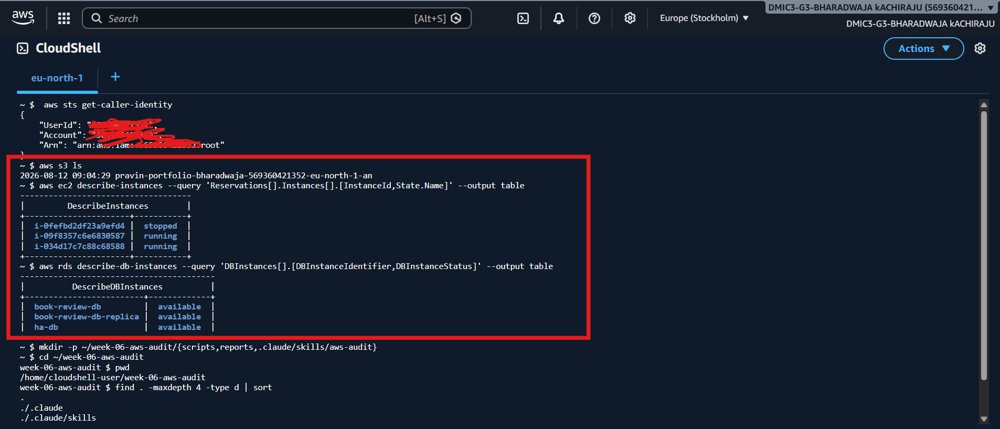

---

#### Screenshot 2 — Output of `pwd` and `find . -maxdepth 4 -type d | sort`

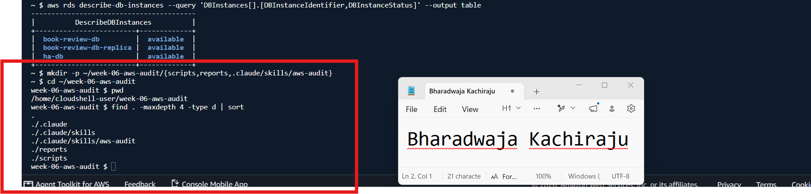

---

### Notes You Must Write (Very Important)

**1. Which resources from this week's earlier assignments did you see in the listings?**

S3 Buckets, EC2 instances, RDS.

**2. Why must you confirm your resources exist before writing an audit script against them?**

You must confirm your resources exist before writing an audit script because the script needs accurate resource names, IDs, configurations, and relationships to check.

If you assume resources exist and write the script against incorrect names or IDs, the audit may fail or produce misleading results. For example, checking a target group, EC2 instance, ALB, or RDS database that doesn't actually exist would give a false picture of the environment.

---

# Task 2 — Define Safety Rules in CLAUDE.md

## Goal

Create a `CLAUDE.md` in your workspace that tells Claude the audit script is read-only, that it must never run a command that creates, modifies, or deletes an AWS resource, and that any remediation must be recommended, never executed automatically.

### Evidence

#### Screenshot 3 — `CLAUDE.md` open in VS Code showing all four sections

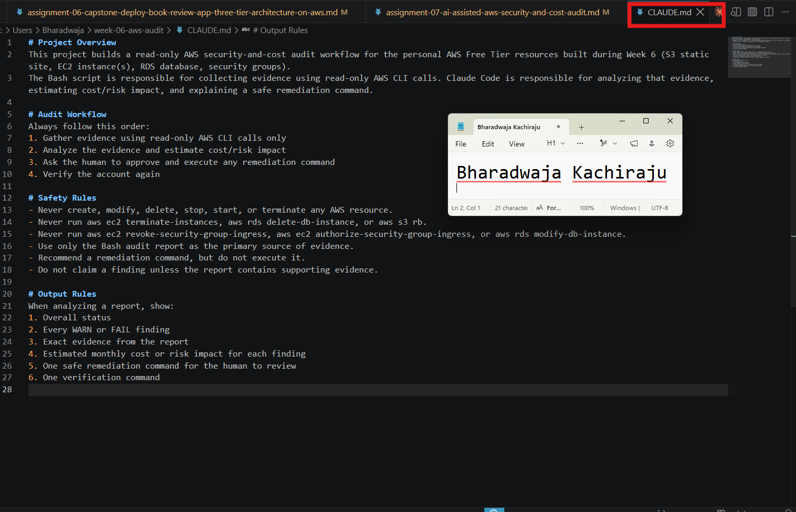

---

### Notes You Must Write (Very Important)

**1. Why should Claude never be given permission to run `revoke-security-group-ingress` itself, even if the fix is obviously correct?**

Because changing security group rules directly can affect application connectivity and security. Even if the fix appears correct, Claude should only analyze the evidence and recommend the remediation. A human must review and approve the command before executing it to prevent accidental disruption or incorrect changes.

**2. Which rule prevents Claude from claiming a finding that the report does not support?**

The rule is:

“Do not claim a finding unless the report contains supporting evidence.”

---

# Task 3 — Plan the Audit with Claude Code

## Goal

Ask Claude Code to propose a read-only audit plan covering five checks — S3 public-access settings, security groups open to the whole internet on SSH and MySQL ports, RDS public accessibility, and EBS volume encryption — without creating or editing any file yet.

### Evidence

#### Screenshot 4 — Claude Code showing the five-check plan

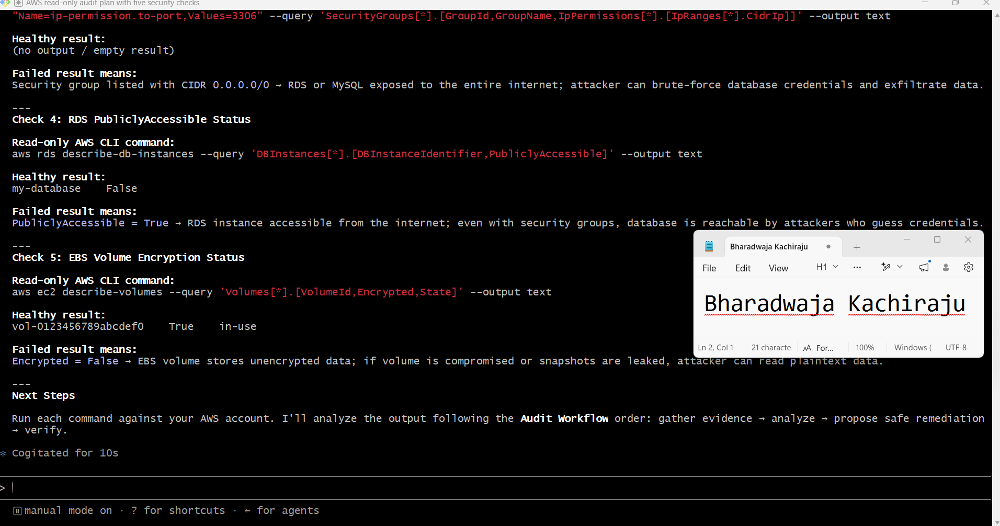

---

### Notes You Must Write (Very Important)

**1. Which part of this task represents the Gather phase?**

The Gather phase is the part where Claude proposes the five read-only AWS CLI commands to collect evidence from the AWS account. Commands such as aws rds describe-db-instances and aws ec2 describe-volumes gather the current status of resources without making any changes.

**2. Did every proposed command start with `describe-`, `get-`, or `list-`? Why does that matter?**

Yes. Every proposed command uses a read-only operation such as describe- or get-. This matters because these commands only retrieve information and do not create, modify, delete, start, or stop AWS resources. That follows the safety rules in the CLAUDE.md and keeps the Gather phase safe and non-destructive.

---

# Task 4 — Build the AWS Audit Script

## Goal

Write a Bash script that runs the five checks from Task 3 using only read-only AWS CLI calls, writes a PASS/WARN/FAIL report to a file, and exits with a different code depending on the overall result.

Make it executable and confirm it has no syntax errors.

### Evidence

#### Screenshot 5 — Top section of `aws-audit.sh` showing the variables and the checks array

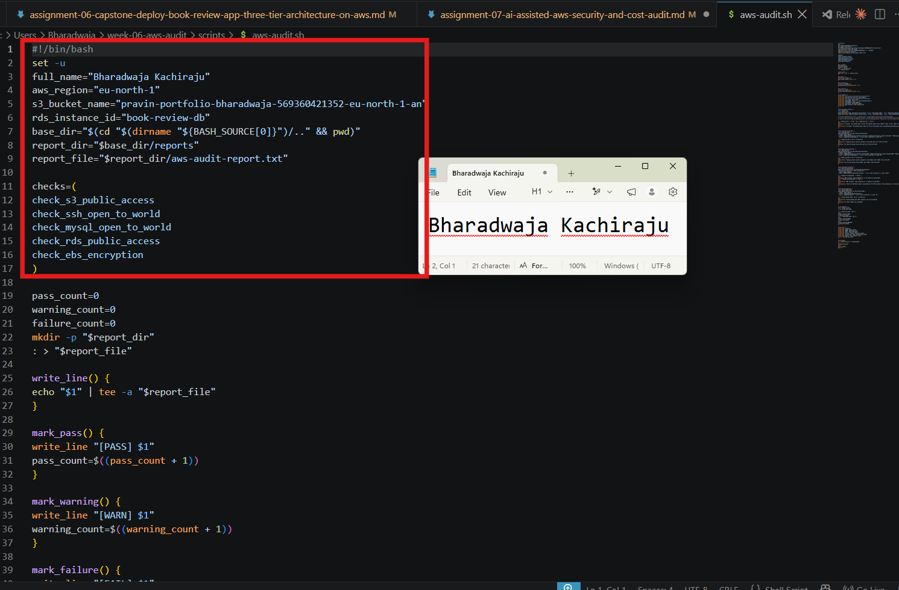

---

#### Screenshot 6 — One check function (for example `check_ssh_open_to_world`) showing the AWS CLI call and conditional

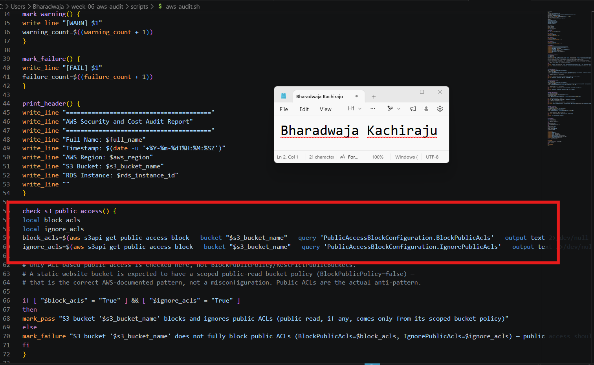

---

#### Screenshot 7 — Output of `bash -n scripts/aws-audit.sh` and `ls -l scripts/aws-audit.sh`

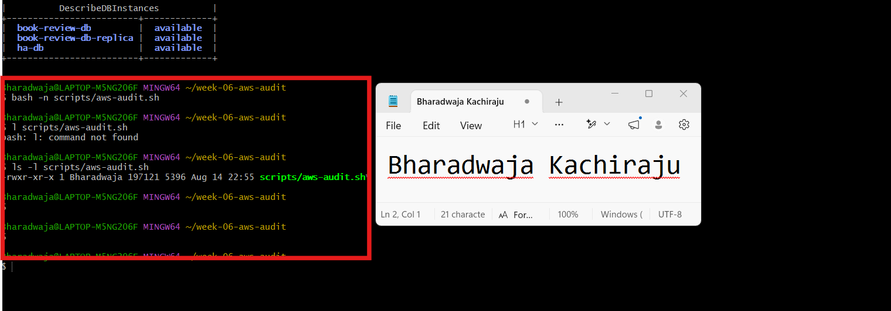

---

### Notes You Must Write (Very Important)

**1. What is stored in the checks array, and how does the loop use it?**

The checks array stores the names of the five audit check functions: S3 public access, SSH exposure, MySQL exposure, RDS public access, and EBS encryption. The for loop goes through each function name in the array and executes it one by one, making it easy to run all audit checks in a defined order.

**2. Why does every AWS CLI call in this script use `--query` and `--output text` instead of parsing raw JSON?**

--query extracts only the specific information needed for each check, while --output text returns a simple value that Bash can easily store in a variable and compare using if conditions. This makes the script simpler and avoids having to parse large raw JSON responses

**3. Why does the script use different exit codes for HEALTHY, WARN, and FAIL?**

Different exit codes allow the result to be understood automatically by other tools or scripts. The script returns 0 for HEALTHY, 1 for WARN, and 2 for FAIL, so automation can quickly identify the overall audit status without reading the full report.

---

# Task 5 — Run the Baseline Audit

## Goal

Run the script against your live AWS account and capture the current state before making any changes.

### Evidence

#### Screenshot 8 — Output of `./scripts/aws-audit.sh` showing your Full Name and all five checks

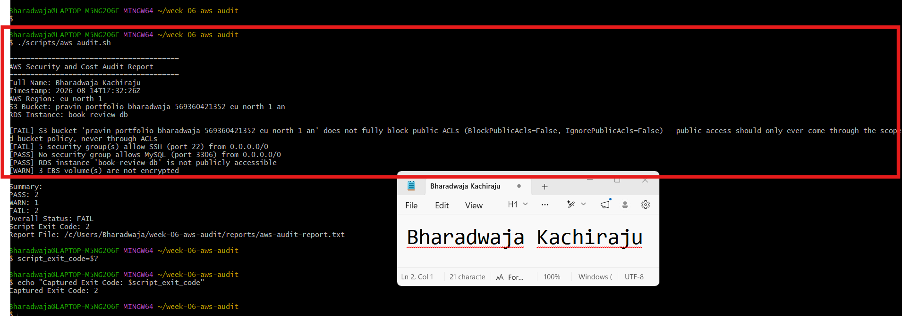

---

#### Screenshot 9 — Output showing the captured exit code and final summary

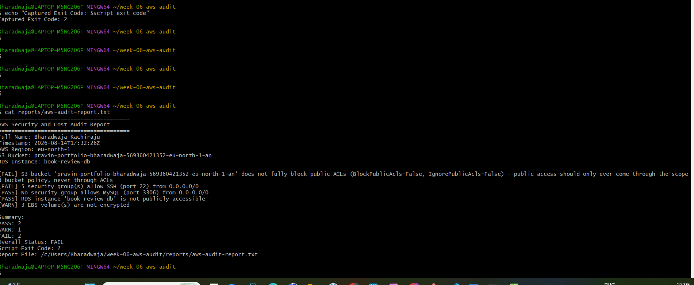

---

### Notes You Must Write (Very Important)

**1. What is the overall status of your baseline audit?**

The overall status of my baseline audit is FAIL. The audit summary shows 2 PASS, 1 WARN, and 2 FAIL, with a Script Exit Code of 2.

**2. Did any check return FAIL or WARN? If so, which one, and what evidence did it show?**

Yes. The audit returned the following findings:

FAIL – S3 public-access block: The S3 bucket did not fully block public ACLs. Evidence showed BlockPublicAcls=False and IgnorePublicAcls=False.
FAIL – EC2 Security Group SSH: A security group allows SSH (port 22) from 0.0.0.0/0, meaning it is open to the entire internet.
WARN – EBS Volume Encryption: 3 EBS volumes are not encrypted.

The MySQL port 3306 check and RDS public accessibility check passed..

**3. If every check passed, what does that tell you about the security posture of your account so far?**

In my case, not every check passed, so I cannot conclude that the account has a fully healthy security posture. The FAIL and WARN findings show that there are still security improvements needed, particularly around S3 public ACL protection, unrestricted SSH access, and EBS encryption.

---

# Task 6 — Build and Run the /aws-audit Skill

## Goal

Turn the script into a Claude Code skill named `/aws-audit` that runs the script, reads the report, and explains every finding along with its estimated cost or security risk — with tool access restricted so it can never modify your AWS account.

### Evidence

#### Screenshot 10 — `SKILL.md` showing the frontmatter, tool restrictions, and safety rules

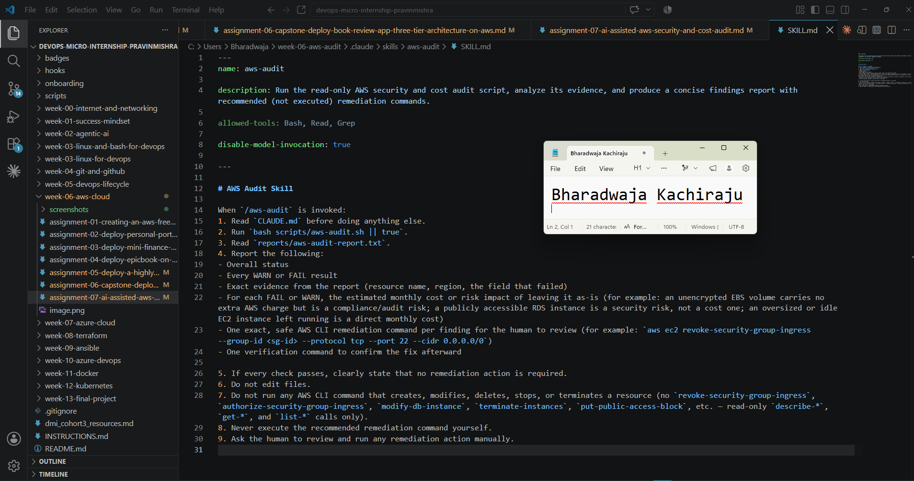

---

#### Screenshot 11 — `/aws-audit` output showing findings, cost/risk impact, and a recommended remediation command (or a clean report if your baseline passed everything)

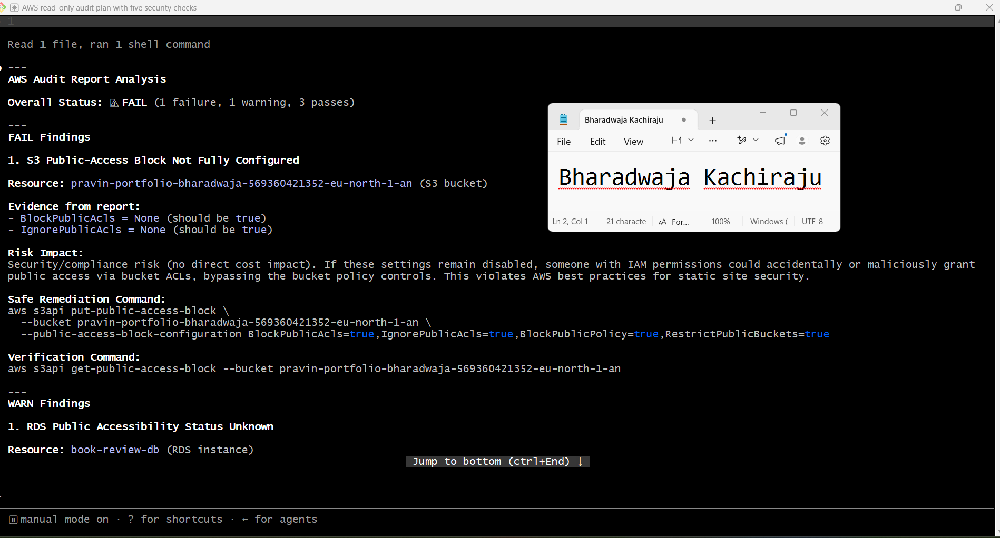

---

### Notes You Must Write (Very Important)

**1. Why does this skill have Bash, Read, and Grep, but not Write?**

The skill is designed to be read-only and safe. Bash is used to run the audit script, while Read and Grep can inspect the configuration and audit report. It does not include Write because the skill must not edit files or make changes to AWS resources.

**2. What part is performed by Bash, and what part is performed by Claude?**

Bash performs the evidence-gathering part by running the aws-audit.sh script and collecting the audit results. Claude reads and analyzes the generated report, identifies WARN and FAIL findings, explains the evidence, estimates the cost or risk impact, and recommends a remediation command for the human to review—but never executes it.

**3. Why is estimating cost/risk impact something the AI adds on top of a plain PASS/FAIL script?**

A plain script can tell us what passed or failed, but it cannot provide useful context about how serious the finding is or what the impact could be. Claude adds this analysis by explaining whether a finding creates a direct monthly cost, a security risk, or a compliance/audit risk. This helps the human understand the priority of each finding before deciding on remediation.

---

# Task 7 — Fix a Real Finding and Re-Verify

## Goal

Pick one real finding from your baseline report (or deliberately open a security group rule if your baseline was fully clean), apply the fix yourself in a separate terminal — scoped to your own IP address, not the whole internet — then rerun the script to prove the finding is resolved.

### Evidence

#### Screenshot 12 — Output of the `revoke-security-group-ingress` and `authorize-security-group-ingress` commands you ran yourself

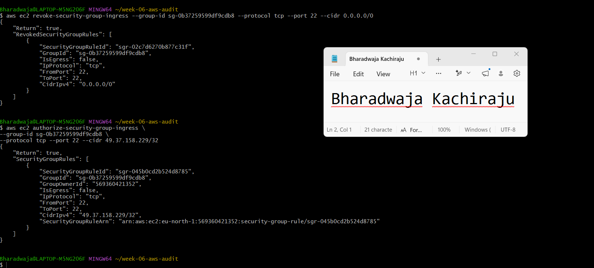

---

#### Screenshot 13 — Rerun of `./scripts/aws-audit.sh` showing the finding is now PASS

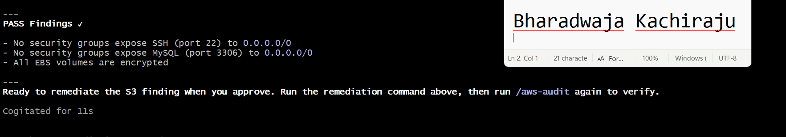

---

### Notes You Must Write (Very Important)

**1. Which exact finding did you fix, and what command did you run?**

I fixed the EC2 Security Group finding that allowed SSH (port 22) access from 0.0.0.0/0. First, I removed the open SSH rule Then, I added a new SSH rule restricted to my own public IP address

**2. Why did you scope the new rule to your own IP address instead of leaving it open to `0.0.0.0/0`?**

I scoped the rule to my own IP address using /32 so that only my specific IP address can connect to SSH on port 22. Leaving it open to 0.0.0.0/0 would allow connection attempts from anywhere on the internet, increasing the security risk.

**3. Did Claude execute the remediation command, or did you? Why does that matter?**

I executed the remediation commands myself; Claude did not execute them. This matters because the workflow keeps the human in control of infrastructure changes. Claude can analyze the audit evidence and recommend a safe command, but the human must review, approve, and manually execute the change.

**4. Which phase of the Agentic Loop does the Bash script represent? Which phase does Claude's explanation represent? Which phase is you running the fix?**

Bash script: Gather phase — it collects read-only evidence from AWS.
Claude's explanation: Analyze phase — it analyzes the evidence, identifies risks, and recommends remediation.
Me running the fix: Human Act phase — I reviewed and manually executed the remediation command.

After this, rerunning the audit represents the Verify phase.

---

# LinkedIn Post (Required)

## Goal

Create a LinkedIn post including:

- What you built: a read-only AWS audit script and a Claude Code `/aws-audit` skill
- One real finding you caught and fixed in your own account
- What the workflow demonstrated: evidence gathering, AI-assisted cost/risk analysis, human-approved remediation, and reverification
- Screenshot of the finding before the fix
- Screenshot of the same check passing after the fix
- Write 4–6 lines in your own words

Suggested tags:

`#DMIByPravinMishra #AWS #AgenticAI #ClaudeCode #DevOps`

### Evidence

#### LinkedIn Post URL

Paste your LinkedIn post URL here:

https://www.linkedin.com/posts/bharadwaja-kachiraju-78a45598_ai-found-the-problem-i-fixed-it-that-share-7494252111912681473-vyIp/?utm_source=share&utm_medium=member_desktop&rcm=ACoAABS2KxoBOPNTBIxog_qhN1vz4HLYmnjgQPY

---

#### Screenshot of Published LinkedIn Post

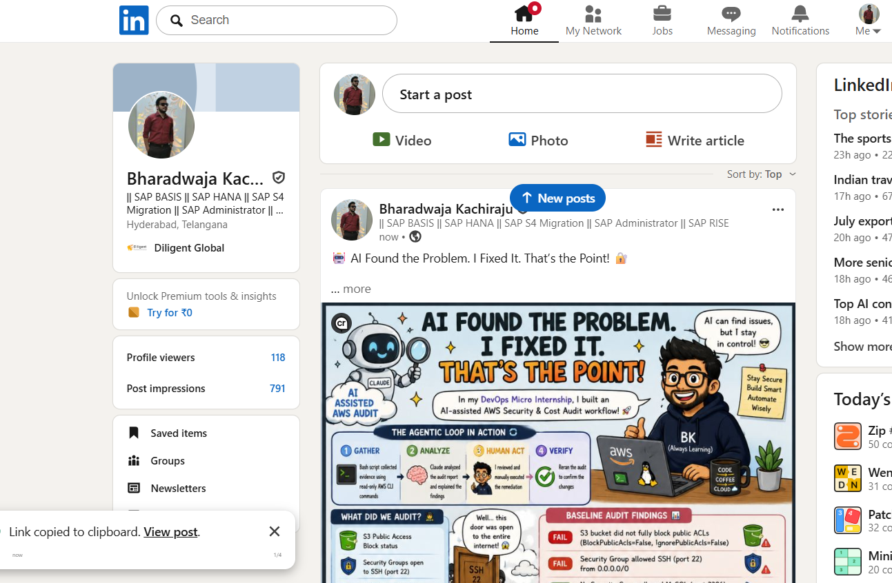

---

# Submission Instructions

Complete all tasks in sequence.

Your submission must include:

- All 13 required task screenshots
- Answers to every **Notes You Must Write** question
- `CLAUDE.md`
- `scripts/aws-audit.sh`
- `.claude/skills/aws-audit/SKILL.md`
- `reports/aws-audit-report.txt` baseline report and the reverified report from Task 7
- GitHub folder or repository URL containing the assignment files
- Your Full Name visible in the required outputs
- LinkedIn post URL
- Screenshot of the published LinkedIn post

Submit only a Google Doc link.

Add the GitHub URL inside the Google Doc.

Follow the Assignment Submission Guidelines.

---

# Completion Checklist

- [ ] Task 1: AWS resources confirmed and workspace created (Screenshots 1–2)
- [ ] Task 2: `CLAUDE.md` created with project context and safety rules (Screenshot 3)
- [ ] Task 3: Claude produced a read-only five-check audit plan before any script existed (Screenshot 4)
- [ ] Task 4: `aws-audit.sh` built, executable, and passes `bash -n` (Screenshots 5–7)
- [ ] Task 5: Baseline audit captured and saved with Full Name visible (Screenshots 8–9)
- [ ] Task 6: `/aws-audit` skill loads and runs successfully with no Write permission (Screenshots 10–11)
- [ ] Task 7: A real finding was fixed by you and reverified as PASS (Screenshots 12–13)
- [ ] Skill never executed a remediation command
- [ ] New security group rule is scoped to your own IP, not `0.0.0.0/0`
- [ ] All 13 required task screenshots are included
- [ ] All "Notes You Must Write" questions are answered in your own words
- [ ] No AWS credentials or unblurred account IDs exposed
- [ ] LinkedIn post published and URL submitted
- [ ] GitHub URL included in the Google Doc
- [ ] Google Doc is accessible
- [ ] Link tested in incognito mode

---

# Final Submission

Submit only your Google Doc link.

### Question

Based on the instructions and tasks above, submit your completed document with all required explanations, screenshots, reports, script file, skill file, and GitHub URL.

`Add your Google Doc link here`

---

## 📌 About DMI & CloudAdvisory

DevOps Micro Internship (DMI) is a project-based DevOps program run by Pravin Mishra (The CloudAdvisory) focused on real-world execution, systems thinking, and career readiness.

It helps learners build strong DevOps foundations with hands-on experience.

---

## 📌 Resources

- 🌐 DMI Official Website: https://dmi.pravinmishra.com?utm_source=github&utm_medium=readme  
- 🎓 University: https://university.pravinmishra.com?utm_source=github&utm_medium=readme  
- 💬 Discord Community: https://discord.pravinmishra.com?utm_source=github&utm_medium=readme  
- 📝 Blog: https://dmi.pravinmishra.com/blog?utm_source=github&utm_medium=readme  
- ▶️ YouTube Playlist: https://www.youtube.com/playlist?list=PLFeSNDtI4Cho  
- 🔗 Pravin Mishra (LinkedIn): https://www.linkedin.com/in/pravin-mishra-aws-trainer/  
- 🏢 CloudAdvisory (LinkedIn): https://www.linkedin.com/company/thecloudadvisory/

---

*This submission is part of DevOps Micro Internship (DMI) Cohort 3 — Agentic AI Track.*