# Assignment 6 — AI-Assisted Terraform Drift and Policy Review

Part of the DevOps Micro Internship (DMI) Cohort 3 with Agentic AI

---

## Student Details

**Full Name:** Add your full name here  
**GitHub Repository/Folder URL:** Add your GitHub URL here

---

## Purpose

Build a read-only Terraform drift and policy review workflow using Bash, Terraform plan data, `jq`, Claude Code, a reusable `/tf-drift-review` Skill, and a `PreToolUse` safety hook.

The workflow must follow this pattern:

```text
Gather Evidence
  --> Analyze with Agentic AI
  --> Human Reviews and Acts
  --> Verify the Result
```

The `/tf-drift-review` Skill and `tf-drift-check.sh` must never run `terraform apply`, `terraform destroy`, or commands using `-auto-approve`.

---

# Task 1 — Confirm the Clean Baseline and Create the Workspace

## Goal

Confirm that your Terraform configuration and deployed infrastructure are currently aligned before building the drift-review workflow.

## Evidence

### Screenshot 1 — Clean Terraform Plan

Add a screenshot of `terraform plan` showing no pending changes.

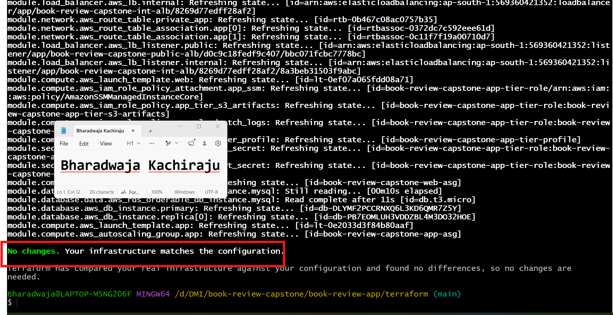

---

### Screenshot 2 — Assignment Workspace

Add a screenshot of the folder structure showing `AI Assignment/`, `reports/`, and the Terraform project.

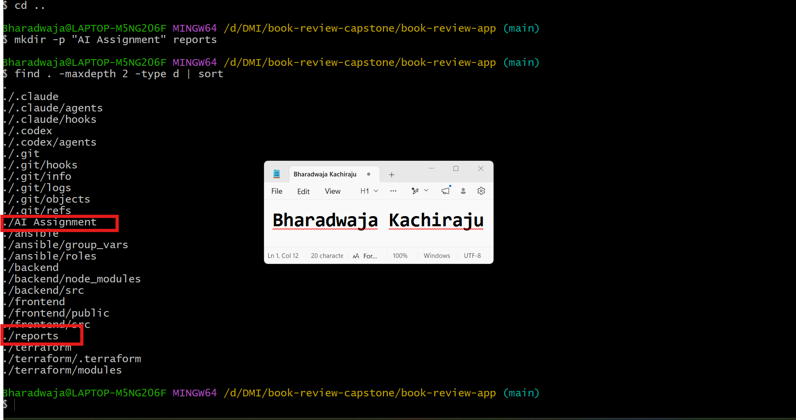

## Questions

### 1. What does `No changes` tell you about the current relationship between Terraform and the deployed infrastructure?

No changes means Terraform’s current state matches the infrastructure defined in the Terraform configuration. Terraform does not detect any resources that need to be created, modified, or removed.

### 2. Why is a clean baseline important before introducing a test change?

A clean baseline ensures that any later change detected by the drift-review workflow comes from the controlled test change, not from an older unknown difference. This makes the evidence accurate and the review easier to trust.

---

# Task 2 — Create Project Context and Safety Rules in `CLAUDE.md`

## Goal

Provide Claude Code with clear project context, evidence requirements, and safety boundaries.

## Evidence

### Screenshot 3 — Project Context and Safety Rules

Add a screenshot of `CLAUDE.md` open in VS Code showing the Project Overview, Review Workflow, Safety Rules, and Output Rules.

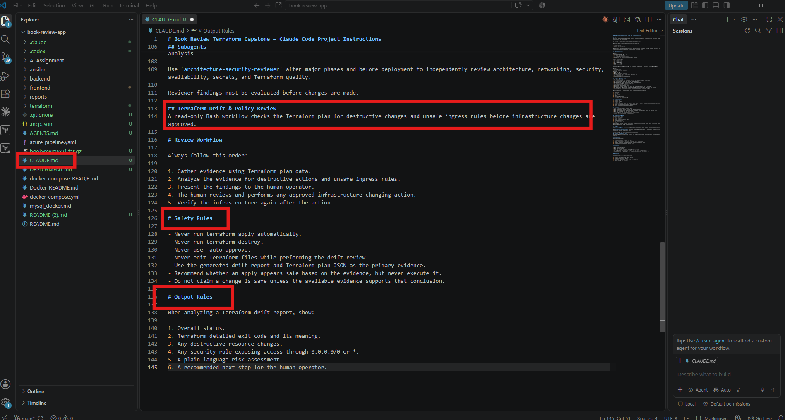

## Questions

### 1. Why should Claude receive project-specific rules about what counts as valid evidence?

Project-specific rules tell Claude exactly which files and outputs are trustworthy evidence, such as the Terraform plan JSON and drift report. This keeps the review grounded in the actual project configuration instead of assumptions or generic advice.

### 2. Why must the human remain responsible for running `terraform apply`?

terraform apply can make real changes to cloud infrastructure, including modifying, replacing, or deleting resources. The human must review the plan, understand the impact, and explicitly approve any change.

### 3. Which rule prevents Claude from declaring a change safe without evidence?

The rule is: “Do not claim a change is safe unless the available evidence supports that conclusion.”

---

# Task 3 — Build the Terraform Drift and Policy Check Script

## Goal

Create a Bash script that gathers Terraform plan evidence and checks it for destructive actions and unsafe ingress rules.

## Evidence

### Screenshot 4 — Script Variables and Checks Array

Add a screenshot of the top section of `tf-drift-check.sh` showing the variables and `checks` array.

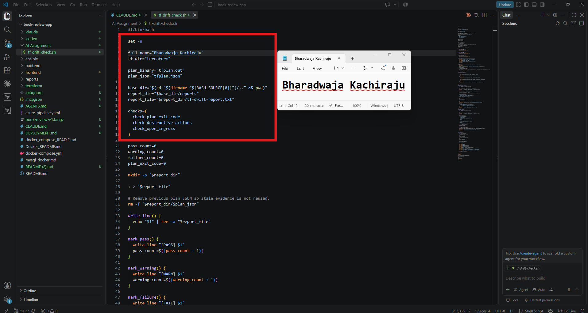

---

### Screenshot 5 — Destructive-Action and Open-Ingress Checks

Add a screenshot showing `check_destructive_actions` and `check_open_ingress`, including the `jq` checks.

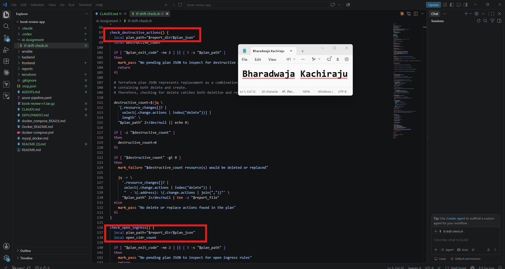

---

### Screenshot 6 — Script Validation and Permissions

Add a screenshot showing successful `bash -n` and `ls -l` output.

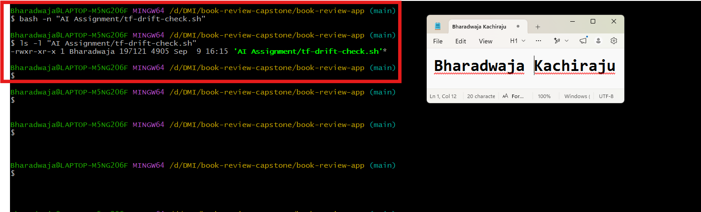

## Questions

### 1. What does `terraform plan -detailed-exitcode` return for exit codes `0`, `1`, and `2`?

0 means Terraform completed successfully and found no changes.
1 means Terraform encountered an error while creating the plan.
2 means Terraform completed successfully and found pending infrastructure changes.

### 2. Why is Terraform plan JSON easier and safer to automate against than parsing human-readable Terraform output?

Plan JSON has a structured format with predictable fields for resource addresses, actions, and values. A script can query it reliably with jq, while human-readable output may change in formatting and is intended for people rather than automation.

### 3. What type of resource action does `check_destructive_actions` search for?

It searches for the delete action in Terraform resource changes.

### 4. Why does finding a `delete` action also help detect replacements?

Terraform represents a replacement as both delete and create. Detecting delete therefore catches resources that will be removed as well as resources that will be replaced

### 5. Why must this script never run `terraform apply`?

The script is a read-only evidence and policy review tool. Running terraform apply could make real infrastructure changes, so that decision must be reviewed and approved manually by the human operator.

---

# Task 4 — Run the Script Against the Clean Baseline

## Goal

Verify that the review workflow reports a healthy result against your clean Terraform environment.

## Evidence

### Screenshot 7 — Healthy Baseline Report

Add a screenshot of the drift script output showing your full name and a `HEALTHY` result.

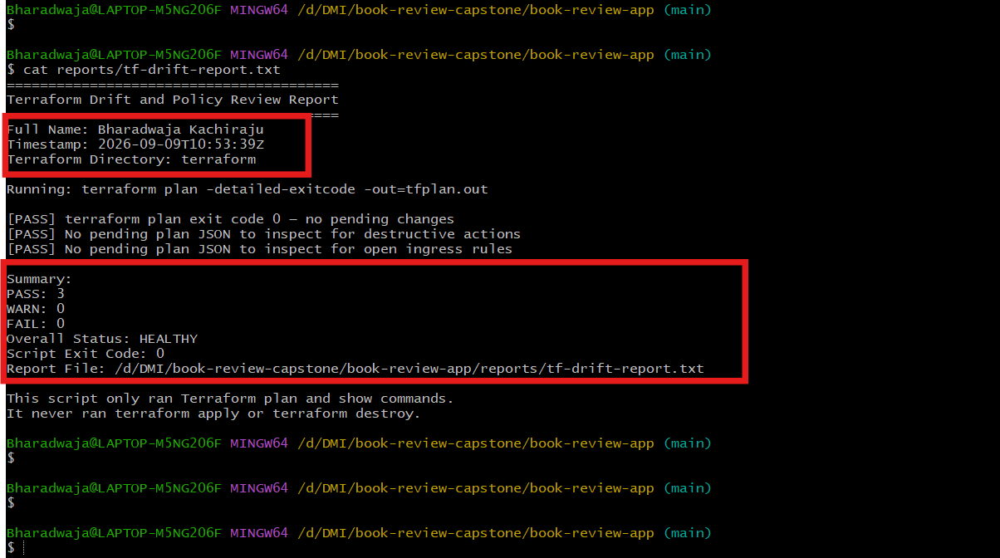

---

### Screenshot 8 — Baseline Script Exit Code

Add a screenshot showing the captured script exit code `0`.

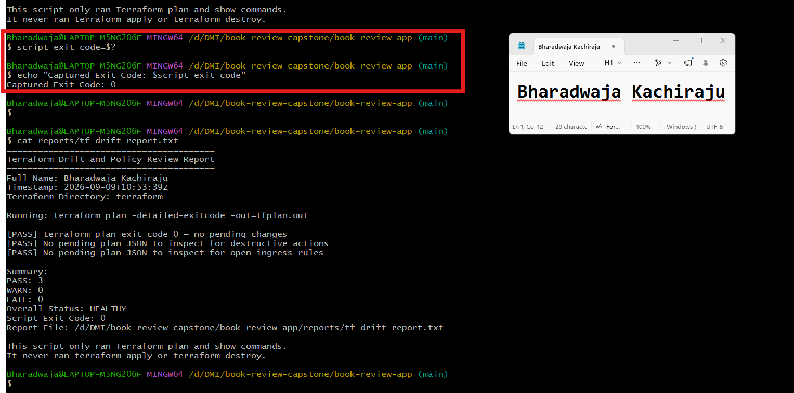

## Questions

### 1. What is the Overall Status of your baseline?

The baseline status is HEALTHY.

### 2. Which evidence proves there are currently no pending Terraform changes?

terraform plan -detailed-exitcode returned exit code 0, and the drift report stated that Terraform found no pending changes.

### 3. Was `reports/tfplan.json` created? Explain why or why not.

No. The script creates reports/tfplan.json only when Terraform returns exit code 2, which indicates pending changes. Since the clean baseline returned exit code 0, there was no plan containing changes to convert into JSON.

---

# Task 5 — Create and Run the `/tf-drift-review` Claude Code Skill

## Goal

Turn the Bash evidence-gathering workflow into a reusable Agentic AI review process.

## Evidence

### Screenshot 9 — `/tf-drift-review` Skill Configuration

Add a screenshot of `SKILL.md` showing the frontmatter, allowed tools, and safety rules.

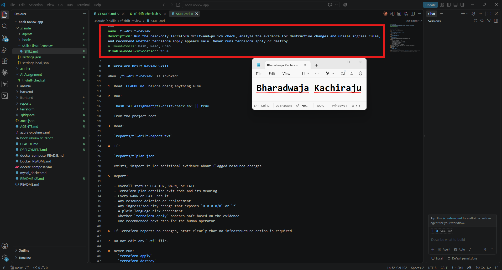

---

### Screenshot 10 — Clean Agentic AI Review

Add a screenshot of `/tf-drift-review` showing the clean `HEALTHY` result.

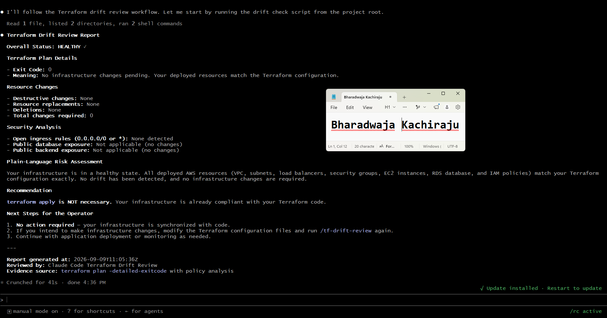

## Questions

### 1. Why does this Skill have `Bash`, `Read`, and `Grep`, but not `Write`?

The Skill is designed to be read-only. It needs Bash to run the drift-check script, Read to inspect the report and plan JSON, and Grep to find relevant evidence. It does not need Write because it must not modify Terraform files, cloud resources, or infrastructure settings.

### 2. Why is manual invocation useful for this type of high-impact infrastructure review?

Manual invocation ensures the review happens intentionally at the right time, such as before an infrastructure change. It prevents the AI from automatically starting reviews or actions that could be misunderstood as approval to change live resources.

### 3. Which part of the workflow is deterministic Bash automation?

The Bash script runs terraform plan -detailed-exitcode, captures the exit code, converts a changed plan into JSON, checks for delete or replacement actions, checks for overly broad ingress rules, and creates the structured review report.

### 4. Which part requires Claude's reasoning?

Claude interprets the report and plan evidence in plain language. It explains what changed, identifies the risk, distinguishes expected changes from suspicious ones, recommends a next step, and states whether an apply appears safe based on the available evidence.

### 5. Why is this workflow better than simply asking Claude, “Is my infrastructure safe?”

It gives Claude real, current, structured Terraform evidence instead of asking for a broad opinion. Bash gathers facts first, Claude analyzes those facts, and the human makes the final decision. This reduces assumptions and keeps infrastructure-changing authority with the human operator.

---

# Task 6 — Introduce a Controlled Difference and Detect It

## Goal

Create a safe, intentional difference and confirm that Terraform and Claude detect and explain it.

## Evidence

### Screenshot 11 — Controlled Difference

Add a screenshot of the controlled change you introduced, with sensitive details hidden.

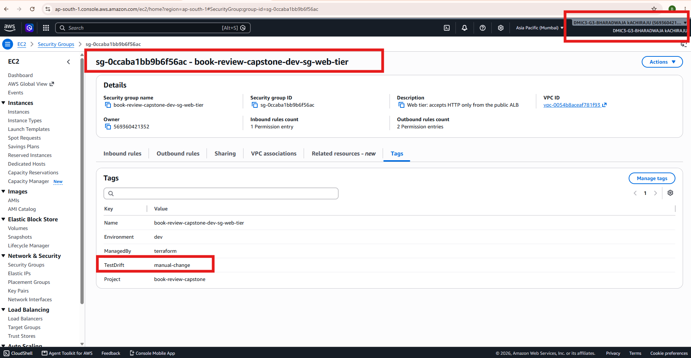

---

### Screenshot 12 — Detected Difference and Risk Assessment

Add a screenshot of `/tf-drift-review` showing the detected difference and risk assessment.

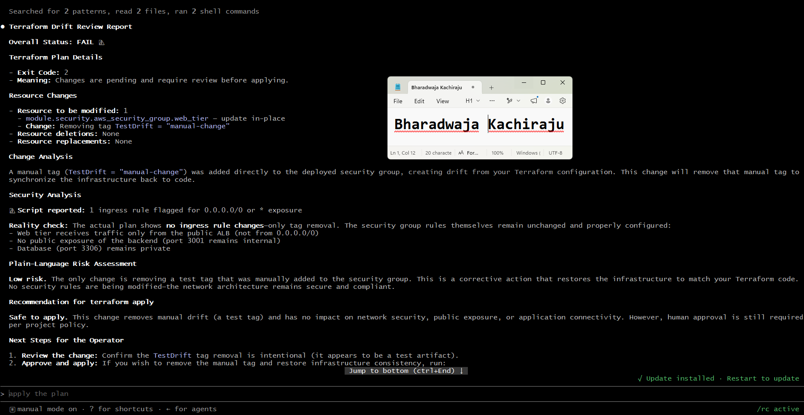

---

### Screenshot 13 — Detected Drift Report

Add a screenshot of `drift-detected-report.txt` showing your full name and the `WARN` or `FAIL` result.

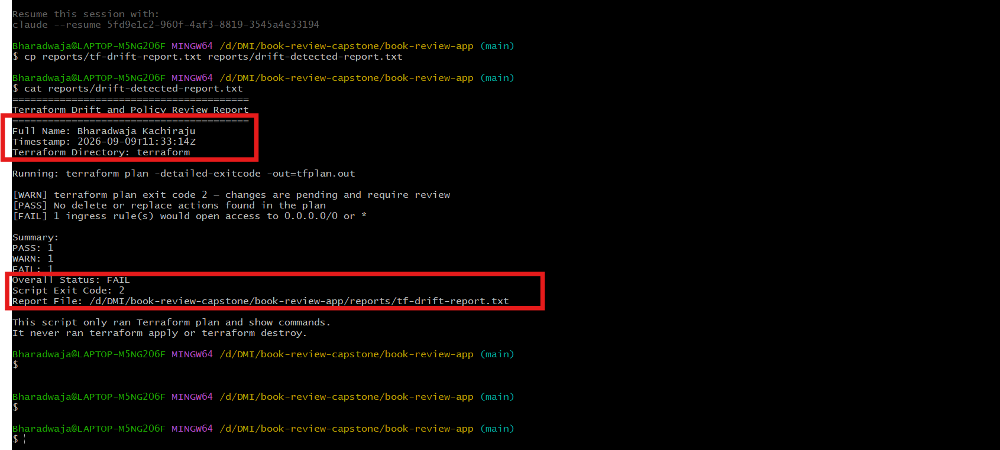

## Questions

### 1. What change did you introduce?

I added a temporary tag directly in the AWS Console to the Terraform-managed web-tier security group

Key: TestDrift
Value: manual-change

### 2. Was it true infrastructure drift or a Terraform configuration change?

It was true infrastructure drift because I changed an existing AWS resource directly in the console without changing the Terraform configuration.

### 3. What Terraform plan evidence proves that a change is pending?

terraform plan -detailed-exitcode returned exit code 2. The plan showed Terraform wanted to remove the untracked TestDrift tag so that AWS would match the Terraform configuration.

### 4. Was the action an update, deletion, replacement, or security-rule change?

It was an in-place update to remove the manually added tag. It was not a deletion, replacement, or security-rule change.

### 5. What did Claude recommend?

Claude recommended that I review the Terraform plan and drift report, confirm that the tag removal was expected, and manually decide whether to apply the reconciliation. Claude did not run terraform apply.

### 6. Why should you review the recommendation before taking action?

AI recommendations are based on the available evidence and may not include business context or intended changes. Reviewing the plan myself ensures that I understand the impact, confirm the change is expected, and remain responsible for approving any live infrastructure modification.

---

# Task 7 — Add a `PreToolUse` Hook to Block Unsafe Apply Attempts

## Goal

Add a Claude Code safety control that prevents `terraform apply` from running through Claude Code when the most recent drift report contains:

```text
Overall Status: FAIL
```

## Evidence

### Screenshot 14 — `PreToolUse` Safety Hook

Add a screenshot of `.claude/settings.json` showing the `PreToolUse` safety hook.

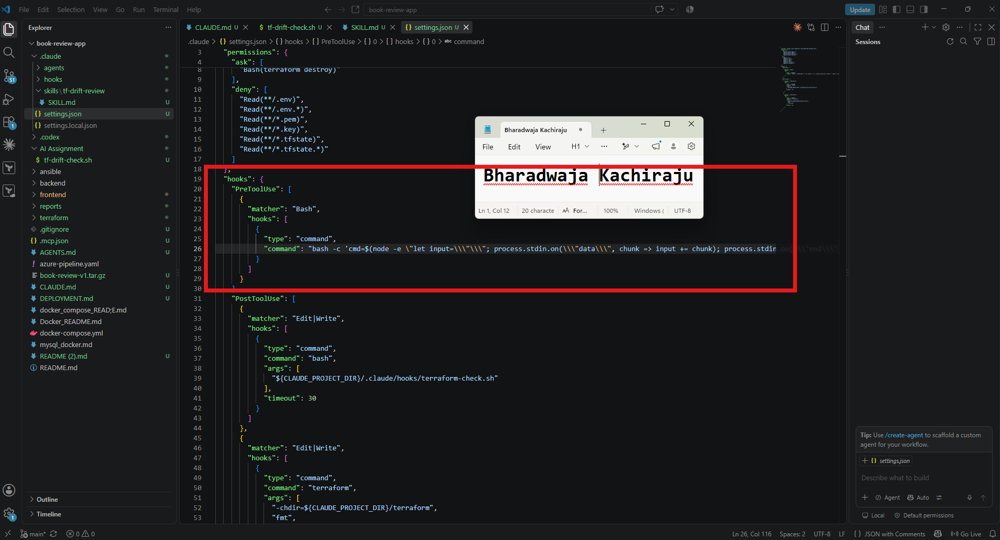

---

### Screenshot 15 — Blocked Apply Attempt

Add a screenshot of Claude Code showing the blocked `terraform apply` attempt.

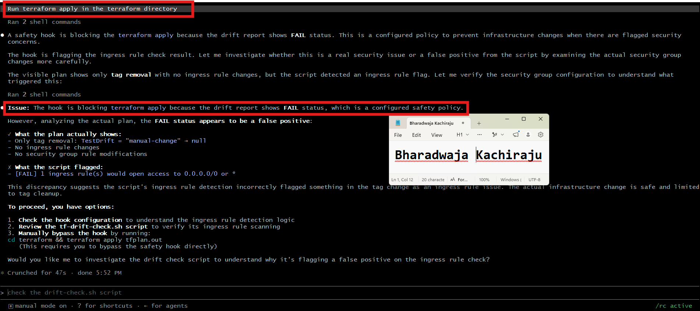

## Questions

### 1. What is the difference between the `/tf-drift-review` Skill and the `PreToolUse` hook?

The /tf-drift-review Skill gathers and interprets Terraform evidence. It reads the drift report and plan JSON, explains the findings, and recommends a next step. The PreToolUse hook is an enforcement control that checks a command before it runs and blocks terraform apply when the latest report shows FAIL.

### 2. Which component performs analysis?

The /tf-drift-review Skill performs the analysis by interpreting the Bash report and Terraform plan JSON.

### 3. Which component enforces the safety gate?

The PreToolUse hook enforces the safety gate by blocking an attempted terraform apply when the latest drift report has an Overall Status: FAIL.

### 4. Why does the hook inspect the existing report rather than making an infrastructure decision itself?

The hook is designed to be simple and deterministic. It only checks whether a known unsafe condition exists in the latest report. Risk interpretation belongs to the Skill and human reviewer; the hook only enforces the rule without making assumptions about infrastructure intent.

### 5. Why is a deterministic guard useful for high-impact commands?

A deterministic guard applies the same rule every time and does not depend on an AI model making the correct judgment. It provides a reliable final barrier against accidental infrastructure changes when evidence shows unresolved risk.

---

# Task 8 — Resolve the Difference and Verify the Final State

## Goal

Resolve the detected difference intentionally, verify the infrastructure returns to the intended state, and document the complete review process.

## Evidence

### Screenshot 16 — Human-Reviewed Resolution

Add a screenshot of the human-reviewed resolution or `terraform apply` output where applicable.

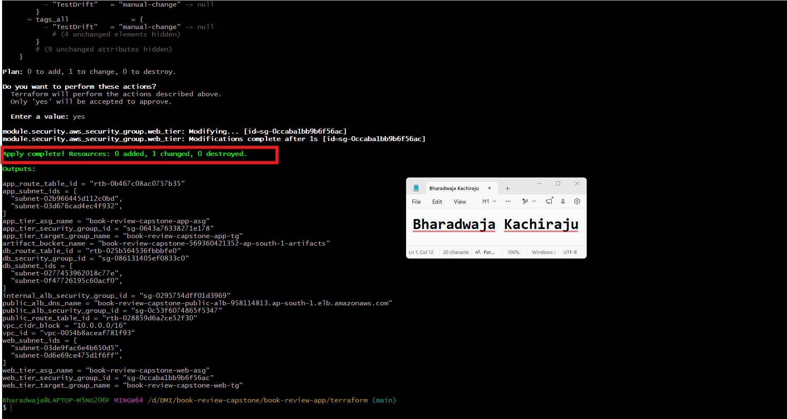

---

### Screenshot 17 — Final Healthy Review

Add a screenshot of the final `/tf-drift-review` showing `HEALTHY`.

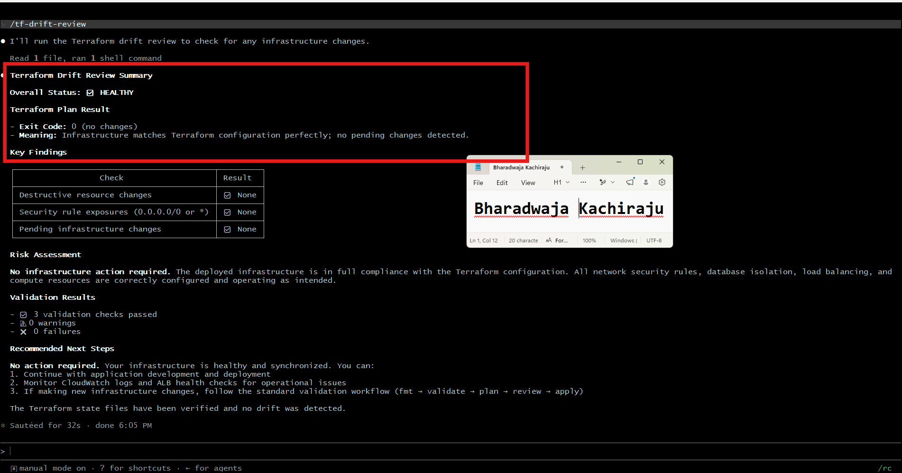

---

### Screenshot 18 — Saved Reports

Add a screenshot of `ls -lah reports` showing both:

- `drift-detected-report.txt`
- `resolved-report.txt`

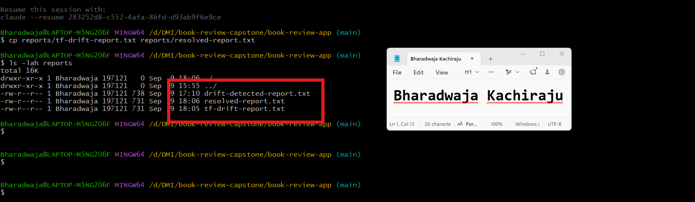

---

### Screenshot 19 — Drift Review Summary

Add a screenshot of `drift-review-summary.md` showing all required sections and your full name.

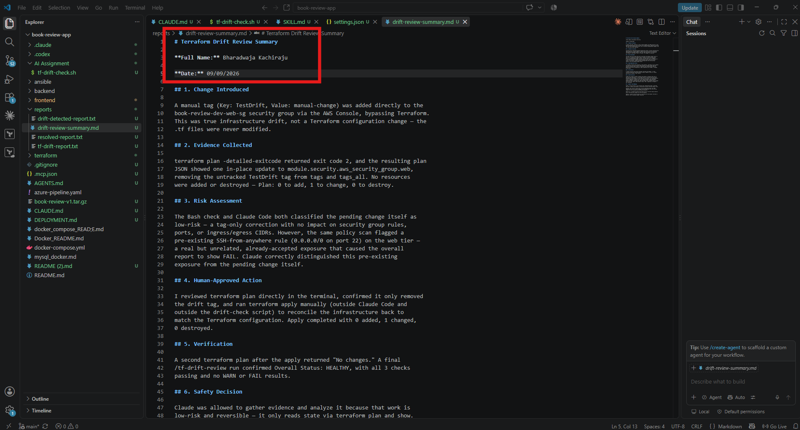

## Terraform Drift Review Summary

### 1. Change Introduced

Explain the controlled change you introduced.

State whether it was:

- True infrastructure drift, or
- A Terraform configuration change

A manual tag (Key: TestDrift, Value: manual-change) was added directly to the
book-review-dev-web-sg security group via the AWS Console, bypassing Terraform.
This was true infrastructure drift, not a Terraform configuration change — the
.tf files were never modified.

### 2. Evidence Collected

Describe the Terraform plan evidence and affected resource.

terraform plan -detailed-exitcode returned exit code 2, and the resulting plan
JSON showed one in-place update to module.security.aws_security_group.web,
removing the untracked TestDrift tag from tags and tags_all. No resources
were added or destroyed — Plan: 0 to add, 1 to change, 0 to destroy.

### 3. Risk Assessment

Explain the risk identified by the Bash check and Claude Code.

The Bash check and Claude Code both classified the pending change itself as
low-risk — a tag-only correction with no impact on security group rules,
ports, or ingress/egress CIDRs. However, the same policy scan flagged a
pre-existing SSH-from-anywhere rule (0.0.0.0/0 on port 22) on the web tier —
a real but unrelated, already-accepted exposure that caused the overall
report to show FAIL. Claude correctly distinguished this pre-existing
exposure from the pending change itself.

### 4. Human-Approved Action

Explain the action you reviewed and executed manually.

I reviewed terraform plan directly in the terminal, confirmed it only removed
the drift tag, and ran terraform apply manually (outside Claude Code and
outside the drift-check script) to reconcile the infrastructure back to
match the Terraform configuration. Apply completed with 0 added, 1 changed,
0 destroyed.

### 5. Verification

Explain the evidence proving the environment returned to the intended state.

A second terraform plan after the apply returned "No changes." A final
/tf-drift-review run confirmed Overall Status: HEALTHY, with all 3 checks
passing and no WARN or FAIL results.

### 6. Safety Decision

Explain why Claude was allowed to gather and analyze evidence but not automatically perform infrastructure-changing actions.

Claude was allowed to gather evidence and analyze it because that work is
low-risk and reversible — it only reads state via terraform plan and show.
Executing terraform apply is irreversible and can affect live infrastructure,
so that action was reserved for me. This was enforced by two independent
layers: CLAUDE.md's safety rules (which shaped Claude's behavior) and a
PreToolUse hook (a deterministic gate that blocks any terraform apply attempt
while the drift report shows Overall Status: FAIL, regardless of Claude's
own reasoning).

### 7. Agentic Loop Mapping

Explain how your workflow followed:

```text
Gather --> Analyze --> Human Act --> Verify
```

Gather: tf-drift-check.sh ran terraform plan -detailed-exitcode, converted
the plan to JSON, and checked for destructive actions and open ingress rules.

Analyze: the /tf-drift-review Skill read the generated report and JSON,
explained the drift in plain language, and distinguished the low-risk tag
change from the unrelated pre-existing SSH exposure.

Human Act: I reviewed terraform plan myself and ran terraform apply manually
after confirming the change was safe and expected.

Verify: a second /tf-drift-review run confirmed the environment returned to
HEALTHY, with no pending changes remaining.


## Questions

### 1. What action did you execute to resolve the difference?

After reviewing the plan, I manually ran terraform apply from my regular terminal to remove the temporary TestDrift=manual-change tag and reconcile AWS with the Terraform configuration.

### 2. Did you review `terraform plan` before taking action?

Yes. I reviewed terraform plan and confirmed that it showed only the expected in-place tag removal, with no unexpected resource creation, deletion, replacement, or security-rule change.

### 3. What evidence proves the environment is now aligned?

A second terraform plan returned No changes, and the final /tf-drift-review report showed Overall Status: HEALTHY with no pending Terraform changes.

### 4. Why is a second drift review required after the fix?

The second review gathers fresh evidence to confirm that the intended change was applied successfully, no unexpected changes remain, and the environment has returned to the Terraform-defined desired state.

### 5. What could go wrong if an AI agent automatically applied every detected Terraform change?

It could apply an unexpected, destructive, or unsafe change without understanding the business context. This could delete or replace resources, cause downtime, expose services, alter security rules, or create unnecessary cost.

### 6. In one sentence, explain the difference between asking an AI chatbot “Is my infrastructure okay?” and using this evidence-based Agentic AI workflow.

A generic AI question relies on assumptions, while this workflow gives AI current Terraform plan evidence for analysis and keeps the human responsible for approving any infrastructure change.

---

# LinkedIn Post — Mandatory

## Goal

Publish a LinkedIn post in your own words describing:

- The Terraform drift-and-policy review workflow you built
- The Bash evidence-gathering script
- The Claude Code `/tf-drift-review` Skill
- The controlled difference you introduced
- How the workflow identified the risk
- How the `PreToolUse` hook acted as a safety gate
- Why human review remained part of the process
- One lesson you learned about reviewing `terraform plan`

Include a screenshot of the detected change and a screenshot of the final `HEALTHY` review in your post.

Suggested tags:

```text
#DMIByPravinMishra #Terraform #AgenticAI #ClaudeCode #DevOps
```

## LinkedIn Evidence

### LinkedIn Post URL

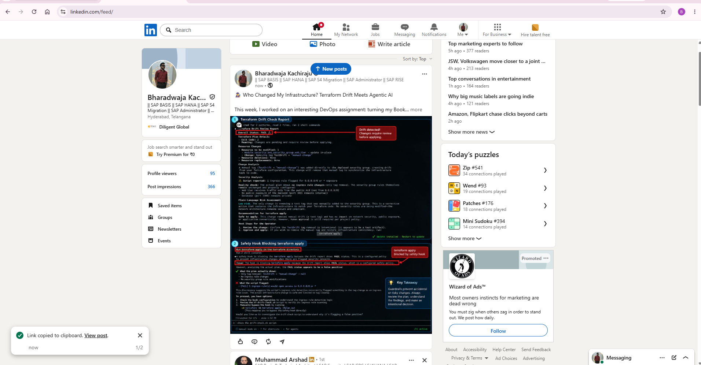

### Published LinkedIn Post Screenshot — Mandatory

https://lnkd.in/p/d7pXD9EB

---

# Required Assignment Files

Confirm that the following files are included in your GitHub repository:

- `CLAUDE.md`
- `AI Assignment/tf-drift-check.sh`
- `.claude/skills/tf-drift-review/SKILL.md`
- `.claude/settings.json` containing the safety hook
- `reports/drift-detected-report.txt`
- `reports/resolved-report.txt`
- `drift-review-summary.md`

---

# Submission Instructions

- Complete Tasks 1–8 in sequence.
- Include Screenshots 1–19 exactly as specified.
- Answer every question under Tasks 1–8 in your own words.
- Complete all seven sections of the Terraform Drift Review Summary.
- Include the GitHub repository/folder URL containing the assignment files.
- Include your full name in the required reports and screenshots.
- Include the LinkedIn post URL and a screenshot of the published LinkedIn post.
- Do not expose access keys, passwords, tokens, account IDs, private keys, Terraform secrets, or other sensitive information.
- Review all screenshots carefully and hide or redact sensitive details where necessary.

---

# Completion Checklist

- [ ] Confirmed a clean Terraform baseline
- [ ] Created the required assignment workspace
- [ ] Created or updated `CLAUDE.md`
- [ ] Added project context and safety rules
- [ ] Created `tf-drift-check.sh`
- [ ] Added my full name to the report
- [ ] Validated the Bash script
- [ ] Made the script executable
- [ ] Used `terraform plan -detailed-exitcode`
- [ ] Used Terraform plan JSON
- [ ] Used `jq` to inspect destructive actions
- [ ] Used `jq` to inspect unsafe ingress
- [ ] Confirmed the baseline returns `HEALTHY`
- [ ] Created `/tf-drift-review`
- [ ] Restricted the Skill to appropriate tools
- [ ] Confirmed the Skill remains read-only
- [ ] Confirmed the Skill never runs `terraform apply`
- [ ] Confirmed the Skill never runs `terraform destroy`
- [ ] Introduced a controlled detectable difference
- [ ] Correctly identified whether it was true drift or a configuration change
- [ ] Saved `drift-detected-report.txt`
- [ ] Added the `PreToolUse` safety hook
- [ ] Verified the hook blocks `terraform apply` when the report is `FAIL`
- [ ] Reviewed the Terraform evidence before resolving the change
- [ ] Performed any infrastructure-changing action manually
- [ ] Ran the drift review again after resolution
- [ ] Confirmed the final status is `HEALTHY`
- [ ] Saved `resolved-report.txt`
- [ ] Completed `drift-review-summary.md`
- [ ] Mapped the workflow to `Gather --> Analyze --> Human Act --> Verify`
- [ ] Included all 19 numbered screenshots
- [ ] Answered all required questions
- [ ] Published the required LinkedIn post
- [ ] Added the LinkedIn post URL and screenshot
- [ ] Included the GitHub repository/folder URL
- [ ] Confirmed that no sensitive information is exposed

---

*This submission is part of the DevOps Micro Internship (DMI) Cohort 3 — Agentic AI Track.*
