# Assignment 03 — Deploy a Static Website to Multiple Servers Using a Multi-Play Ansible Playbook

Part of the DevOps Micro Internship (DMI) Cohort 3 with Agentic AI

---

## Student Details

**Full Name:** Bharadwaja Kachiraju 
**Cloud Platform Used:** Azure  
**Server 1 URL:** http://172.198.64.104 
**Server 2 URL:** http://172.198.70.96

---

## Purpose

In this assignment, you will create a multi-play Ansible playbook to install Nginx, deploy a static website to two Ubuntu servers, and verify that the website is accessible from both servers.

You may use either AWS EC2 instances or Azure Virtual Machines as your managed servers.

---

# Task 1 — Create the Project Structure

## Goal

Create the required folders and files for the Ansible project.

## Evidence

### Screenshot 1 — Terminal or VS Code showing the complete `static-web` project structure

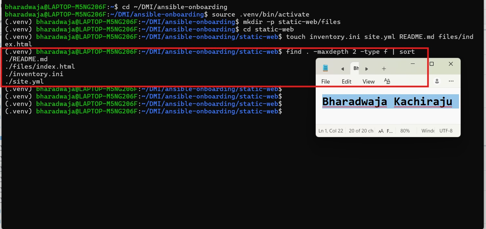

---

# Task 2 — Configure the Ansible Inventory

## Goal

Add both Ubuntu servers to the Ansible inventory.

## Evidence

### Screenshot 2 — Output of `ansible-inventory -i inventory.ini --graph` showing `web1` and `web2`

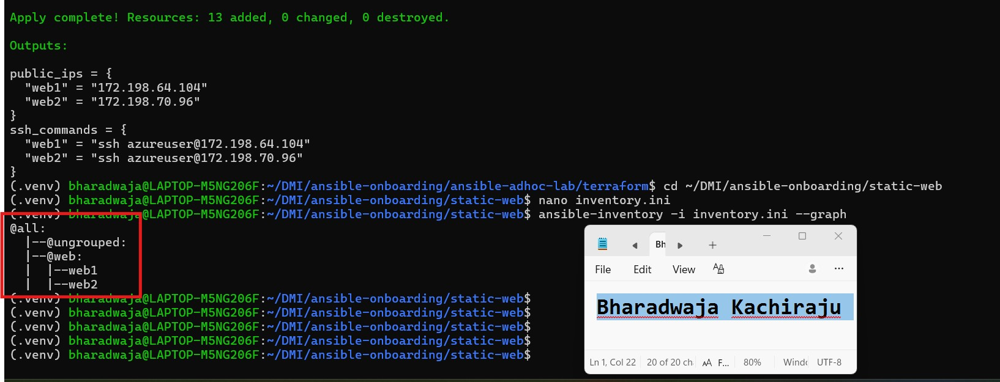

---

## Configuration File

Copy and paste the complete contents of your `inventory.ini` file below:

```
[web]
web1 ansible_host=172.198.64.104
web2 ansible_host=172.198.70.96

[web:vars]
ansible_user=azureuser
ansible_ssh_private_key_file=/home/bharadwaja/.ssh/id_ed25519

```

---

# Task 3 — Verify Ansible Connectivity

## Goal

Confirm that the Ansible controller can connect to both servers.

## Evidence

### Screenshot 3 — Ansible ping output showing `SUCCESS` and `pong` for both servers

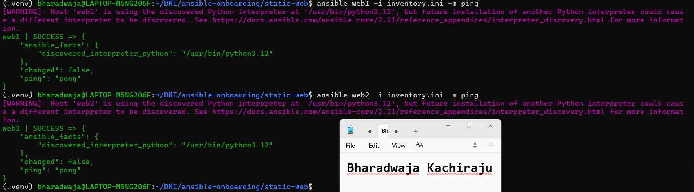

---

# Task 4 — Download and Personalize the Static Website

## Goal

Download `index.html` to the Ansible controller and personalize the website with your full name.

## Evidence

### Screenshot 4 — Edited `files/index.html` showing the footer line with your full name

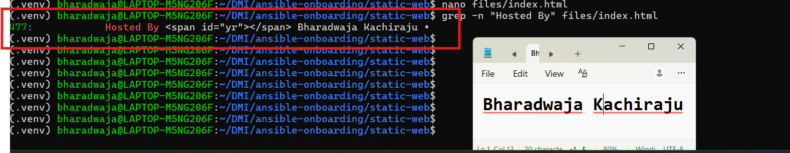

---

# Task 5 — Create the Multi-Play Ansible Playbook

## Goal

Create a single Ansible playbook containing separate plays for installation, deployment, and verification.

## Configuration File

Copy and paste the complete contents of your `site.yml` file below:

---
- name: Install and configure Nginx
  hosts: web
  become: true
  tasks:
    - name: Update the APT package cache
      ansible.builtin.apt:
        update_cache: true

    - name: Install Nginx
      ansible.builtin.apt:
        name: nginx
        state: present

    - name: Start and enable Nginx
      ansible.builtin.service:
        name: nginx
        state: started
        enabled: true

- name: Deploy the static website
  hosts: web
  become: true
  tasks:
    - name: Copy index.html to the web root
      ansible.builtin.copy:
        src: files/index.html
        dest: /var/www/html/index.html
        owner: www-data
        group: www-data
        mode: "0644"
      notify: Reload nginx

  handlers:
    - name: Reload nginx
      ansible.builtin.service:
        name: nginx
        state: reloaded

- name: Verify both websites from the controller
  hosts: localhost
  connection: local
  gather_facts: false
  become: false
  tasks:
    - name: Send an HTTP GET request to each web server
      ansible.builtin.uri:
        url: "http://{{ hostvars[item].ansible_host }}"
        status_code: 200
      loop: "{{ groups['web'] }}"
      register: website_checks

    - name: Confirm each server returned HTTP 200
      ansible.builtin.assert:
        that:
          - item.status == 200
        success_msg: "{{ item.item }} returned HTTP {{ item.status }}"
      loop: "{{ website_checks.results }}"
---

# Task 6 — Validate the Playbook Syntax

## Goal

Check the playbook for YAML or Ansible syntax errors before running it.

## Evidence

### Screenshot 5 — Successful syntax-check output showing `playbook: site.yml`

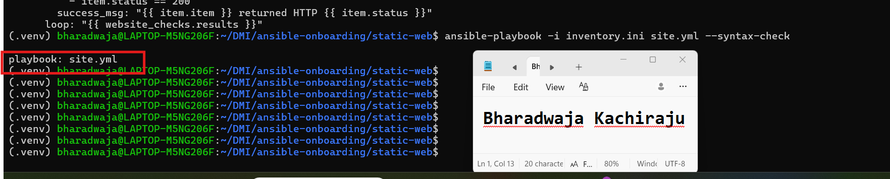

---

# Task 7 — Run the Multi-Play Playbook

## Goal

Install Nginx, deploy the website, and verify both servers in one playbook run.

## Evidence

### Screenshot 6 — Play 3 verification showing HTTP `200` for both servers

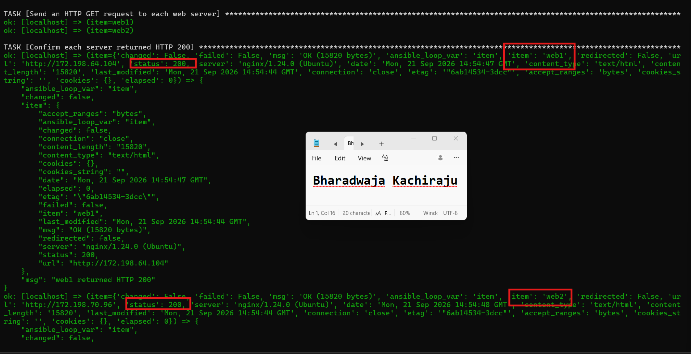

---

### Screenshot 7 — Final play recap showing `unreachable=0` and `failed=0` for `web1`, `web2`, and `localhost`


---

# Task 8 — Verify Idempotency

## Goal

Run the playbook again and confirm that it does not make unnecessary changes.

## Evidence

### Screenshot 8 — Second playbook run showing the play recap with `changed=0`, `unreachable=0`, and `failed=0` for both web servers

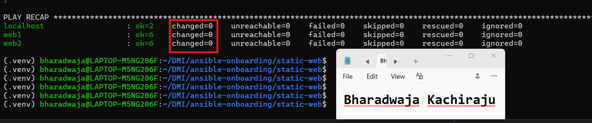

---

# Task 9 — Test Both Websites Manually

## Goal

Confirm that the static website is accessible from both public IP addresses.

## Evidence

### Screenshot 9 — `curl -I` output showing HTTP `200 OK` from both servers

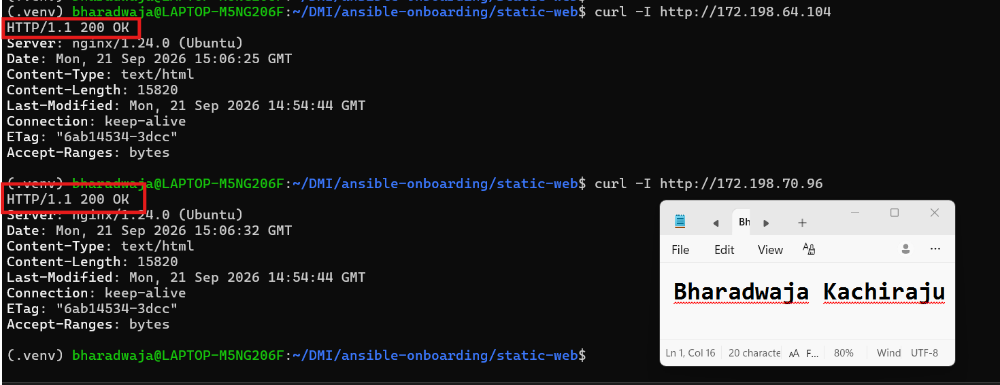

---

### Screenshot 10 — Browser showing the website from Server 1 with the public IP and your full name visible

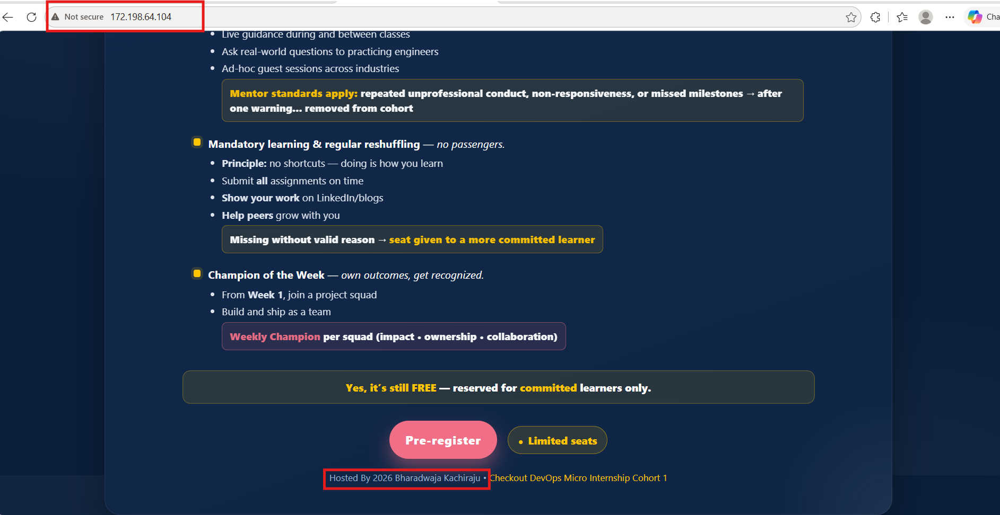

---

### Screenshot 11 — Browser showing the website from Server 2 with the public IP and your full name visible

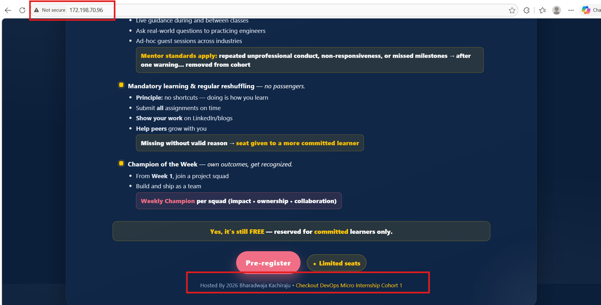

---

## Website URLs

Add both deployed website URLs below:

```
Server 1: http://172.198.64.104
Server 2: http://172.198.70.96

```

---

# Task 10 — Complete the Project README

## Goal

Document how the project works and record what you learned.

## README Content

Copy and paste the complete contents of your `README.md` file below:


# Multi-Play Ansible Static Website Deployment

## Project Overview

This project deploys the same personalized static website to two Ubuntu web servers in Microsoft Azure. A multi-play Ansible playbook installs and configures Nginx, copies the website file to both servers, and verifies that both websites return HTTP status 200.

## Environment

- Cloud platform: Microsoft Azure
- Operating system: Ubuntu 24.04 LTS
- Number of managed servers: 2
- Web server: Nginx
- Ansible controller: Ubuntu WSL virtual environment

## How to Run the Playbook

ansible-playbook -i inventory.ini site.yml

## Issue Faced and Solution

Ansible initially failed to connect because host-key verification was enabled in the new project directory. I fixed the issue by creating a local `ansible.cfg` file with `host_key_checking = False`. After that, Ansible successfully connected to both web servers.

## What I Learned

I learned how to use a multi-play Ansible playbook to manage several servers with one automation file. I used the apt module to install packages, the service module to manage Nginx, the copy module to deploy a local website file, and the uri module to verify HTTP responses from the controller.

I also learned how Ansible inventory groups make it possible to target multiple web servers together and how handlers reload a service only when a managed file changes.

## Why Installation and Deployment Are Separate

Installing Nginx and deploying website content are separate tasks with different responsibilities. Nginx installation configures the server software, while website deployment updates the application content. Keeping them in different plays makes the playbook easier to maintain, test, reuse, and update.

## Benefit of the Ansible Copy Module

The Ansible copy module transfers the approved website file directly from the controller to each managed server. It compares the source and destination files and copies the file only when the content has changed. This makes deployments consistent and avoids unnecessary file transfers or service reloads.

---

# LinkedIn Post Required

## Evidence

### LinkedIn Post URL

Paste your LinkedIn post URL here:

https://lnkd.in/p/dzqBJZn9

---

### Screenshot — Published LinkedIn post

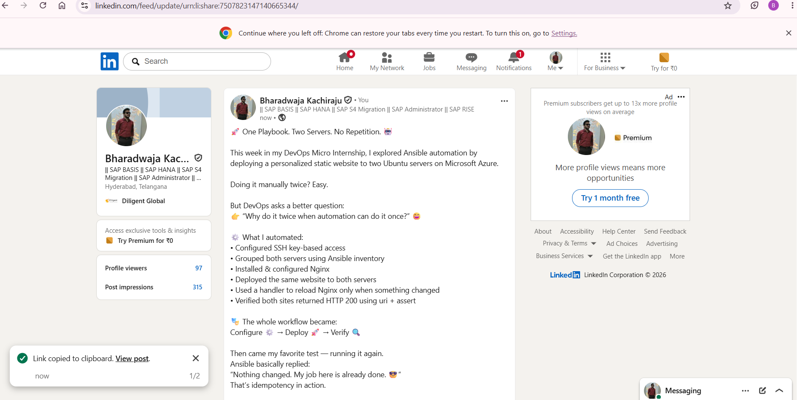

---

# Assignment Questions

Answer the following in your own words:

**1. What issue did you face while completing this assignment, and how did you fix it?**

I faced an SSH host-key verification error when Ansible tried to connect from the new static-web project directory. I fixed it by creating a local ansible.cfg file and setting host_key_checking = False for this temporary lab. After that, Ansible connected successfully to both web servers.

---

**2. What did you learn from this assignment?**

I learned how to manage two web servers through one Ansible inventory and deploy the same website to both servers with a multi-play playbook. I also learned how to install Nginx, copy a local HTML file, manage a service, use handlers, verify HTTP responses, and test idempotency.

---

**3. Why is it useful to split installation, deployment, and verification into separate plays?**

Separating these tasks makes the playbook easier to understand, test, maintain, and reuse. The installation play prepares the server, the deployment play manages website content, and the verification play confirms that the finished website works. Each play has one clear responsibility.

---

**4. What is one benefit of using the Ansible `copy` module instead of cloning the website directly from Git on every managed server?**

The copy module deploys the approved website file directly from the Ansible controller to every server. This keeps both servers consistent and avoids requiring Git, repository access, or separate Git configuration on each managed server.

---

**5. What does idempotency mean in this assignment?**

Idempotency means that running the same playbook multiple times produces the same desired final state without making unnecessary changes. For example, Ansible does not reinstall Nginx, restart an already running service, or copy index.html again when the file has not changed.

---

**6. What does the Ansible `uri` module verify in Play 3?**

The uri module sends an HTTP request from the Ansible controller to each web server’s public IP address. It verifies that each server is reachable over HTTP and returns status code 200, confirming that the Nginx website is available.

---

# Required Files

Confirm that the following files are included in your assignment folder:

- [ ] `inventory.ini`
- [ ] `site.yml`
- [ ] `files/index.html`
- [ ] `README.md`

---

# Submission Instructions

- Add all required screenshots in the correct order.
- Full Name must be visible in required screenshots.
- Include both deployed website URLs.
- Paste `inventory.ini`, `site.yml`, and `README.md` as editable text.
- Answer all assignment questions clearly in your own words.
- Add your LinkedIn post URL.
- Do not expose SSH private keys, passwords, cloud account IDs, or other sensitive information.

---

# Completion Checklist

- [ ] Task 1: `static-web` folder structure is complete
- [ ] Task 2: Both servers are listed under the `[web]` group in `inventory.ini`
- [ ] Task 2: Inventory graph shows `web1` and `web2`
- [ ] Task 3: Ansible ping returns `SUCCESS` and `pong` for both servers
- [ ] Task 4: `files/index.html` contains your full name
- [ ] Task 5: `site.yml` contains three separate plays
- [ ] Task 5: Play 1 installs, starts, and enables Nginx
- [ ] Task 5: Play 2 deploys `index.html` using the `copy` module
- [ ] Task 5: Nginx reload handler is included
- [ ] Task 5: Play 3 verifies both web servers from the controller
- [ ] Task 6: Playbook syntax check passes
- [ ] Task 7: First playbook run completes with `unreachable=0` and `failed=0`
- [ ] Task 7: URI verification returns HTTP `200` for both servers
- [ ] Task 8: Second playbook run demonstrates idempotency
- [ ] Task 8: Second run shows `changed=0` for both web servers
- [ ] Task 9: Both `curl -I` commands return HTTP `200 OK`
- [ ] Task 9: Website loads from Server 1
- [ ] Task 9: Website loads from Server 2
- [ ] Task 9: Full name is visible on both deployed websites
- [ ] Task 10: `README.md` contains all required explanations
- [ ] Screenshots 1–11 are included
- [ ] `inventory.ini`, `site.yml`, and `README.md` are pasted as editable text
- [ ] Both website URLs are included
- [ ] Assignment questions are answered
- [ ] LinkedIn post published
- [ ] LinkedIn post URL added
- [ ] No sensitive information is exposed

---

## About DMI & CloudAdvisory

DevOps Micro Internship (DMI) is a project-based DevOps program run by Pravin Mishra and The CloudAdvisory, focused on real-world execution, systems thinking, and career readiness.

It helps learners build strong DevOps foundations with hands-on experience.

---

## Resources

- DMI Official Website: [https://dmi.pravinmishra.com?utm_source=github&utm_medium=readme](https://dmi.pravinmishra.com?utm_source=github&utm_medium=readme)
- University: [https://university.pravinmishra.com?utm_source=github&utm_medium=readme](https://university.pravinmishra.com?utm_source=github&utm_medium=readme)
- Discord Community: [https://discord.pravinmishra.com?utm_source=github&utm_medium=readme](https://discord.pravinmishra.com?utm_source=github&utm_medium=readme)
- Blog: [https://dmi.pravinmishra.com/blog?utm_source=github&utm_medium=readme](https://dmi.pravinmishra.com/blog?utm_source=github&utm_medium=readme)
- YouTube Playlist: [https://www.youtube.com/playlist?list=PLFeSNDtI4Cho](https://www.youtube.com/playlist?list=PLFeSNDtI4Cho)
- Pravin Mishra LinkedIn: [https://www.linkedin.com/in/pravin-mishra-aws-trainer/](https://www.linkedin.com/in/pravin-mishra-aws-trainer/)
- CloudAdvisory LinkedIn: [https://www.linkedin.com/company/thecloudadvisory/](https://www.linkedin.com/company/thecloudadvisory/)

---

*This submission is part of DevOps Micro Internship (DMI) Cohort 3 — Agentic AI Track.*