# Assignment 04 — Deploy Mini Finance on Azure Using Terraform and Ansible

Part of the DevOps Micro Internship (DMI) Cohort 3 with Agentic AI

---

## Purpose

In this assignment, you will provision Azure infrastructure using Terraform and deploy the Mini Finance website using an Ansible multi-play playbook.

Terraform will create the Azure Virtual Machine and networking resources. Ansible will install Nginx, clone the Mini Finance repository, deploy the website, and verify the deployment.

---

# Task 1 — Create the Project Structure

## Goal

Create separate directories and files for the Terraform infrastructure and Ansible configuration.

### Evidence

#### Screenshot 1 — Terminal or VS Code showing the complete `mini-finance` project structure

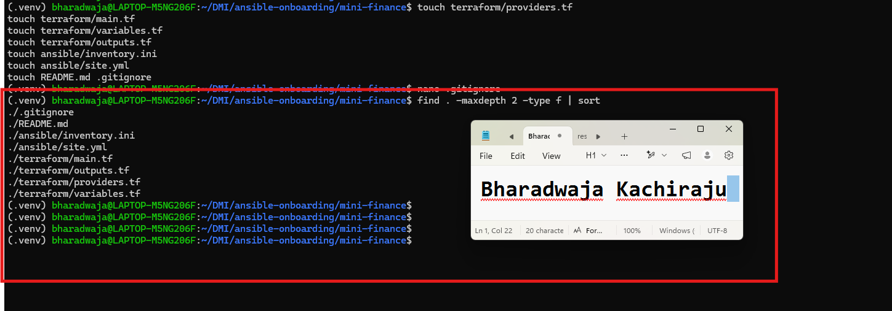

---

### Notes

Created the `mini-finance` project inside the existing Ansible controller workspace. The project separates Terraform infrastructure files from Ansible configuration files.

Created the Terraform files `providers.tf`, `main.tf`, `variables.tf`, and `outputs.tf` in the `terraform` directory. Created `inventory.ini` and `site.yml` in the `ansible` directory. Also created `README.md` for project documentation.

Added a `.gitignore` file to prevent Terraform working files, state files, saved plans, crash logs, and private-key files from being committed. This helps protect sensitive infrastructure information and SSH credentials.

---

# Task 2 — Create the Azure Infrastructure Using Terraform

## Goal

Use Terraform to provision an Ubuntu Virtual Machine with the required Azure networking and security resources.

### Evidence

#### Screenshot 2 — Terraform code showing the `Allow-SSH` rule for port `22` and the `Allow-HTTP` rule for port `80`

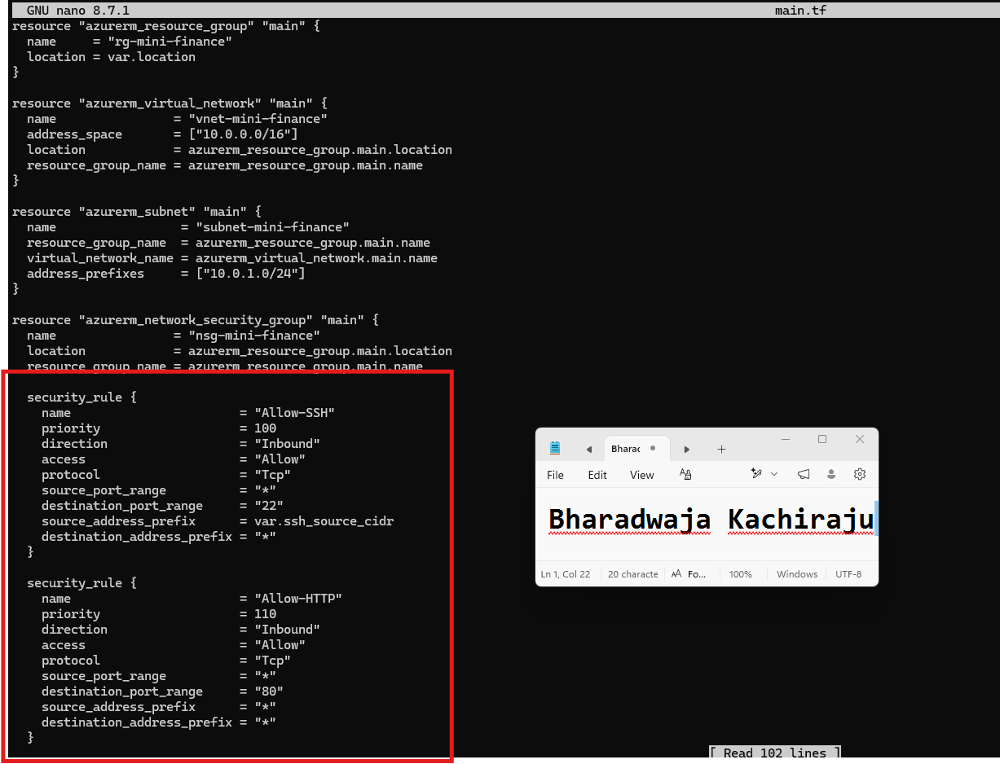

---

#### Screenshot 3 — Terraform code showing the association between `nsg-mini-finance` and `nic-mini-finance`

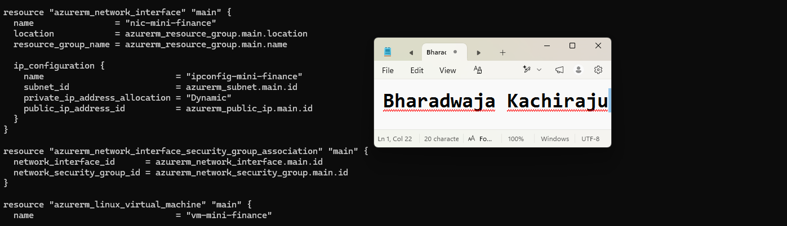

---

### Notes

Created the Terraform configuration required to provision the Mini Finance infrastructure in Microsoft Azure.

The configuration creates an Azure Resource Group, Virtual Network, Subnet, Network Security Group, Standard static Public IP address, Network Interface, NSG-to-NIC association, and an Ubuntu 22.04 Linux virtual machine.

Configured the Network Security Group with two inbound rules. SSH traffic on port 22 is restricted to the Ansible controller’s public IP address using a `/32` CIDR range. HTTP traffic on port 80 is allowed from the internet so that the Mini Finance website can be accessed publicly.

Configured the Ubuntu VM with the required fixed resource names, `azureuser` administrator account, SSH public-key authentication, password authentication disabled, and the `nic-mini-finance` network interface. Added the `public_ip` Terraform output to display the VM public IP address after deployment.

---

# Task 3 — Initialize and Apply the Terraform Configuration

## Goal

Format and validate the Terraform configuration, review the execution plan, and provision the Azure infrastructure.

### Evidence

#### Screenshot 4 — End of the `terraform apply` output showing `Apply complete!` with no errors

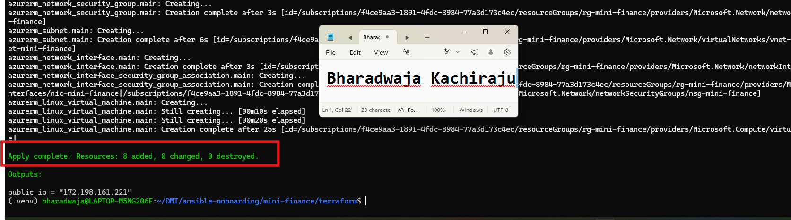

---

#### Screenshot 5 — Output of `terraform output public_ip` showing the VM’s public IP address

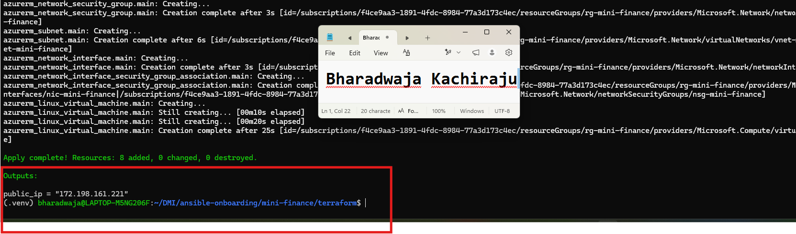

---

### Notes

Formatted, initialized, and validated the Terraform configuration for the Mini Finance Azure infrastructure. Terraform initialization completed successfully, and validation confirmed that the configuration syntax was valid.

Reviewed the Terraform execution plan before deployment. The plan showed the creation of the required Mini Finance resources with no unexpected changes or deletions.

Terraform provisioned the Azure Resource Group, Virtual Network, Subnet, Network Security Group, Standard static Public IP address, Network Interface, NSG-to-NIC association, and Ubuntu Linux virtual machine.

After deployment, the `terraform output public_ip` command displayed the public IP address of the Mini Finance virtual machine. This public IP is used for passwordless SSH access, the Ansible inventory, deployment verification, and browser access to the website.

---

# Task 4 — Verify Passwordless SSH Access

## Goal

Confirm that the Ansible controller can connect to the Terraform-provisioned Azure VM using SSH key authentication.

### Evidence

#### Screenshot 6 — Passwordless SSH command and the returned `mini-finance` hostname

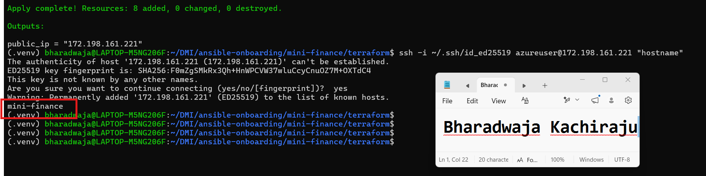

---

### Notes

Verified passwordless SSH access from the Ansible controller to the Terraform-provisioned Azure virtual machine.

Used the public IP address returned by `terraform output public_ip` and connected with the existing private key at `~/.ssh/id_ed25519` using the `azureuser` account.

The SSH command returned the hostname `mini-finance` without requesting a password. This confirms that Terraform correctly added the SSH public key to the Ubuntu VM and that the SSH security rule allows access from the Ansible controller.

---

# Task 5 — Create the Ansible Inventory and Verify Connectivity

## Goal

Add the Terraform-provisioned Azure VM to the Ansible inventory and confirm that Ansible can connect to it.

### Evidence

#### Screenshot 7 — Ansible ping output showing `SUCCESS` and `pong` from the Azure VM

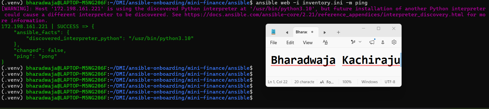

---

### Configuration File

Copy and paste the complete contents of your `ansible/inventory.ini` file below:

```ini
[web]
172.198.161.221

[web:vars]
ansible_user=azureuser
ansible_ssh_private_key_file=~/.ssh/id_ed25519

```

---

# Task 6 — Create the Multi-Play Ansible Playbook

## Goal

Create one Ansible playbook containing separate plays to install Nginx, deploy the Mini Finance website, and verify the deployment.

### Evidence

#### Screenshot 8 — `site.yml` showing Play 1 and the beginning of Play 2

Screenshot must show:

- Play 1 targeting the `web` group
- Installation of `nginx`, `git`, and `rsync`
- Nginx service configured as started and enabled
- Beginning of Play 2 with the Git repository URL and synchronization task

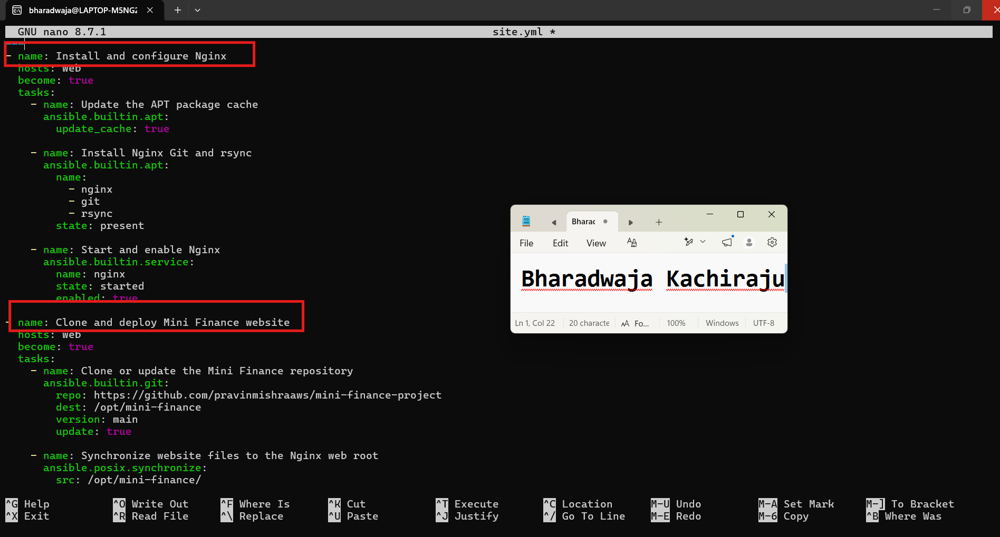

---

#### Screenshot 9 — `site.yml` showing the deployment destination, handler, and Play 3 verification

Screenshot must show:

- Website destination `/var/www/html/`
- Ownership set to `www-data:www-data`
- Nginx reload handler
- Play 3 targeting `localhost`
- The `uri` verification and `assert` condition

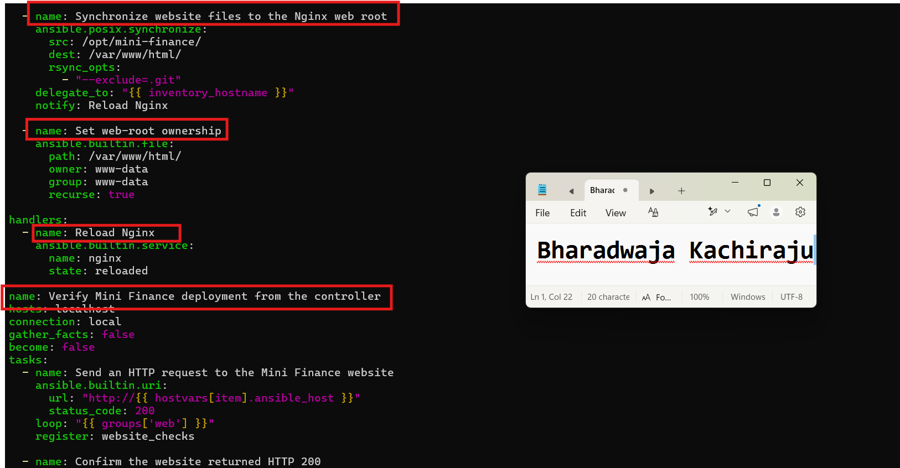

---

### Configuration File

Copy and paste the complete contents of your `ansible/site.yml` file below:

```yaml
---
- name: Install and configure Nginx
  hosts: web
  become: true
  tasks:
    - name: Update the APT package cache
      ansible.builtin.apt:
        update_cache: true

    - name: Install Nginx Git and rsync
      ansible.builtin.apt:
        name:
          - nginx
          - git
          - rsync
        state: present

    - name: Start and enable Nginx
      ansible.builtin.service:
        name: nginx
        state: started
        enabled: true

- name: Clone and deploy Mini Finance website
  hosts: web
  become: true
  tasks:
    - name: Clone or update the Mini Finance repository
      ansible.builtin.git:
        repo: https://github.com/pravinmishraaws/mini-finance-project
        dest: /opt/mini-finance
        version: main
        update: true

    - name: Synchronize website files to the Nginx web root
      ansible.posix.synchronize:
        src: /opt/mini-finance/
        dest: /var/www/html/
        rsync_opts:
          - "--exclude=.git"
      delegate_to: "{{ inventory_hostname }}"
      notify: Reload Nginx

    - name: Set web-root ownership
      ansible.builtin.file:
        path: /var/www/html/
        owner: www-data
        group: www-data
        recurse: true

  handlers:
    - name: Reload Nginx
      ansible.builtin.service:
        name: nginx
        state: reloaded

- name: Verify Mini Finance deployment from the controller
  hosts: localhost
  connection: local
  gather_facts: false
  become: false
  tasks:
    - name: Send an HTTP request to the Mini Finance website
      ansible.builtin.uri:
        url: "http://{{ hostvars[item].ansible_host }}"
        status_code: 200
      loop: "{{ groups['web'] }}"
      register: website_checks

    - name: Confirm the website returned HTTP 200
      ansible.builtin.assert:
        that:
          - item.status == 200
        success_msg: "{{ item.item }} returned HTTP {{ item.status }}"
      loop: "{{ website_checks.results }}"
```

---

# Task 7 — Validate and Run the Ansible Playbook

## Goal

Validate the syntax of the multi-play Ansible playbook and run it to install Nginx, deploy the Mini Finance website, and verify the deployment.

### Evidence

#### Screenshot 10 — Successful playbook syntax check showing `playbook: site.yml`

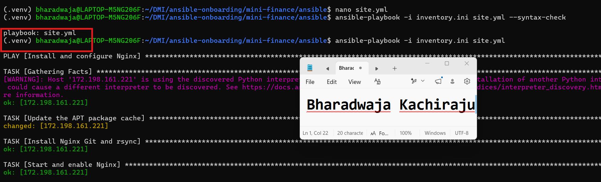

---

#### Screenshot 11 — Play 3 output showing the successful HTTP verification and assertion

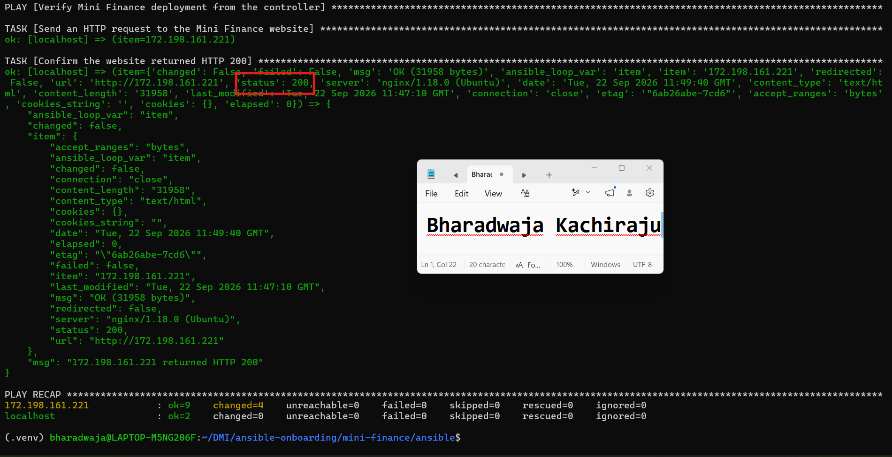

---

#### Screenshot 12 — Final `PLAY RECAP` showing `failed=0` and `unreachable=0`

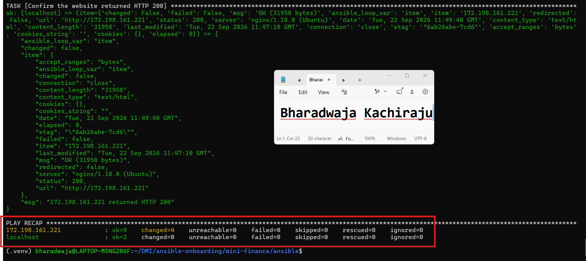

---

### Notes

Validated the Mini Finance Ansible playbook with the Ansible syntax-check command before running it against the Azure virtual machine.

Ran the multi-play playbook to install and configure Nginx, Git, and rsync on the Ubuntu VM. The playbook cloned the Mini Finance repository into `/opt/mini-finance`, synchronized the website files to `/var/www/html/`, set ownership to `www-data:www-data`, and reloaded Nginx after the website content changed.

During the first run, Play 3 failed because the inventory used the VM public IP address directly as the host name. The original URI task attempted to use `hostvars[item].ansible_host`, but that variable was not defined for a host represented only by its IP address.

I fixed the issue by changing the URI task URL to use `http://{{ item }}`. This uses the IP address from the `web` group directly. After rerunning the playbook, Ansible verified that the Mini Finance website returned HTTP status code 200 and the assertion completed successfully.

The final play recap confirmed that the deployment completed with no unreachable hosts and no failed tasks.

---

# Task 8 — Test the Mini Finance Website in a Browser

## Goal

Confirm that the Mini Finance website is publicly accessible through the Azure VM’s public IP address.

### Evidence

#### Screenshot 13 — Mini Finance website successfully loading in the browser, with the Azure VM’s public IP address visible in the address bar

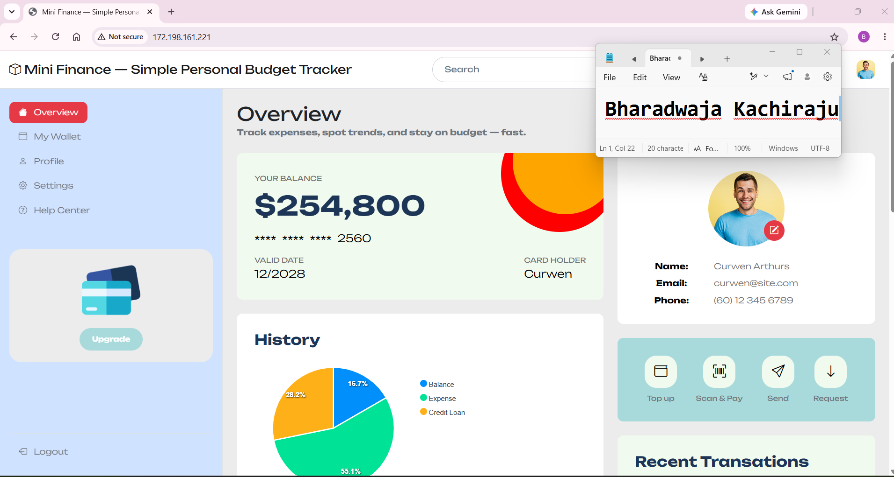

---

### Website URL

Add your deployed website URL below:

```text
http://172.198.161.221/
```

---

# Task 9 — Create the Project README

## Goal

Create a `README.md` file to document the Mini Finance infrastructure and deployment project.

### Evidence

#### Screenshot 14 — Completed `README.md` displayed in the VS Code Markdown preview or terminal

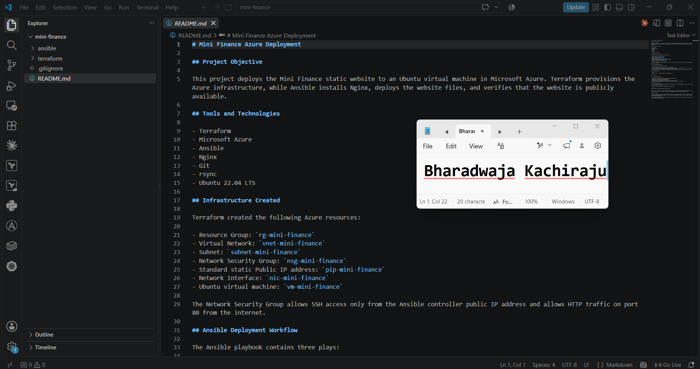

---

### README Content

Copy and paste the complete contents of your `README.md` file below:

```markdown
# Mini Finance Azure Deployment

## Project Objective

This project deploys the Mini Finance static website to an Ubuntu virtual machine in Microsoft Azure. Terraform provisions the Azure infrastructure, while Ansible installs Nginx, deploys the website files, and verifies that the website is publicly available.

## Tools and Technologies

- Terraform
- Microsoft Azure
- Ansible
- Nginx
- Git
- rsync
- Ubuntu 22.04 LTS

## Infrastructure Created

Terraform created the following Azure resources:

- Resource Group: `rg-mini-finance`
- Virtual Network: `vnet-mini-finance`
- Subnet: `subnet-mini-finance`
- Network Security Group: `nsg-mini-finance`
- Standard static Public IP address: `pip-mini-finance`
- Network Interface: `nic-mini-finance`
- Ubuntu virtual machine: `vm-mini-finance`

The Network Security Group allows SSH access only from the Ansible controller public IP address and allows HTTP traffic on port 80 from the internet.

## Ansible Deployment Workflow

The Ansible playbook contains three plays:

1. Install and configure Nginx, Git, and rsync on the Ubuntu VM.
2. Clone the Mini Finance repository into `/opt/mini-finance`, synchronize the website files to `/var/www/html/`, set ownership to `www-data:www-data`, and reload Nginx when website content changes.
3. Send an HTTP request from the Ansible controller and confirm that the website returns HTTP status code 200.

Run the playbook with:

```bash
ansible-playbook -i ansible/inventory.ini ansible/site.yml
```

## Verification

I verified the deployment by:

- Using Terraform output to retrieve the Azure VM public IP address.
- Connecting to the VM through passwordless SSH.
- Running the Ansible ping module successfully.
- Running the Ansible playbook and confirming the HTTP 200 assertion.
- Opening the Mini Finance website in a browser through the Azure VM public IP address.

## Challenge and Solution

The original repository URL in the assignment was unavailable. This caused the Ansible Git task to wait and then fail when it could not access the repository.

I resolved the issue by using the updated public repository URL:

```text
https://github.com/pravinmishraaws/mini_finance.git
```

Another issue occurred in the HTTP verification play because the inventory used the VM public IP address directly. I changed the URI task to use `http://{{ item }}`, which allowed the playbook to verify the website successfully.

## What I Learned

This project showed how Terraform and Ansible work together in a deployment workflow. Terraform manages cloud infrastructure, including networking and virtual machines. Ansible configures the operating system, installs software, deploys website content, and verifies the application.

I also learned how Ansible handlers, the Git module, the synchronize module, and the URI module can create a repeatable and reliable website deployment process.


---

# LinkedIn Post Required

## Evidence

#### Screenshot 15 — Published LinkedIn post showing the text and at least one deployment screenshot

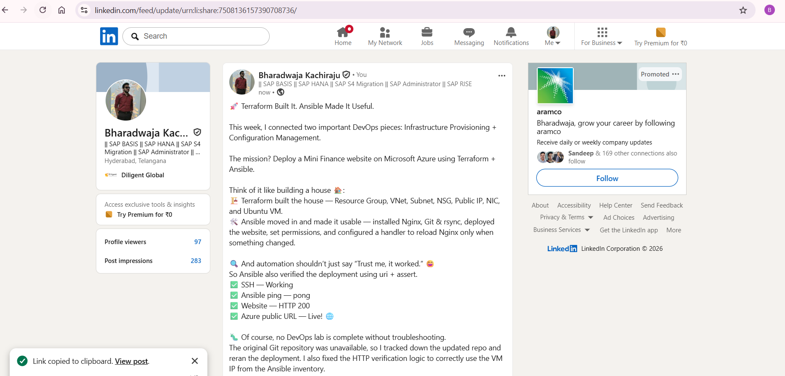

---

#### LinkedIn Post URL

Paste your LinkedIn post URL here:

https://lnkd.in/p/d-F-hPk8

---

### LinkedIn Submission Notes

**One challenge you faced and how you fixed it:**

The original Mini Finance repository URL provided in the assignment was unavailable, which caused the Ansible Git task to fail. I checked the repository and replaced the outdated URL with the updated public repository URL: https://github.com/pravinmishraaws/mini_finance.git.

I also faced an HTTP verification error because the Ansible inventory used the VM public IP address directly. I fixed the URI task by changing the URL to http://{{ item }}, allowing Ansible to verify that the website returned HTTP status code 200

---

**One real-world example where you can use this learning:**

This workflow can be used to deploy a company marketing website or internal dashboard to a newly created cloud virtual machine. Terraform can consistently provision the Azure network, security rules, public IP, and virtual machine. Ansible can then install the web server, deploy the approved website files, and verify that the application is available. This makes deployments repeatable and reduces manual configuration errors.

---

# Assignment Questions

Answer the following in your own words:

**1. What did you provision using Terraform in this assignment?**

I used Terraform to provision the Azure infrastructure required for the website, including the Resource Group, VNet, Subnet, NSG, Public IP, NIC, and an Ubuntu 22.04 VM.

---

**2. What did Ansible configure and deploy in this assignment?**

I used Ansible to configure the Ubuntu VM and deploy the Mini Finance website. It installed Nginx, Git, and rsync, started Nginx, cloned the website repository, copied the website files to /var/www/html/, set the required permissions, and verified the website.

---

**3. Why is SSH access on port `22` restricted to your public IP address?**

SSH provides administrative access to the server, so exposing port 22 to everyone would unnecessarily increase the security risk. I restricted it to my controller's public IP so that only my machine could connect through SSH.

---

**4. Why is HTTP port `80` open to the internet?**

Port 80 is open because the website needs to be publicly accessible through a web browser. Users need to be able to send HTTP requests to the Nginx web server.

---

**5. What is the purpose of the Ansible inventory file?**

The inventory tells Ansible which servers it should manage and how to connect to them. In this assignment, it contained the Azure VM's public IP and connection information.

---

**6. Why does the playbook use separate plays for install, deploy, and verify?**

Separate plays make the automation clear and easier to troubleshoot. Each stage has one responsibility:
Install  Deploy  Verify 
If something fails, I can quickly identify which stage caused the problem.

---

**7. Why is `rsync` useful when deploying website files?**

rsync efficiently synchronizes files between locations. Instead of blindly copying everything every time, it can transfer the required differences, making deployments faster and more efficient.

---

**8. What does the Ansible `uri` module verify in this assignment?**

The uri module sends an HTTP request to the deployed website and checks whether it is reachable. In my assignment, I verified that the website returned HTTP status 200, confirming that Nginx was successfully serving the website.

---

**9. What issue did you face during this assignment, and how did you fix it?**

I faced two issues.
The original Git repository URL was unavailable, so I identified the updated public repository URL and updated the playbook.
I also had an issue during HTTP verification because my inventory contained the VM's public IP directly. I updated the uri task to use the inventory item value, after which the verification successfully returned HTTP 200.

---

**10. What did you learn from using Terraform and Ansible together?**

I learned how Terraform and Ansible solve different parts of the same deployment problem.
Terraform → builds the infrastructure 
Ansible → configures the server and deploys the application 
Using them together allowed me to go from no infrastructure to a working website through a repeatable automated workflow instead of manually creating and configuring everything.

---

# Required Files

Confirm that the following files are included in your assignment folder:

- [ ] `.gitignore`
- [ ] `README.md`
- [ ] `terraform/providers.tf`
- [ ] `terraform/main.tf`
- [ ] `terraform/variables.tf`
- [ ] `terraform/outputs.tf`
- [ ] `ansible/inventory.ini`
- [ ] `ansible/site.yml`

---

# Submission Instructions

- Add all required screenshots in the correct order.
- Full Name must be visible in required screenshots.
- Add the Azure VM public IP address.
- Add the final Mini Finance website URL.
- Paste `inventory.ini`, `site.yml`, and `README.md` as editable text.
- Answer all assignment questions clearly in your own words.
- Add your LinkedIn post URL.
- Do not expose SSH private keys, passwords, Azure credentials, subscription IDs, Terraform state contents, or other sensitive information.
- Submit only one Google Doc link.
- Ensure that anyone with the link can view the document.
- Test the Google Doc link in an incognito or private browser window before submitting.

---

# Completion Checklist

- [ ] Task 1: `mini-finance` project structure created
- [ ] Task 1: `.gitignore` created
- [ ] Task 2: Terraform Azure infrastructure code created
- [ ] Task 2: `Allow-SSH` rule configured for port `22`
- [ ] Task 2: `Allow-HTTP` rule configured for port `80`
- [ ] Task 2: NSG associated with the Network Interface
- [ ] Task 3: `terraform fmt` completed
- [ ] Task 3: `terraform init` completed
- [ ] Task 3: `terraform validate` completed successfully
- [ ] Task 3: `terraform apply` completed successfully
- [ ] Task 3: `terraform output public_ip` displayed the VM public IP
- [ ] Task 4: Passwordless SSH works from the Ansible controller
- [ ] Task 5: `inventory.ini` created
- [ ] Task 5: Ansible ping returns `SUCCESS` and `pong`
- [ ] Task 6: `site.yml` contains three separate plays
- [ ] Task 6: Play 1 installs Nginx, Git, and rsync
- [ ] Task 6: Play 2 clones and deploys the Mini Finance website
- [ ] Task 6: Play 3 verifies HTTP status code `200`
- [ ] Task 7: Playbook syntax check passes
- [ ] Task 7: Ansible playbook completes successfully
- [ ] Task 7: Final recap shows `failed=0` and `unreachable=0`
- [ ] Task 8: Mini Finance website loads in the browser
- [ ] Task 8: Azure VM public IP is visible in the browser screenshot
- [ ] Task 9: `README.md` completed
- [ ] Screenshots 1–15 are included
- [ ] `inventory.ini`, `site.yml`, and `README.md` are pasted as editable text
- [ ] Assignment questions are answered
- [ ] LinkedIn post published with Anyone visibility
- [ ] LinkedIn post URL added
- [ ] No sensitive information is exposed
- [ ] Google Doc is accessible

---

## About DMI & CloudAdvisory

DevOps Micro Internship (DMI) is a project-based DevOps program run by Pravin Mishra and The CloudAdvisory, focused on real-world execution, systems thinking, and career readiness.

It helps learners build strong DevOps foundations with hands-on experience.

---

## Resources

- DMI Official Website: [https://dmi.pravinmishra.com?utm_source=github&utm_medium=readme](https://dmi.pravinmishra.com?utm_source=github&utm_medium=readme)
- University: [https://university.pravinmishra.com?utm_source=github&utm_medium=readme](https://university.pravinmishra.com?utm_source=github&utm_medium=readme)
- Discord Community: [https://discord.pravinmishra.com?utm_source=github&utm_medium=readme](https://discord.pravinmishra.com?utm_source=github&utm_medium=readme)
- Blog: [https://dmi.pravinmishra.com/blog?utm_source=github&utm_medium=readme](https://dmi.pravinmishra.com/blog?utm_source=github&utm_medium=readme)
- YouTube Playlist: [https://www.youtube.com/playlist?list=PLFeSNDtI4Cho](https://www.youtube.com/playlist?list=PLFeSNDtI4Cho)
- Pravin Mishra LinkedIn: [https://www.linkedin.com/in/pravin-mishra-aws-trainer/](https://www.linkedin.com/in/pravin-mishra-aws-trainer/)
- CloudAdvisory LinkedIn: [https://www.linkedin.com/company/thecloudadvisory/](https://www.linkedin.com/company/thecloudadvisory/)

---

*This submission is part of DevOps Micro Internship (DMI) Cohort 3 — Agentic AI Track.*