# Assignment — Deploy EpicBook with Terraform and Ansible Roles

Part of the DevOps Micro Internship (DMI) Cohort 3 with Agentic AI

---

## Purpose

In this assignment, you will deploy the EpicBook web application using Terraform and Ansible roles.

Terraform provisions the cloud infrastructure, including one Ubuntu VM and one managed MySQL database. Ansible roles configure the VM, install required software, deploy the EpicBook application, configure Nginx, connect the app to the managed MySQL database, and verify the deployment.

---

# Task 1 — Set Up the Project Folder Layout

## Goal

Create the project folder structure for Terraform and Ansible roles.

Terraform will be used to provision the cloud infrastructure. Ansible roles will be used to configure the VM and deploy the EpicBook application.

### Evidence

#### Screenshot 1 — Terminal showing the completed `epicbook-prod` project structure

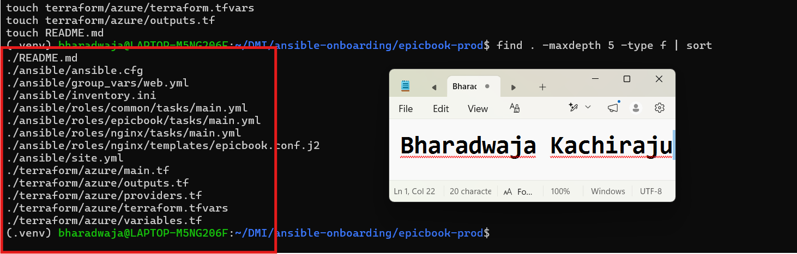

---

### Notes

Answer the following in your own words:

**1. Which cloud provider did you choose for this assignment?**

I chose Microsoft Azure. Terraform will provision the Ubuntu virtual machine, Azure networking resources, and Azure Database for MySQL Flexible Server.

---

**2. Why is it useful to keep Terraform files and Ansible files in separate folders?**

Terraform and Ansible have different responsibilities. Terraform creates and manages cloud infrastructure such as virtual machines, networks, security rules, and databases. Ansible configures the virtual machine after it is created, installs software, deploys the application, and manages services.

Keeping the files separate makes the project easier to understand, maintain, troubleshoot, and reuse.

---

**3. What is the purpose of the `roles` directory in Ansible?**

The roles directory organizes Ansible automation into reusable parts. Each role contains tasks and related files for one responsibility.

In this project, the common role prepares the server with required packages, the nginx role installs and configures the reverse proxy, and the epicbook role deploys and runs the Node.js application. This keeps the main playbook simple and makes the automation easier to manage.

---

# Task 2 — Provision the Infrastructure with Terraform

## Goal

Run Terraform to provision the cloud infrastructure for the EpicBook deployment.

Terraform will create the VM, managed MySQL database, networking, security rules, and required outputs.

### Evidence

#### Screenshot 2 — `terraform apply` completed successfully

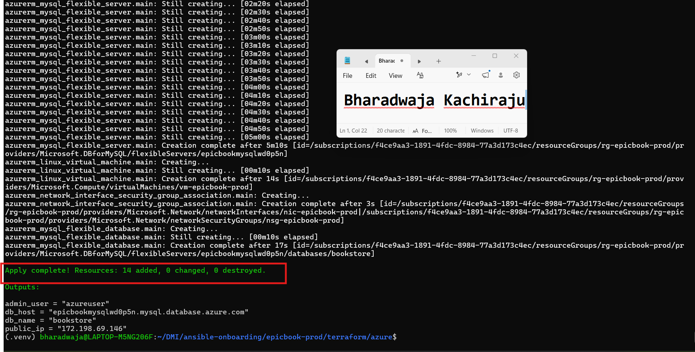

---

#### Screenshot 3 — Output of `terraform output`

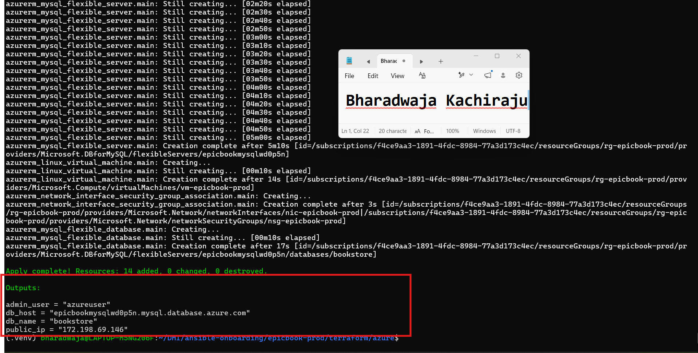

---

#### Screenshot 4 — Azure Portal or AWS Console showing the VM running

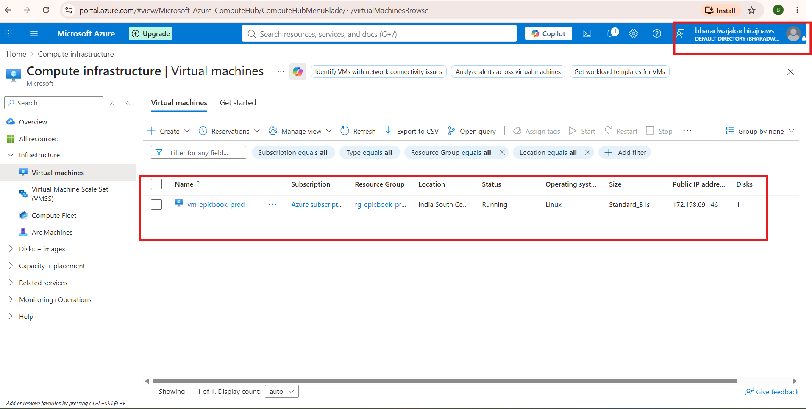

---

#### Screenshot 5 — Azure Portal or AWS Console showing the managed MySQL database created

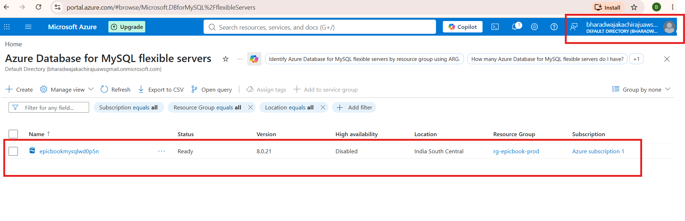

---

### Notes

Answer the following in your own words:

**1. What resources did Terraform create for this assignment?**

Terraform created the Azure infrastructure required for the EpicBook application. This includes a Resource Group, Virtual Network, VM subnet, MySQL delegated subnet, Network Security Group, Public IP address, Network Interface, NSG-to-NIC association, Ubuntu virtual machine, Private DNS Zone, Private DNS Zone virtual-network link, Azure Database for MySQL Flexible Server, and the bookstore database.

Terraform also configured SSH access only from the Ansible controller public IP address and HTTP access on port 80 for the public website.

---

**2. Why should you review `terraform plan` before running `terraform apply`?**

The Terraform plan shows exactly what Terraform intends to create, change, or destroy. Reviewing it before applying helps confirm that the correct cloud resources will be created and prevents unexpected deletions, replacements, configuration mistakes, or unnecessary cloud costs.

---

**3. Why should database passwords not be shown in Terraform output?**

Database passwords are sensitive credentials. If they are shown in Terraform output, screenshots, logs, repositories, or shared documents, someone else could use them to access the database. Passwords should be stored securely, such as in a local ignored variables file or Ansible Vault, and should never be exposed in public output.

---

# Task 3 — Verify SSH Key-Based Access

## Goal

Verify that the cloud VM can be accessed from the Ansible controller using SSH key-based authentication.

### Evidence

#### Screenshot 6 — Successful SSH hostname check from the Ansible controller

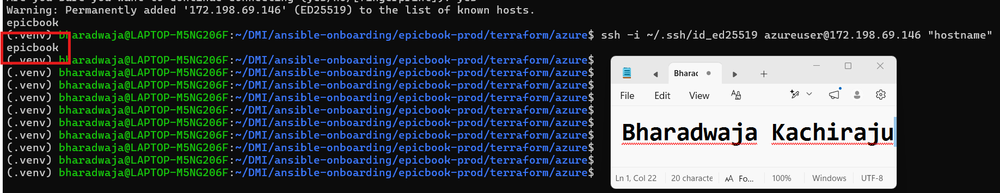

---

### Notes

Answer the following in your own words:

**1. What command did you use to verify SSH access?**

I used the following command:

ssh -i ~/.ssh/id_ed25519 azureuser@172.198.69.146 "hostname"

---

**2. What proves that SSH key-based access worked successfully?**

The SSH command connected without requesting the azureuser password and returned the hostname epicbook. This confirms that the private key on the Ansible controller matched the public key configured on the Azure VM.

---

**3. What would you check if SSH returned `Permission denied (publickey)`?**

I would check that I used the correct SSH username, public IP address, and private-key path. I would also confirm that Terraform added the matching public key to the VM, verify that the SSH security rule allows port 22 from my current public IP address, and check whether the SSH key is available to the SSH agent if required.

---

# Task 4 — Create the Ansible Inventory and Configuration

## Goal

Create the Ansible inventory file and local Ansible configuration for the EpicBook VM.

The inventory tells Ansible which VM to manage and which SSH user to use.

### Evidence

#### Screenshot 7 — `inventory.ini` showing the VM under the `web` group

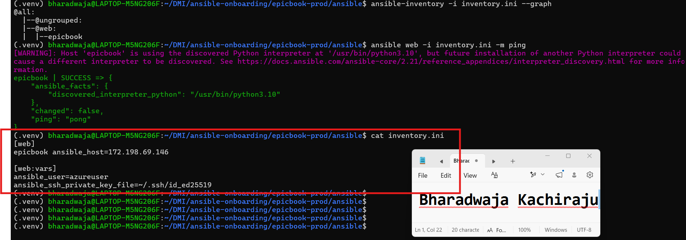

---

#### Screenshot 8 — Output of `ansible-inventory -i inventory.ini --graph`

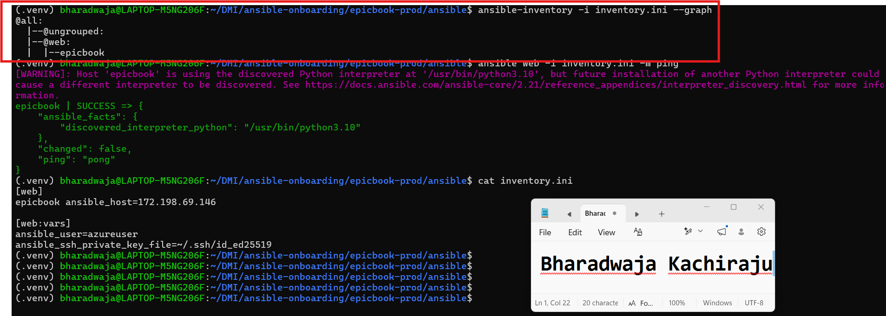

---

#### Screenshot 9 — Output of `ansible web -i inventory.ini -m ping`

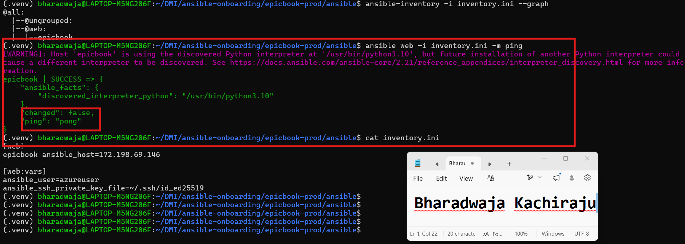

---

### Notes

Answer the following in your own words:

**1. What is the purpose of `inventory.ini`?**

The inventory.ini file tells Ansible which servers it should manage and how to connect to them. It organizes managed servers into groups, such as the web group used for the EpicBook VM.

---

**2. What does `ansible_host` store?**

ansible_host stores the real network address that Ansible should use to connect to a host. In this assignment, it stores the public IP address of the EpicBook Azure VM.

---

**3. What does `ansible_ssh_private_key_file` tell Ansible?**

ansible_ssh_private_key_file tells Ansible which private SSH key to use when connecting to the managed server. It must match the public key that Terraform added to the Azure VM.

---

**4. Why is `host_key_checking = False` used only for this temporary lab?**

Disabling host-key checking prevents Ansible from stopping to request confirmation when it connects to a new server for the first time. This is useful for a temporary lab, but it is not recommended for production because host-key checking helps confirm that Ansible is connecting to the correct server and protects against impersonation attacks.

---

# Task 5 — Create the Main Ansible Playbook

## Goal

Create the main Ansible playbook that runs the required roles in the correct order.

The `site.yml` file will call the `common`, `nginx`, and `epicbook` roles.

### Evidence

#### Screenshot 10 — `site.yml` showing the roles in the correct order

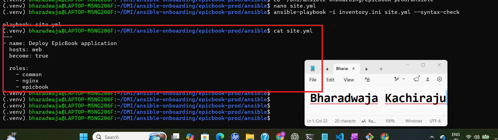

---

#### Screenshot 11 — Output of `ansible-playbook -i inventory.ini site.yml --syntax-check`

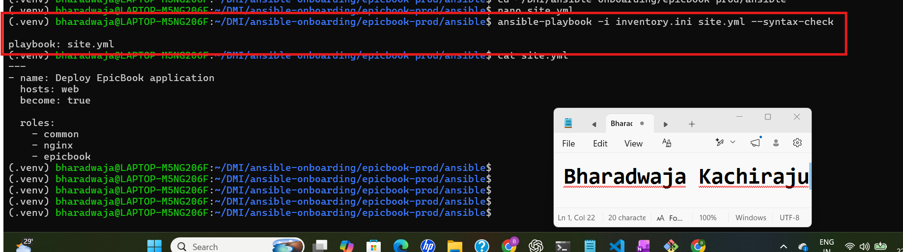

---

### Notes

Answer the following in your own words:

**1. What is the purpose of `site.yml`?**

site.yml is the main Ansible playbook for the project. It defines which host group Ansible should manage and calls the required roles in the correct order.

---

**2. Why should the roles run in the order `common`, `nginx`, and `epicbook`?**

The common role runs first to prepare the Ubuntu VM with required tools such as Git, curl, MySQL client tools, and package dependencies. The nginx role runs next to install and configure Nginx as the reverse proxy. The epicbook role runs last because it deploys and starts the Node.js application after the server and reverse proxy are ready.

---

**3. What does `become: true` allow Ansible to do?**

become: true allows Ansible to run tasks with administrator privileges, similar to using sudo. This is required for tasks such as installing packages, managing services, writing to protected system directories, and changing file ownership.

---

# Task 6 — Create the `common` Role

## Goal

Create the `common` role to prepare the Ubuntu VM with the basic packages required for the EpicBook deployment.

This role handles the common server setup before Nginx and the application are configured.

### Evidence

#### Screenshot 12 — `roles/common/tasks/main.yml` showing the common setup tasks

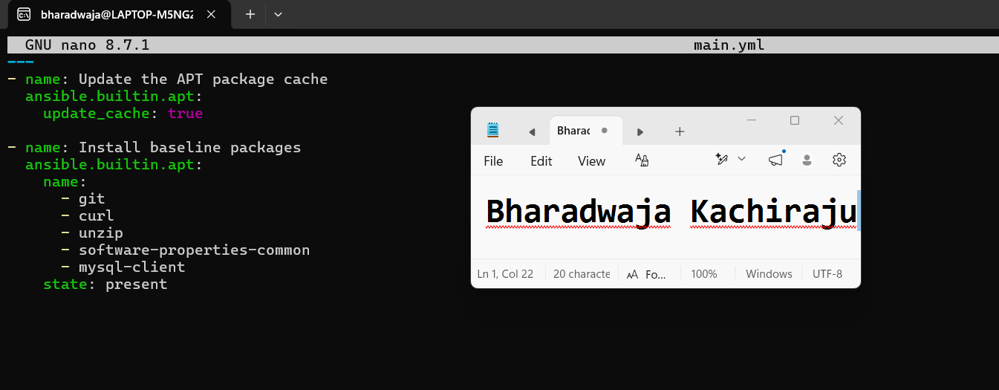

---

### Notes

Answer the following in your own words:

**1. What is the responsibility of the `common` role?**

The common role prepares the Ubuntu VM with the baseline packages needed by the rest of the deployment. It installs tools such as Git, curl, unzip, software-properties-common, and MySQL client tools.

---

**2. Why should Nginx installation not be placed inside the `common` role?**

Nginx has a separate responsibility from general server preparation. Keeping it in the nginx role makes the automation easier to organize, test, maintain, and reuse. The common role should contain only packages and setup that are generally needed by the server.

---

**3. Why is `mysql-client` useful in this deployment?**

The MySQL client allows the VM to connect to and test the managed MySQL database. It is useful for checking database connectivity, running SQL commands, inspecting tables, and troubleshooting the connection between the EpicBook application and the database.

---

# Task 7 — Create the `nginx` Role

## Goal

Create the `nginx` role to install Nginx and configure it as a reverse proxy for the EpicBook application.

Nginx will receive browser traffic on port `80` and forward it to the EpicBook Node.js application running on the VM.

### Evidence

#### Screenshot 13 — `roles/nginx/tasks/main.yml` showing Nginx installation and site configuration tasks

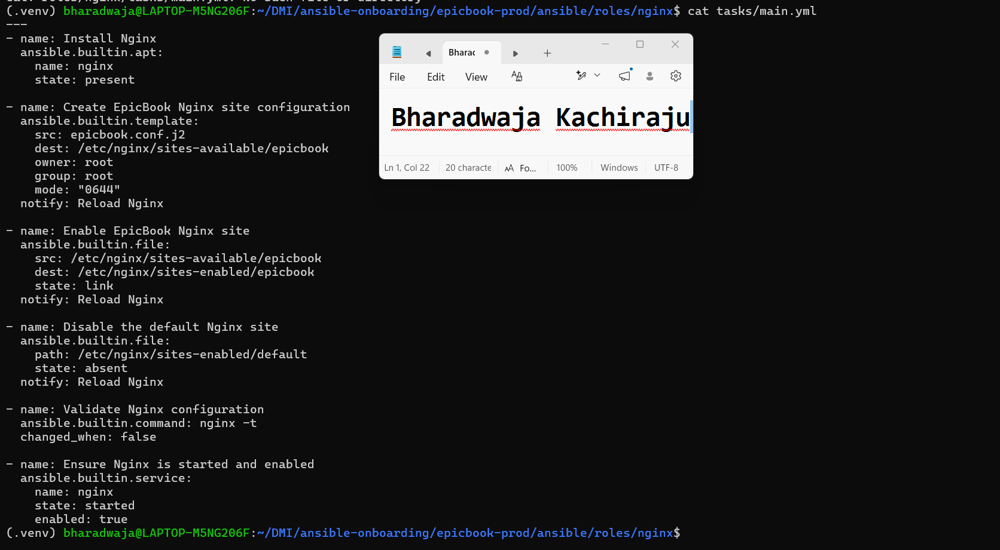

---

#### Screenshot 14 — `roles/nginx/templates/epicbook.conf.j2` showing the reverse proxy configuration

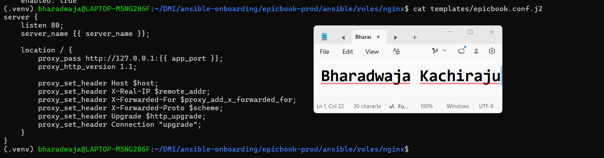

---

### Notes

Answer the following in your own words:

**1. What is the responsibility of the `nginx` role?**

The nginx role installs Nginx, creates the EpicBook site configuration, enables the site, disables the default site, validates the Nginx configuration, and ensures that Nginx is running and enabled after reboot.

---

**2. Why is Nginx configured as a reverse proxy in this deployment?**

Nginx receives public browser traffic on port 80 and forwards it to the EpicBook Node.js application running locally on port 8080. This allows the application to run on its internal port while Nginx handles public HTTP requests, proxy headers, and web-server responsibilities.

---

**3. Why should the application port come from `group_vars/web.yml` instead of being hard-coded?**

Using a variable keeps the configuration flexible and reusable. If the application port changes, it can be updated once in group_vars/web.yml without editing the Nginx template or other role files. This reduces duplication and makes the deployment easier to maintain.

---

# Task 8 — Create the `epicbook` Role

## Goal

Create the `epicbook` role to deploy the EpicBook application, connect it to the managed MySQL database, and run the application on port `8080` using PM2.

### Evidence

#### Screenshot 15 — `roles/epicbook/tasks/main.yml` showing application deployment tasks

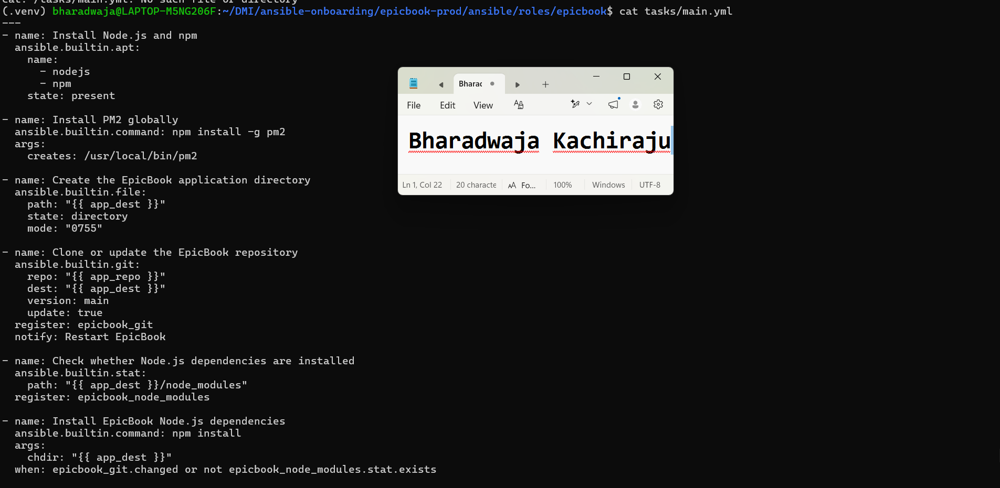

---

#### Screenshot 16 — Task or file showing how the database connection is configured, with secrets hidden

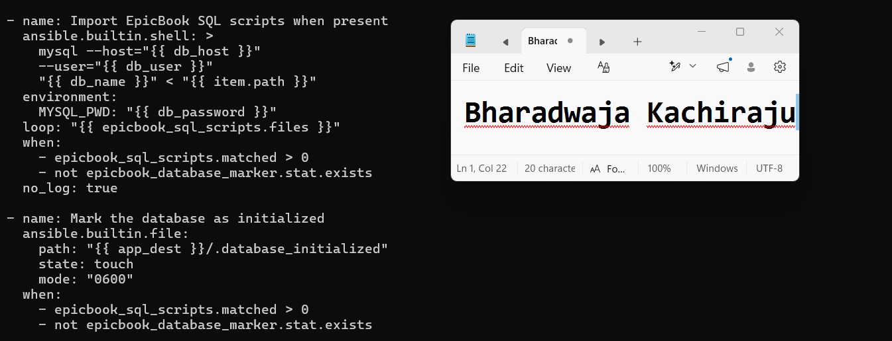

---

#### Screenshot 17 — Task or output showing the EpicBook application managed by PM2

---

### Notes

Answer the following in your own words:

**1. What is the responsibility of the `epicbook` role?**

The epicbook role deploys and runs the EpicBook Node.js application. It installs Node.js and PM2, clones the application repository, installs Node.js dependencies, configures the managed MySQL database connection, imports SQL scripts when available, and starts the application on port 8080.

---

**2. Why is PM2 used for the EpicBook Node.js application?**

PM2 runs the Node.js application as a managed background process. It keeps the application running after the SSH session ends, provides process status information, allows the application to be restarted, and helps manage the service more reliably than starting Node.js manually.

---

**3. Why should database passwords not be hard-coded in public files?**

Database passwords are sensitive credentials. Hard-coding them in public files, Git repositories, screenshots, or logs can allow unauthorized users to access the database. The password should be stored securely in Ansible Vault and referenced through a variable.

---

**4. What does it mean for the application to run on port `8080` while Nginx listens on port `80`?**

The EpicBook Node.js application runs internally on port 8080. Nginx listens publicly on port 80 and receives browser requests. Nginx then forwards those requests to the application on 127.0.0.1:8080. This setup keeps the application port internal while providing normal HTTP access through Nginx.

---

# Task 9 — Create Group Variables

## Goal

Create reusable variables for the EpicBook deployment.

The `group_vars/web.yml` file stores values that can be reused across the Ansible roles.

### Evidence

#### Screenshot 18 — `group_vars/web.yml` showing the application, PM2, and database variables, with passwords hidden or masked

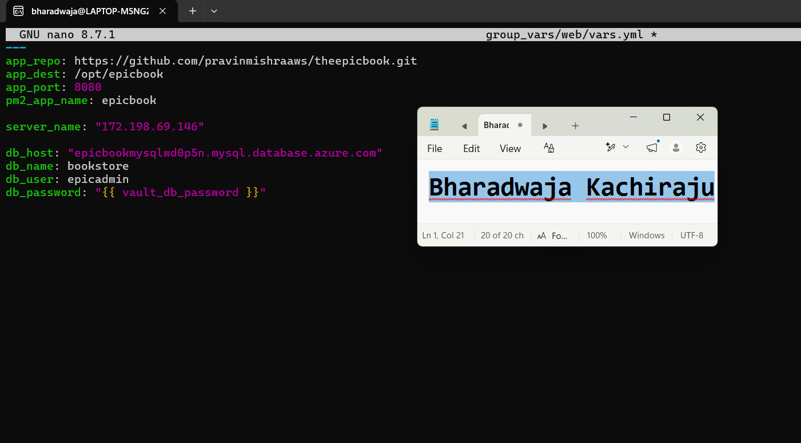

---

### Notes

Answer the following in your own words:

**1. What is the purpose of `group_vars/web.yml`?**

group_vars/web.yml stores variables that apply to every host in the web inventory group. It keeps application settings separate from the playbook and roles, making the deployment easier to manage and reuse.

---

**2. Which values did you store in `group_vars/web.yml`?**

I stored the EpicBook repository URL, application destination directory, application port (8080), PM2 process name, Nginx server name/public IP, database host, database name, and database username. The database password reference was also included without exposing the real password.

---

**3. How did you handle the database password securely?**

I saved the actual database password in an Ansible Vault file, group_vars/web/vault.yml, using the variable vault_db_password. The regular variables file refers to it as {{ vault_db_password }}, so the password is encrypted at rest and is not shown in the playbook, screenshots, Git repository, or normal configuration files.

---

# Task 10 — Run the Ansible Playbook

## Goal

Run the Ansible playbook to configure the VM and deploy the EpicBook application.

The playbook should run the roles in this order:

1. `common`
2. `nginx`
3. `epicbook`

### Evidence

#### Screenshot 19 — Ansible playbook output showing the roles running

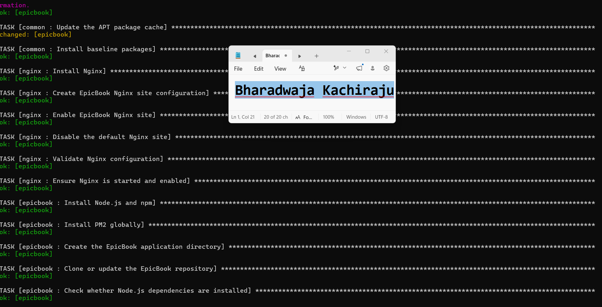

---

#### Screenshot 20 — Final Ansible recap showing `failed=0`

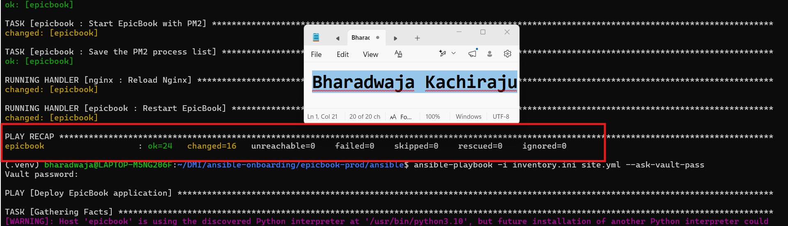

---

#### Screenshot 21 — Output of `ansible web -i inventory.ini -m command -a "systemctl is-active nginx" --become`

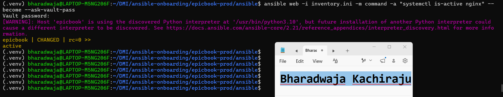

---

#### Screenshot 22 — Output of `ansible web -i inventory.ini -m command -a "pm2 status"`

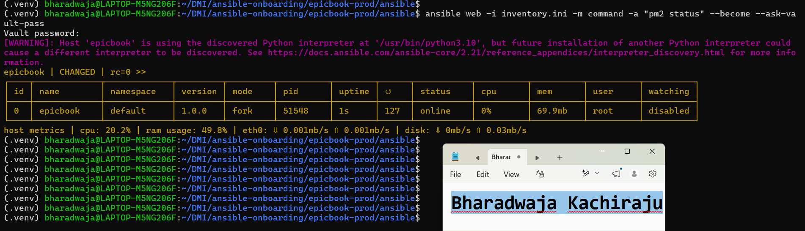

---

#### Screenshot 23 — Output of `ansible web -i inventory.ini -m command -a "curl -I http://localhost:8080"`

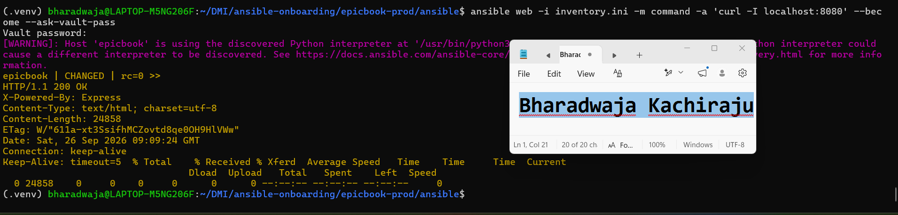

---

### Notes

Answer the following in your own words:

**1. What command did you run to execute the Ansible playbook?**

I ran the following command from the Ansible directory:

ansible-playbook -i inventory.ini site.yml --ask-vault-pass

---

**2. How do you know all roles completed successfully?**

The playbook completed and the PLAY RECAP showed failed=0 and unreachable=0. The tasks from the common, nginx, and epicbook roles completed without errors.

---

**3. What proves that Nginx is active?**

I ran systemctl is-active nginx through Ansible, and the command returned active. This confirms that the Nginx service is running on the server.

---

**4. What proves that PM2 is managing the EpicBook application?**

The pm2 status command displayed the epicbook application in the PM2 process list with an online status. This confirms that PM2 started and is managing the Node.js application.

---

**5. What proves that the EpicBook application responds on port `8080`?**

I ran curl -I http://localhost:8080 on the managed server through Ansible. The response returned HTTP/1.1 200 OK, confirming that the EpicBook application is running and responding on port 8080.

---

# Task 11 — Verify the EpicBook Deployment

## Goal

Verify that the EpicBook application is running, accessible in the browser, and connected to the managed MySQL database.

### Evidence

#### Screenshot 24 — Output of `curl -I http://<public_ip>`

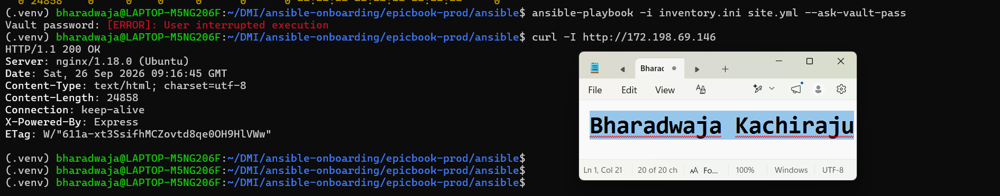

---

#### Screenshot 25 — Output of the cart API test command

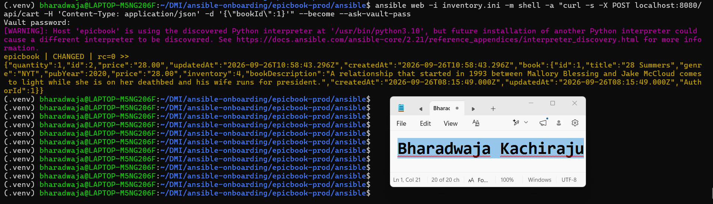

---

#### Screenshot 26 — Output of the `/cart` HTTP status check

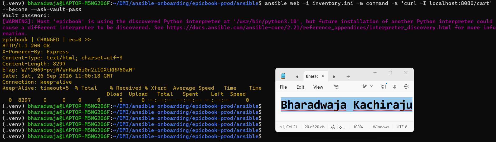

---

#### Screenshot 27 — Browser showing the EpicBook application loaded from `http://<public_ip>`

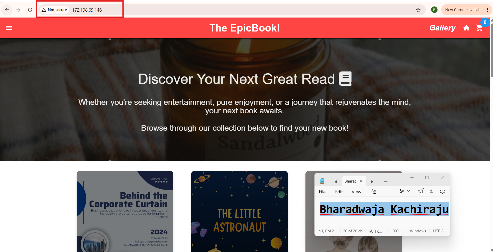

---

### Notes

Answer the following in your own words:

**1. What HTTP response did you receive from the public application URL?**

The public EpicBook application URL returned HTTP/1.1 200 OK. This confirmed that Nginx accepted the public HTTP request and successfully forwarded it to the EpicBook application.

---

**2. What did the cart API test prove?**

The cart API test proved that the application could process a request to add a book to the cart and return a JSON response. It also verified that the Node.js application could communicate with the MySQL database.

---

**3. What did the `/cart` status check return?**

The /cart status check returned HTTP/1.1 200 OK. This confirmed that the cart page route was available and responded successfully.

---

**4. What issue did you face during verification, and how did you fix it?**

During verification, the EpicBook application could not connect to Azure MySQL because the database required a secure TLS connection. I added TLS settings to the application configuration and updated the EpicBook database connection so it applied those settings. I then reran the Ansible playbook, restarted the PM2 process, and verified the application through HTTP checks.

---

# LinkedIn Post Required

## Evidence

#### LinkedIn Post URL

Paste your LinkedIn post URL here:

https://lnkd.in/p/d63YQaTF

---

#### Screenshot — Published LinkedIn post

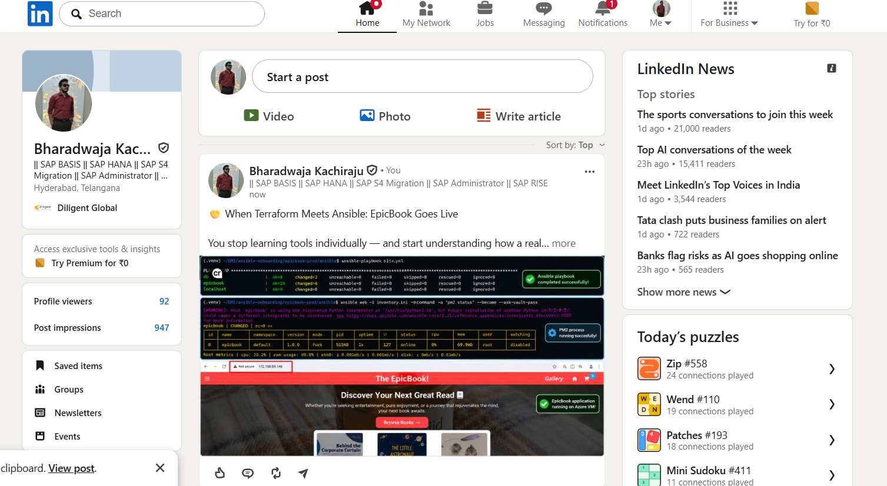

---

# Assignment Questions

Answer the following in your own words:

**1. Why is Terraform used for infrastructure provisioning?**

Terraform defines cloud infrastructure as code. It can create and manage the Azure resource group, network, virtual machine, security rules, public IP address, and managed MySQL database consistently from version-controlled configuration files.

---

**2. Why are Ansible roles useful for production-style deployments?**

Ansible roles separate related tasks into reusable units. For example, the common role installs baseline packages, the nginx role configures the reverse proxy, and the epicbook role deploys and runs the application. This makes the deployment easier to maintain, test, and reuse.

---

**3. What is the purpose of `group_vars/web.yml`?**

group_vars/web.yml stores variables that apply to the web-server group, including the application repository, application port, PM2 process name, database host, database name, and Nginx server name. It keeps configuration separate from playbook logic.

---

**4. Why should database passwords not be committed to GitHub?**

A Git repository can be viewed, copied, or shared by other people. If a password is committed, it may remain in Git history even after being removed. Database passwords should be stored in Ansible Vault, a secret manager, or environment-specific secure configuration.

---

**5. What is the purpose of Nginx in this deployment?**

Nginx listens for public HTTP traffic on port 80 and acts as a reverse proxy. It forwards requests to the EpicBook Node.js application running privately on port 8080.

---

**6. Why should the managed MySQL database not be publicly accessible?**

Keeping MySQL private reduces the attack surface. Only the application server in the Azure virtual network should communicate with the database, which helps prevent unauthorized internet access and protects application data.

---

**7. Why is PM2 used for the EpicBook Node.js application?**

PM2 manages the Node.js process. It starts the EpicBook application, monitors its status, restarts it if it stops unexpectedly, and provides commands such as pm2 status and pm2 logs for operational checks.

---

**8. What does idempotency mean in Ansible?**

Idempotency means that running the same playbook multiple times produces the intended final state without making unnecessary changes. For example, Ansible does not reinstall a package that is already installed or restart a service unless a configuration change requires it.

---

**9. What issue did you face during the deployment, and how did you fix it?**

The EpicBook application initially failed to connect to Azure MySQL because the server required TLS-encrypted connections. I added TLS configuration and updated the application’s production database connection to apply those settings. After rerunning the Ansible playbook, PM2 restarted the application with the corrected configuration.

---

**10. What security improvement would you make before using this setup in production?**

I would use a managed secret service such as Azure Key Vault for database credentials and certificates, instead of supplying secrets through local files or command prompts. I would also enable HTTPS with a trusted TLS certificate at Nginx and restrict SSH access through a VPN or Azure Bastion.

---

# Required Files

Confirm that the following files are included in your GitHub repository or assignment folder:

- [ ] `README.md`
- [ ] Terraform files under either `terraform/azure/` or `terraform/aws/`
- [ ] `ansible/ansible.cfg`
- [ ] `ansible/inventory.ini`
- [ ] `ansible/site.yml`
- [ ] `ansible/group_vars/web.yml`
- [ ] `ansible/roles/common/tasks/main.yml`
- [ ] `ansible/roles/nginx/tasks/main.yml`
- [ ] `ansible/roles/nginx/templates/epicbook.conf.j2`
- [ ] `ansible/roles/epicbook/tasks/main.yml`

---

# Submission Instructions

- Add all required screenshots in your submission.
- Full Name must be visible in required screenshots.
- Mention the cloud provider used: Azure or AWS.
- Add the VM public IP address.
- Add the final application URL.
- Add Terraform output proof.
- Add Ansible role tree proof.
- Add all required notes and assignment question answers.
- Add your LinkedIn post URL.
- Do not expose SSH private keys, passwords, cloud credentials, database credentials, Terraform state files, subscription IDs, or account IDs.
- Submit only your Google Doc link.

---

# Completion Checklist

- [ ] Task 1: Project folder layout created
- [ ] Task 2: Terraform infrastructure provisioned
- [ ] Task 3: SSH key-based access verified
- [ ] Task 4: Ansible inventory and configuration created
- [ ] Task 5: Main Ansible playbook created
- [ ] Task 6: `common` role created
- [ ] Task 7: `nginx` role created
- [ ] Task 8: `epicbook` role created
- [ ] Task 9: Group variables created
- [ ] Task 10: Ansible playbook run completed
- [ ] Task 11: EpicBook deployment verified
- [ ] Terraform files created under only one cloud provider folder
- [ ] One Ubuntu VM was created
- [ ] One managed MySQL database was created
- [ ] SSH port `22` is restricted to the controller public IP
- [ ] HTTP port `80` is accessible
- [ ] MySQL port `3306` is not publicly open
- [ ] `ansible web -i inventory.ini -m ping` returns `SUCCESS`
- [ ] `site.yml` calls the roles in the correct order
- [ ] Database secrets are hidden or handled securely
- [ ] Nginx is active
- [ ] PM2 shows the EpicBook application running
- [ ] EpicBook responds on port `8080`
- [ ] Public URL loads in the browser
- [ ] Cart API verification works
- [ ] Playbook completes with `failed=0`
- [ ] Screenshots 1–27 are included
- [ ] Assignment questions are answered
- [ ] LinkedIn post published
- [ ] LinkedIn post URL added
- [ ] No sensitive information is exposed
- [ ] Google Doc is accessible

---

## About DMI & CloudAdvisory

DevOps Micro Internship (DMI) is a project-based DevOps program run by Pravin Mishra and The CloudAdvisory, focused on real-world execution, systems thinking, and career readiness.

It helps learners build strong DevOps foundations with hands-on experience.

---

## Resources

- DMI Official Website: [https://dmi.pravinmishra.com?utm_source=github&utm_medium=readme](https://dmi.pravinmishra.com?utm_source=github&utm_medium=readme)
- University: [https://university.pravinmishra.com?utm_source=github&utm_medium=readme](https://university.pravinmishra.com?utm_source=github&utm_medium=readme)
- Discord Community: [https://discord.pravinmishra.com?utm_source=github&utm_medium=readme](https://discord.pravinmishra.com?utm_source=github&utm_medium=readme)
- Blog: [https://dmi.pravinmishra.com/blog?utm_source=github&utm_medium=readme](https://dmi.pravinmishra.com/blog?utm_source=github&utm_medium=readme)
- YouTube Playlist: [https://www.youtube.com/playlist?list=PLFeSNDtI4Cho](https://www.youtube.com/playlist?list=PLFeSNDtI4Cho)
- Pravin Mishra LinkedIn: [https://www.linkedin.com/in/pravin-mishra-aws-trainer/](https://www.linkedin.com/in/pravin-mishra-aws-trainer/)
- CloudAdvisory LinkedIn: [https://www.linkedin.com/company/thecloudadvisory/](https://www.linkedin.com/company/thecloudadvisory/)

---

*This submission is part of DevOps Micro Internship (DMI) Cohort 3 — Agentic AI Track.*